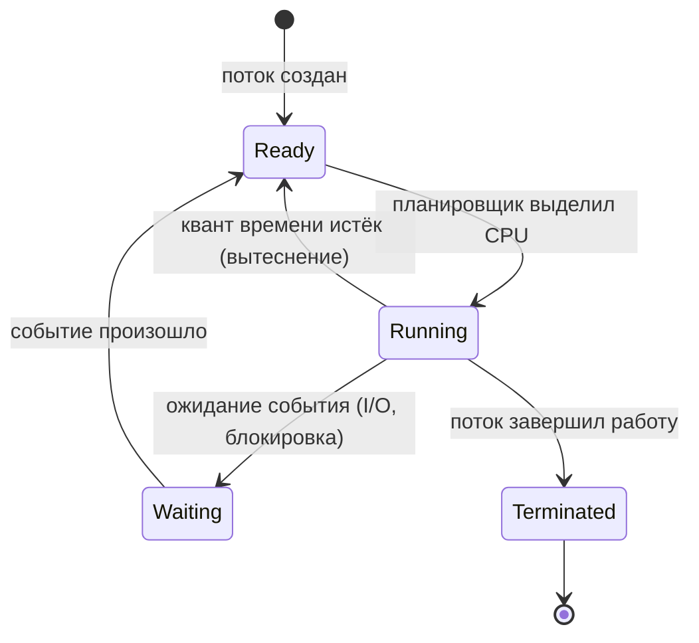
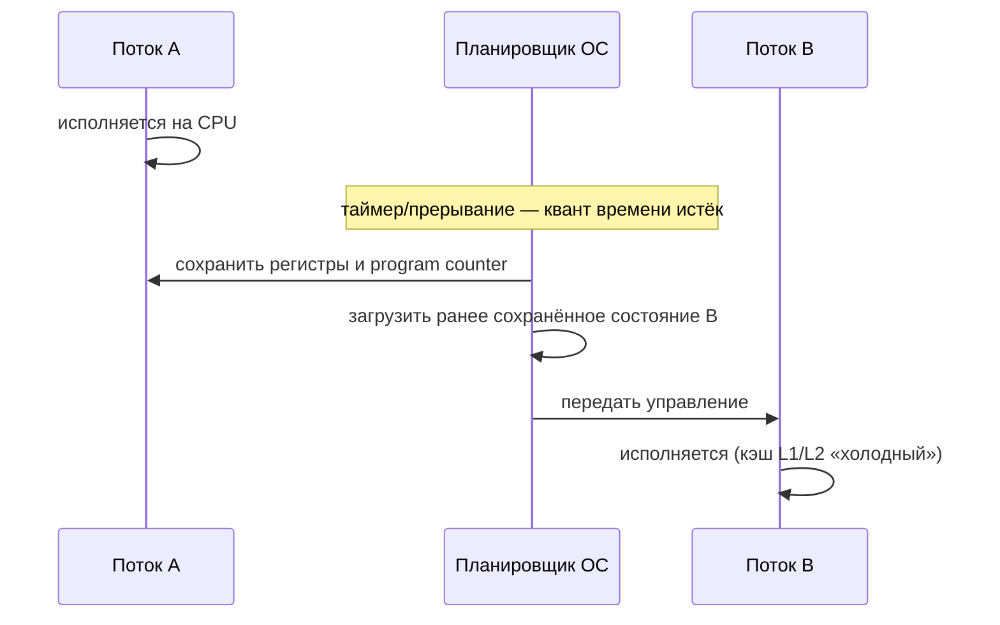

# Как устроен компьютер и операционная система

---
С нуля это на собеседовании не спрашивают, но без этого непонятно, почему JVM ведёт
себя именно так: почему context switch дорог, почему heap и stack разделены, почему
поток — это в первую очередь механизм ОС, на который Java лишь надстраивает свою
модель.

## Ключевые концепции

### Процессы и потоки
Когда запускается любая программа, операционная система создаёт для неё процесс —
изолированное адресное пространство: своя память, свои файловые дескрипторы, свои
переменные окружения. Один процесс не видит память другого напрямую — это и есть
базовая единица изоляции в ОС. Внутри процесса может работать несколько потоков —
это уже единицы выполнения, а не изоляции: все потоки одного процесса разделяют его
память, статические переменные и файловые дескрипторы. Именно из-за этой общей
памяти между потоками одного процесса и возникают гонки данных (data race), когда
два потока одновременно читают и пишут одну и ту же переменную — а вот между
процессами такая гонка в принципе невозможна, у них просто нет общей памяти без
отдельного механизма межпроцессного взаимодействия.

В любой момент времени поток находится в одном из состояний, за которыми следит
планировщик ОС: running — реально исполняется на ядре CPU прямо сейчас; ready —
готов исполняться, но ждёт своей очереди, потому что все ядра заняты; waiting или
blocked — ждёт какого-то события (ответа диска, сети, освобождения блокировки) и
временно не претендует на CPU; terminated — поток завершил работу. Переход между
этими состояниями — это и есть, по сути, работа планировщика: он решает, какому
потоку сейчас отдать CPU, а какой пока подождёт.


Стрелка `Running → Waiting → Ready` — это как раз тот случай, когда поток сам
уступает CPU в ожидании ответа диска или сети, а не потому что его вытеснил
планировщик; стрелка `Running → Ready` — обратная ситуация, поток сам готов
работать, но его прервали принудительно.

Механизм, которым планировщик передаёт CPU от одного потока другому, называется
переключением контекста (context switch): планировщик останавливает исполняющийся
поток, сохраняет его состояние — регистры CPU, program counter — в структуру этого
потока, а затем загружает ранее сохранённое состояние следующего потока и передаёт
ему управление. Само по себе сохранение и восстановление регистров — быстрая
операция, но у переключения контекста есть скрытая цена: новый поток начинает
исполняться на «холодном» кэше процессора (L1/L2) — данные, которые лежали в кэше
для предыдущего потока, уже не актуальны, и их приходится подгружать заново. Именно
поэтому большее число потоков, чем физических ядер CPU, при интенсивной конкуренции
за CPU может не ускорить работу, а наоборот — просадить производительность за счёт
постоянных промахов кэша.


Именно шаг «кэш L1/L2 холодный» на диаграмме и есть та скрытая цена context
switch, о которой шла речь выше, — само сохранение/восстановление регистров
быстрое, а вот заново прогреть кэш процессора для нового потока — уже нет.

### Память и адресация
Каждый процесс видит собственное непрерывное адресное пространство — так работает
виртуальная память: адреса, с которыми имеет дело код процесса, не совпадают
напрямую с физическими адресами в оперативной памяти, а транслируются через таблицы
страниц (page tables). Отсюда сразу два следствия: во-первых, изоляция процессов
друг от друга (один процесс физически не может обратиться к памяти другого, даже
если бы захотел — у него просто нет таких адресов), а во-вторых, возможность
paging/swap — часть виртуальной памяти процесса может временно вытесняться на диск,
если физической памяти не хватает всем процессам сразу.

Внутри своего адресного пространства процесс использует память по-разному в
зависимости от задачи. Stack — быстрая память для локальных переменных и адресов
возврата, которая автоматически очищается при выходе из функции, но ограничена по
размеру (обычно от сотен килобайт до нескольких мегабайт) — именно поэтому глубокая
неконтролируемая рекурсия приводит к `StackOverflowError`, стек физически
заканчивается. Heap, наоборот, — это динамическая память: объект в куче живёт до тех
пор, пока на него есть хотя бы одна достижимая ссылка, независимо от того, какая
функция его создала. В Java эта же модель heap/stack ложится напрямую на устройство
памяти JVM (раздел 9) — JVM не изобретает свою память с нуля, а надстраивает свою
модель поверх того же разделения, которое уже есть на уровне ОС.

### Файловая система и планировщик
Файл на диске состоит из двух разных вещей: самих данных и метаданных о файле —
именно метаданные хранит inode (права доступа, размер, ссылки на блоки данных),
причём отдельно от имени файла — поэтому одно и то же содержимое может быть доступно
под несколькими именами (жёсткими ссылками). Права доступа rwx (read/write/execute)
проверяются сразу на трёх уровнях — владелец файла, группа, все остальные — и именно
эта комбинация определяет, что конкретному пользователю разрешено с файлом делать.

Когда процесс открывает файл или сокет, ОС выдаёт ему файловый дескриптор —
целочисленный идентификатор, привязанный к конкретному процессу. У числа открытых
дескрипторов есть лимит (`ulimit -n`), и его превышение — классическая ошибка в
проде: сервис, который забывает закрывать соединения или файлы, рано или поздно
падает с "too many open files".

Всё это — открытие файла, сетевой запрос, выделение памяти — в конечном счёте
сводится к системному вызову (syscall): единственной легальной границе между
пользовательским кодом и ядром ОС. Приложение не может напрямую трогать железо или
чужую память — оно обязано попросить об этом ядро через syscall, и уже ядро решает,
выполнить операцию или отказать.

## Примеры
```bash
ps -eLf
```
Пример вывода (сокращённо):
```
UID    PID  PPID  LWP  NLWP CMD
root      1    0     1     1  /sbin/init
alice   842  820   842     4  java -jar app.jar
alice   842  820   843     4  java -jar app.jar
alice   842  820   844     4  java -jar app.jar
```
`PID` — идентификатор процесса, `LWP` — идентификатор конкретного потока (light-weight
process) внутри него, `NLWP` — сколько всего потоков у процесса. У процесса `842`
(`java -jar app.jar`) четыре разных `LWP`, но один и тот же `PID` — это и есть
разделение "процесс/поток" из разбора выше, только теперь видно живьём.

```bash
ulimit -n
```
```
1024
```
Это текущий лимит на число одновременно открытых файловых дескрипторов для оболочки
и процессов, запущенных из неё. Когда сервис держит открытыми больше файлов или
сокетов, чем разрешает лимит, новые `open()`/`accept()` начинают падать с ошибкой
"too many open files" — именно та классическая проблема, о которой шла речь выше.

```bash
strace -c ls
```
Пример вывода (сокращённо):
```
% time     seconds  usecs/call     calls    errors syscall
------ ----------- ----------- --------- --------- ----------------
 35.20    0.000142          14        10           openat
 28.15    0.000114          11        10           read
 18.40    0.000074          12         6           mmap
 12.10    0.000049           8         6           close
100.00    0.000404                    54         1 total
```
`strace` перехватывает системные вызовы, которые делает команда, и считает их
количество и время. Даже такая простая команда, как `ls`, — это не одна операция, а
несколько десятков syscall (`openat` на каждый читаемый файл, `read` на содержимое
каталога и так далее): наглядное подтверждение того, что обращение к ядру через
syscall происходит намного чаще, чем кажется на уровне кода.

## Частые вопросы на собеседовании
**Q: Почему переключение контекста между потоками дороже, чем кажется на первый взгляд?**
A: Само сохранение/восстановление регистров быстрое, но новый поток начинает работать
на "холодном" кэше процессора — данные, которые были в L1/L2 у предыдущего потока,
уже не актуальны. Поэтому избыточное количество потоков относительно числа ядер CPU
может ухудшить производительность за счёт частых переключений и промахов кэша.

**Q: Чем поток отличается от процесса с точки зрения памяти?**
A: Процессы изолированы — каждый видит своё адресное пространство. Потоки одного
процесса разделяют heap, статические переменные и файловые дескрипторы, у каждого
свой stack и program counter — отсюда возможность гонок данных между потоками.

## Ловушки и частые ошибки
Распространённое заблуждение — «чем больше потоков, тем быстрее работает
программа». Это верно только пока потоков не сильно больше, чем ядер CPU: как
только их становится значительно больше, накладные расходы на постоянные context
switch и вымывание кэша процессора (cache trashing) начинают перевешивать выгоду от
параллелизма, и производительность падает, а не растёт.

Похожее заблуждение — «стек ничем не ограничен». На самом деле у стека каждого
потока есть предел (по умолчанию — платформозависимый, но его можно настроить через
`-Xss` в JVM), и именно из-за этого предела неконтролируемая рекурсия приводит к
`StackOverflowError`, а не зависает бесконечно.

## Связанные темы
- [Основы сетей](03-networking-basics/00-index.md) — сокет тоже является
  файловым дескриптором с точки зрения ОС.
- Heap vs Stack в JVM (раздел 9) — прямое продолжение этой темы на уровне Java.
- Стоимость context switch в конкурентности (раздел 8) — где это становится
  практическим фактором при выборе числа потоков в пуле.
