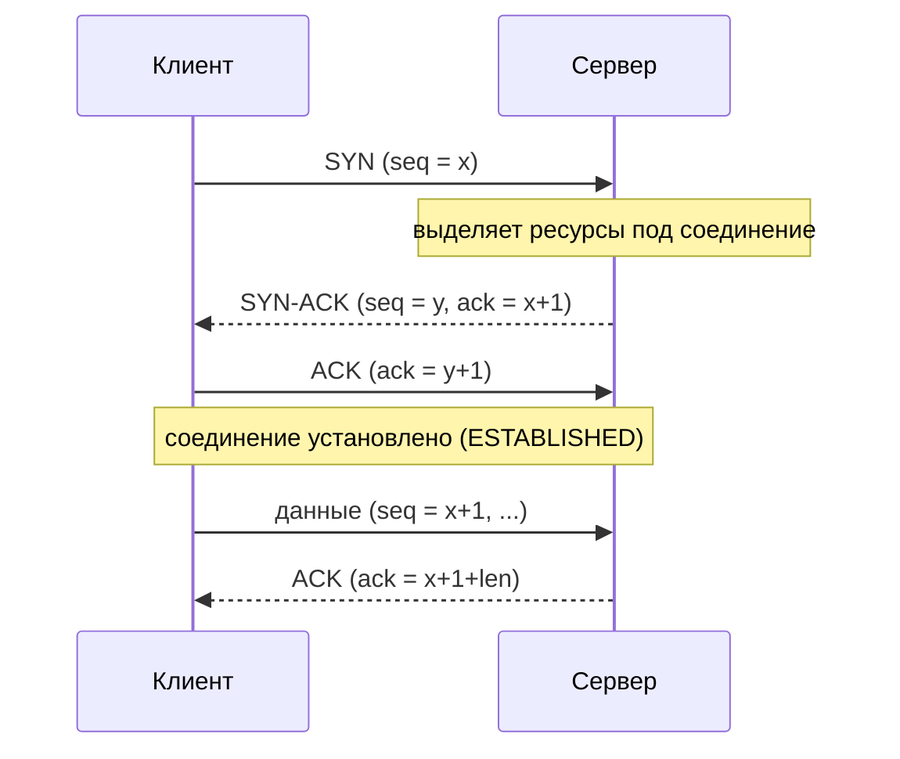
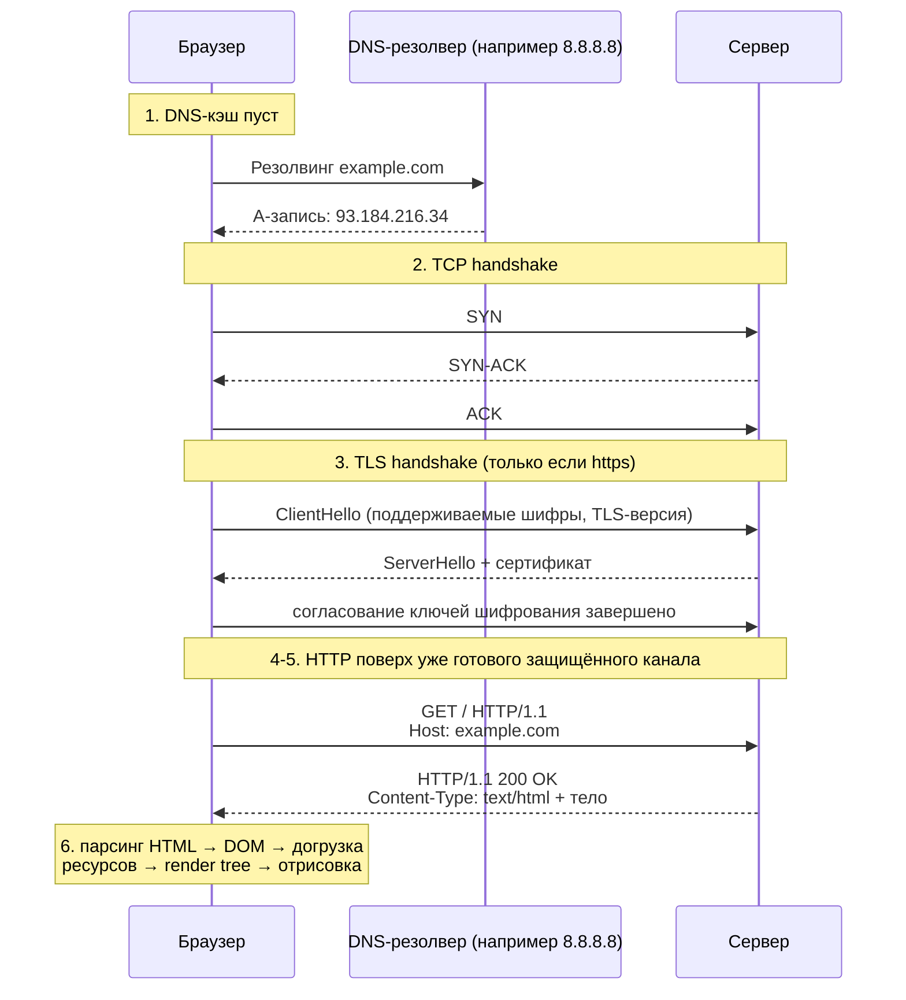

# Основы сетей

## TL;DR
Сетевой стек — то, через что физически проходит любой запрос в распределённой
системе. На собеседовании редко просят объяснить сети «с нуля», но ожидают, что
вы уверенно оперируете терминами TCP/UDP, handshake, DNS и порты, когда
объясняете архитектурные решения — например, почему health-check лучше делать
на TCP, а стриминг метрик — на UDP.

Этот файл — прикладной вход в тему: TCP/UDP, HTTP, DNS, порты, путь запроса
целиком. Он самодостаточен для большинства собеседований. Если нужно понимать
глубже, как физически ходит кадр по свитчу, как маршрутизатор выбирает
следующий узел или зачем нужен VLAN — в этой же папке есть пять файлов
углублённого курса (список — в конце, раздел «Материалы для углублённого
изучения»), которые разворачивают каждый уровень стека по отдельности.

## Ключевые концепции

### Зачем вообще уровни
Сетевое взаимодействие принято описывать не одним монолитным протоколом, а
стопкой независимых уровней, каждый из которых решает свою узкую задачу и не
знает, как устроены соседние. На практике это выглядит так: канальный уровень
доставляет кадр в пределах одного локального сегмента по MAC-адресам; сетевой
(IP) — маршрутизирует пакет между разными сетями по IP-адресам; транспортный
(TCP/UDP) — доставляет данные конкретному процессу через порт и решает, нужна
ли гарантия доставки; прикладной (HTTP, DNS) — придаёт байтам понятный
приложению смысл.

Такое разделение и называют стеком TCP/IP — практическая четырёхуровневая
модель, которой инженеры реально пользуются в разговоре и в проектировании.
Академическая модель OSI режет то же самое на семь более мелких уровней
(например, разносит физическую передачу битов и доставку кадра как два разных
уровня) — она полезна как общий словарь («уровень 3» = сетевой = IP, «уровень
4» = транспортный = TCP/UDP), но в реальном стеке эти семь уровней всё равно
схлопываются в те же четыре. Как устроена OSI по всем семи уровням, что такое
инкапсуляция и зачем нужна стандартизация (IETF/IEEE/ISO) — отдельно и подробно
в `01-switching-and-osi.md`; здесь этого достаточно, чтобы двигаться дальше.

### TCP и UDP
На транспортном уровне две задачи решаются принципиально по-разному. TCP перед
передачей данных сначала устанавливает соединение через three-way handshake:
клиент отправляет `SYN`, сервер отвечает `SYN-ACK`, клиент подтверждает `ACK` —
так обе стороны убеждаются, что канал работает в обе стороны, прежде чем
тратить ресурсы на передачу данных.


`seq` каждой стороны — это её собственная нумерация байтов, стартующая со
случайного начального значения (ISN), а `ack` — это подтверждение "получил
всё до этого байта включительно" по нумерации собеседника; после handshake обе
стороны просто продолжают передавать данные и подтверждать их этими же
номерами.

После этого TCP гарантирует доставку и
порядок байтов за счёт того, что каждый байт пронумерован (sequence number), а
получатель подтверждает (ACK), что и до какого номера он получил, — непризнанные
данные отправитель через некоторое время отправляет повторно. Полный разбор
механизма — состояния соединения, окна, закрытие, и практические тонкости вроде
алгоритма Найгла — в `04-transport-layer.md`.

UDP устроен ровно наоборот: соединение вообще не устанавливается, датаграмма
просто отправляется без гарантии доставки, порядка или дедупликации — либо
доходит целиком, либо теряется, и приложению об этом никак не сообщается. Взамен
— минимальная задержка и минимальные накладные расходы, поэтому UDP выбирают там,
где скорость важнее гарантий: DNS-запросы, стриминг видео и аудио, онлайн-игры, а
в последние годы и современный QUIC — основа HTTP/3, — который построен поверх
UDP, но реализует собственную надёжность уже в userspace, обходя классические
ограничения TCP вроде head-of-line blocking.

### HTTP: модель запрос-ответ
Поверх транспортного уровня работает прикладной протокол HTTP: он работает
поверх TCP (или поверх QUIC для HTTP/3) и добавляет к голому байтовому потоку
понятную структуру запрос-ответ.

Клиент отправляет запрос из трёх частей: стартовой строки (метод, путь, версия
протокола, например `GET /index.html HTTP/1.1`), заголовков (метаданные вида
`Host`, `Content-Type`, `Cookie`) и, опционально, тела запроса (например, JSON в
`POST`). Сервер отвечает симметрично: строкой статуса (версия, код, пояснение,
например `HTTP/1.1 200 OK`), заголовками ответа и, опционально, телом с самими
данными.

Код статуса ответа — не произвольное число: первая цифра сразу говорит, что
произошло. `1xx` — промежуточный информационный ответ (используется редко);
`2xx` — запрос успешно обработан (`200 OK`, `201 Created`); `3xx` — нужно
обратиться в другое место (`301`/`302` redirect); `4xx` — ошибка на стороне
клиента (`404 Not Found`, `401 Unauthorized`); `5xx` — ошибка на стороне сервера
(`500 Internal Server Error`). Этой классификации по первой цифре уже достаточно,
чтобы читать логи и понимать, в какую сторону смотреть при отладке, даже не
помня наизусть все конкретные коды. Подробный разбор методов и заголовков — в
разделе 17; здесь важна сама модель, а не список наизусть.

Ключевое архитектурное свойство HTTP — его stateless-природа: сервер не хранит
между запросами память о том, кто их прислал и что было раньше, в отличие,
например, от самого TCP-соединения, которое состояние как раз держит. Это
осознанное упрощение: благодаря ему любой сервер за балансировщиком может
обработать любой запрос клиента, не деля с другими серверами общее состояние
сессии. Плата за это — если приложению всё же нужна память о клиенте (кто
залогинен, что лежит в корзине), эту память приходится городить поверх
протокола отдельно, через cookies, токены или серверные сессии.

### DNS, порты и сокеты
Чтобы вообще открыть TCP-соединение до сервера, сначала нужно узнать его
IP-адрес — этим занимается DNS: распределённая иерархическая система, которая
переводит доменное имя (`example.com`) в IP-адрес. Резолвинг обычно выполняет
рекурсивный резолвер (у провайдера или, например, `8.8.8.8`), который берёт на
себя всю цепочку обращений: спрашивает корневой сервер → тот отвечает адресом
сервера зоны `.com`/`.ru` → тот отвечает адресом authoritative-сервера
конкретного домена → тот отдаёт финальную запись. С точки зрения самого
резолвера это итеративный обход (он сам ходит по цепочке серверов), а с точки
зрения клиента, который просто ждёт готовый ответ, — рекурсивный запрос.

Среди типов записей чаще всего встречаются `A`/`AAAA` (IPv4/IPv6 адрес), `CNAME`
(алиас на другое имя) и `MX` (почтовый сервер), а параметр `TTL` у записи
определяет, сколько времени результат хранится в кэше — короткий TTL и есть
источник классической проблемы «поменяли IP, а часть клиентов всё ещё бьёт в
старый». Это отдельное поле от TTL у IP-пакета (счётчик хопов через
маршрутизаторы, который защищает сеть от петель маршрутизации) — подробный
разбор IP TTL и того, как маршрутизация вообще устроена, в
`03-network-layer-ip.md`.

Когда IP-адрес уже известен, соединение адресуется не просто по IP, а по сокету
— кортежу `(IP, порт, протокол)`, который однозначно идентифицирует конкретное
соединение. Часть портов закреплена по конвенции за конкретными сервисами
(well-known порты): 80 и 443 — HTTP/HTTPS, 22 — SSH, 5432 — PostgreSQL, 6379 —
Redis, 9092 — Kafka; клиентская сторона обычно использует случайный
«эфемерный» порт из динамического диапазона.

## Как это работает "под капотом"
Путь от ввода URL до отрисовки страницы (частый вопрос на собеседовании,
разберём по шагам):
1. Браузер парсит URL, проверяет DNS-кэш; если пусто — идёт DNS-резолвинг (см. выше).
2. Открывается TCP-соединение до полученного IP (three-way handshake).
3. Если `https://` — поверх TCP выполняется TLS-handshake (обмен сертификатами,
   согласование ключей шифрования; подробнее — раздел 21).
4. Браузер отправляет HTTP-запрос (заголовки, метод, путь).
5. Сервер обрабатывает запрос и возвращает HTTP-ответ.
6. Браузер парсит HTML, строит DOM, параллельно догружает CSS/JS/картинки (часто
   новые TCP/TLS-соединения или переиспользование через HTTP keep-alive/HTTP-2
   мультиплексирование), строит render tree и отрисовывает страницу.


Шаги 1-5 на диаграмме — это ровно то же самое, что видно во flag `-v` у `curl`
в «Примерах» ниже: сначала TCP-рукопожатие, потом (если https) TLS — с теми же
`ClientHello`/`ServerHello`, что и в реальном выводе curl, — и только
потом сам HTTP-запрос и ответ.

## Примеры
```bash
dig +trace example.com
```
Пример вывода (сокращённо):
```
.            518400  IN  NS   a.root-servers.net.
com.         172800  IN  NS   a.gtld-servers.net.
example.com. 86400   IN  NS   a.iana-servers.net.
example.com. 86400   IN  A    93.184.216.34
```
Каждая строка — шаг делегирования из цепочки резолвинга, о которой шла речь
выше: сначала корневой сервер отвечает, кто обслуживает зону `.com`, затем
сервер зоны `.com` отвечает, кто обслуживает конкретно `example.com`, и только
последняя строка — реальный `A`-адрес, ради которого всё это затевалось.

```bash
curl -v https://example.com
```
Пример вывода (сокращённо):
```
* Connected to example.com (93.184.216.34) port 443
* TLS handshake, Client hello (1):
* TLS handshake, Server hello (1):
> GET / HTTP/1.1
> Host: example.com
< HTTP/1.1 200 OK
< Content-Type: text/html
```
Флаг `-v` показывает ровно ту последовательность, что описана в разборе «под
капотом»: сначала TCP-соединение, затем TLS handshake (строки `TLS handshake`),
и только потом сам HTTP-запрос (`>`) и ответ сервера (`<`).

```bash
ss -tnp
```
Пример вывода:
```
State  Recv-Q  Send-Q  Local Address:Port   Peer Address:Port    Process
ESTAB  0       0       10.0.0.5:51342       93.184.216.34:443    curl,pid=1234
```
Локальный порт (`51342`) — тот самый случайный "эфемерный" порт со стороны
клиента, а `443` на удалённой стороне — well-known порт HTTPS: наглядно видно,
что сокет — это пара `(IP, порт)` с каждой стороны, а не просто IP-адрес.

## Частые вопросы на собеседовании
**Q: Чем отличается TCP от UDP?**
A: TCP устанавливает соединение (handshake), гарантирует доставку и порядок
байтов, управляет скоростью через flow/congestion control — ценой
дополнительной задержки и накладных расходов. UDP отправляет пакеты без
соединения и без гарантий — быстрее и дешевле, но приложение само должно
заботиться о надёжности, если она нужна. Выбор зависит от того, что дороже:
потерять данные или потерять время (стриминг и игры — время дороже; банковская
транзакция — данные дороже).

**Q: Что происходит с момента ввода URL в браузере до отрисовки страницы?**
A: DNS-резолвинг → TCP handshake → (TLS handshake, если HTTPS) → отправка
HTTP-запроса → обработка на сервере → HTTP-ответ → парсинг HTML/построение DOM
→ догрузка ресурсов → построение render tree → отрисовка. См. разбор по шагам
выше.

**Q: Зачем TCP-рукопожатию нужны именно три шага, а не два?**
A: Два шага подтвердили бы канал только в одну сторону. Третий `ACK` от клиента
подтверждает серверу, что клиент действительно получил `SYN-ACK` и канал
работает в обе стороны — иначе сервер мог бы начать выделять ресурсы на
соединение, которое клиент никогда не завершит (в чём и состоит атака SYN
flood).

## Ловушки и частые ошибки
Частая ошибка — считать, что раз UDP «ненадёжен», значит он в принципе не
подходит для важных данных. Это не так: современный QUIC/HTTP-3 построен именно
на UDP, но реализует собственную надёжность и порядок доставки поверх него,
обходя классические ограничения TCP.

Ещё одно заблуждение — думать, что TCP гарантирует доставку данных до
пользователя приложения. На самом деле TCP гарантирует доставку байтов только в
рамках соединения между сокетами, а не то, что приложение на сервере
действительно обработало запрос: это уже отдельный уровень ответственности, для
которого нужны свои application-level ack/retry и идемпотентность (см. раздел
18 про гарантии доставки в Kafka).

Наконец, часто путают TTL DNS-записи и TTL IP-пакета — это два разных поля с
похожим названием и разной ролью: первое живёт в кэше резолвера и определяет
свежесть записи, второе — счётчик хопов внутри самого пакета и защищает сеть от
петель маршрутизации. Подробнее про IP TTL — в `03-network-layer-ip.md`.

## Материалы для углублённого изучения
Этот файл покрывает то, что спрашивают на senior-собеседовании по Java «в
среднем». Если нужно понимать сети глубже — как реально ходит кадр по
коммутатору, как ARP находит MAC-адрес, как маршрутизатор выбирает следующий
хоп, что такое VLAN и зачем нужен PMTUD, — в этой же папке есть отдельный
мини-курс, устроенный так же линейно, как этот файл: каждый следующий файл
опирается на предыдущий.

1. [Коммутация каналов, OSI, инкапсуляция](01-switching-and-osi.md) — почему
   сеть построена на пакетах, а не на выделенных каналах, и как устроена полная
   7-уровневая модель OSI.
2. [Ethernet и канальный уровень](02-ethernet-data-link.md) — как выглядит
   реальный кадр, чем хаб отличается от свитча.
3. [Сетевой уровень и IP](03-network-layer-ip.md) — IP-адреса, ARP,
   маршрутизация, NAT, IPv6.
4. [Транспортный уровень](04-transport-layer.md) — TCP изнутри: тонкости вроде
   алгоритма Найгла и window scaling, плюс ICMP.
5. [VLAN, VPN, DHCP и другие продвинутые темы](05-advanced-topics.md).

## Связанные темы
- [Как устроен компьютер и ОС](../01-os-basics.md) — сокеты и системные вызовы,
  через которые TCP/UDP выглядят с точки зрения ОС.
- [HTTP и REST](../../17-rest-api/01-http-basics.md) — прикладной протокол
  поверх TCP.
- [TLS handshake](../../21-security/tls-handshake.md) — что добавляется поверх
  TCP handshake для HTTPS.

## Источники
- RFC 793 — TCP
- RFC 1035 — DNS
- RFC 9110 — HTTP Semantics (методы, статус-коды, заголовки)
- MDN: "What happens when you navigate to a URL"
