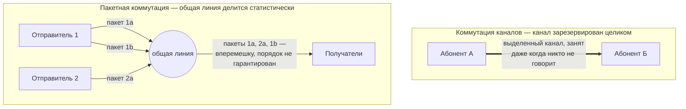
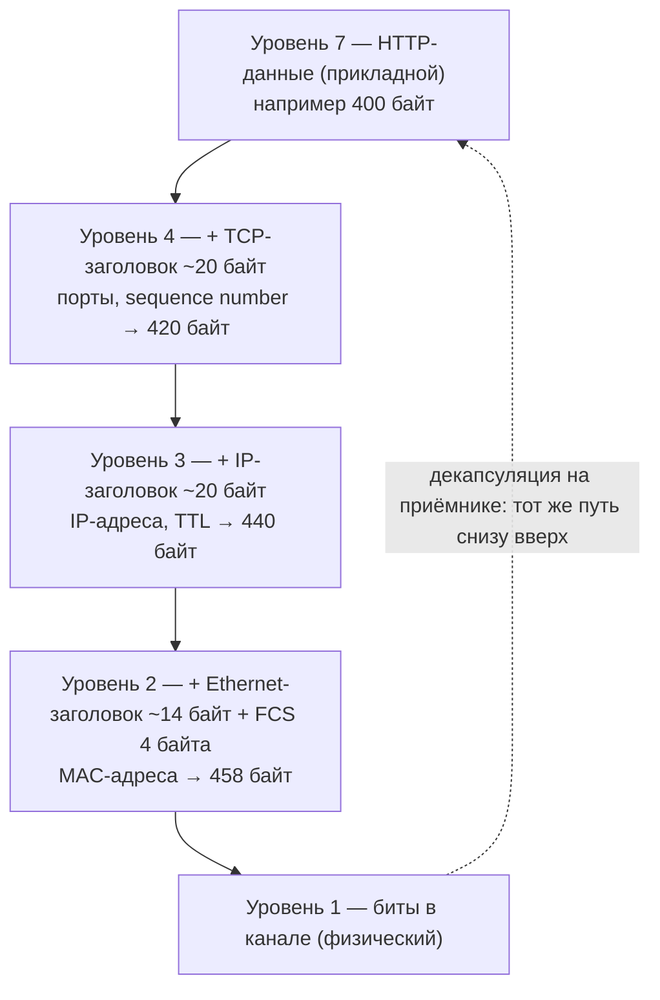

# Коммутация каналов, пакетная коммутация и модель OSI

## TL;DR
Это первый файл углублённого курса (`00-index.md` — короткий практический
обзор, здесь — фундамент под ним). Тема — два решения, которые определили
архитектуру всего интернета: почему сеть построена на пакетах, а не на
выделенных каналах, и почему передачу данных принято резать на уровни. Это не
абстрактная теория — от неё напрямую зависит, почему TCP умеет справляться с
перегрузкой сети, а телефонная сеть прошлого века — нет, и почему у Ethernet,
IP и HTTP можно менять реализацию независимо друг от друга.

## Ключевые концепции

### Коммутация каналов и пакетная коммутация
Есть два принципиально разных способа передать данные между двумя точками через
общую сеть. Коммутация каналов (circuit switching) — классический подход
телефонных сетей: перед разговором на всём пути от абонента к абоненту
резервируется выделенный канал фиксированной пропускной способности, который
принадлежит только этому соединению на всё время разговора. Гарантия простая: раз
канал зарезервирован, задержка и пропускная способность предсказуемы и не зависят
от того, сколько ещё разговоров идёт рядом — но плата за предсказуемость высокая:
если в канале никто не говорит (пауза в разговоре), пропускная способность всё
равно простаивает и не может быть использована для чего-то другого.

Пакетная коммутация (packet switching) — то, на чём построен весь современный
интернет, — устроена иначе: данные режутся на пакеты, и каждый пакет
самостоятельно путешествует по сети, разделяя одни и те же физические каналы с
пакетами других соединений. Никакого выделенного канала никому не принадлежит —
линии связи используются статистически, по мере необходимости. Это даёт куда более
эффективное использование пропускной способности (простой одного соединения не
тратит ресурсы впустую — их тут же займут пакеты другого), но взамен теряется
гарантия: задержка отдельного пакета становится непредсказуемой (jitter) и
зависит от того, сколько других пакетов сейчас конкурирует за тот же канал.


На верхней схеме канал занят даже в паузах разговора — никто другой им
воспользоваться не может. На нижней — два независимых отправителя делят одну и
ту же линию, их пакеты физически перемешиваются в общем потоке, и именно из-за
этого порядок и задержка отдельного пакета непредсказуемы.

Именно из-за этого компромисса транспортному уровню приходится самому
разбираться с перегрузкой сети — сеть с пакетной коммутацией никак не защищает
отправителя от неё сама по себе. TCP решает эту задачу через congestion control
(подробный механизм — в `04-transport-layer.md`); у коммутации каналов такой
проблемы в принципе не возникает, потому что канал зарезервирован заранее и ни с
кем не делится.

### Характеристики каналов передачи данных
У любого физического канала связи (медный кабель, оптоволокно, радиоэфир) есть
несколько характеристик, которые определяют, что вообще можно через него
передать, и они регулярно путаются между собой. Пропускная способность
(bandwidth) — сколько бит в секунду канал способен нести физически. Задержка
распространения (propagation delay) — сколько времени сигнал физически идёт по
каналу: она ограничена скоростью света в среде и расстоянием и никаким
увеличением пропускной способности не уменьшается.

Отдельно стоит задержка передачи (transmission delay) — время, которое требуется,
чтобы протолкнуть весь пакет в канал побитно; она зависит от размера пакета и
пропускной способности, а не от расстояния. Смешивать пропускную способность с
задержкой — частая ошибка: канал с огромной пропускной способностью (например,
спутниковый интернет) может при этом иметь очень высокую задержку распространения
(сигнал физически летит до спутника и обратно) — большой «трубопровод», но с
долгим временем в пути для каждого конкретного байта.

Дуплексность канала определяет, может ли он передавать в обе стороны одновременно
(full-duplex, как современный Ethernet) или только по очереди (half-duplex, как
исторический Ethernet на общей шине — подробнее в `02-ethernet-data-link.md`).
Реальные каналы никогда не идеальны: есть затухание сигнала (attenuation) с
расстоянием и шум (noise), из-за которых часть битов может исказиться при
передаче — это определяет BER (bit error rate) канала и то, насколько часто
верхним уровням (например, TCP) приходится обнаруживать и перезапрашивать
потерянные или испорченные данные.

### Модель OSI: семь уровней
Раз данные всё равно проходят через несколько принципиально разных задач —
доставку сигнала, доставку кадра внутри сегмента, маршрутизацию между сетями,
доставку конкретному процессу, — эти задачи разумно решать отдельно друг от
друга, а не одним монолитным протоколом. Модель OSI (Open Systems
Interconnection) — эталонная архитектура, которая формализует это разделение на
семь уровней:

| № | Уровень | Что делает | Примеры |
|---|---|---|---|
| 7 | Прикладной | То, с чем напрямую работает приложение | HTTP, DNS, SMTP, gRPC |
| 6 | Представления | Кодирование, сжатие, шифрование данных | TLS (формально), сериализация |
| 5 | Сеансовый | Установление/поддержание/завершение сеанса взаимодействия | на практике редко выделяется отдельно |
| 4 | Транспортный | Доставка данных между процессами на хостах: порты, надёжность, порядок | TCP, UDP |
| 3 | Сетевой | Маршрутизация пакетов между разными сетями по IP-адресам | IP, маршрутизаторы |
| 2 | Канальный | Доставка кадров (frames) в пределах одного локального сегмента сети по MAC-адресам | Ethernet, Wi-Fi (802.11), коммутаторы |
| 1 | Физический | Передача битов по физической среде — напряжение на проводе, свет в оптике, радиоволна | кабель Ethernet, Wi-Fi, оптоволокно |

Уровни принято нумеровать снизу вверх (физический — первый, прикладной —
седьмой), но в разговоре чаще всего идут сверху вниз, от того, что видит
приложение, к тому, что реально бежит по проводу. На практике инженеры почти
всегда мыслят более грубой моделью TCP/IP из четырёх уровней (канальный →
сетевой → транспортный → прикладной), которая объединяет уровни 5–7 OSI в один
прикладной (реальные протоколы вроде HTTP или TLS сами решают вопросы сессий и
представления данных — отдельный уровень для этого не нужен), а уровни 1–2 — в
один канальный. Именно эта модель используется в реальном проектировании; OSI
держат в голове скорее как общий словарь номеров уровней, чем как буквальную
архитектуру стека — семь уровней нигде не реализованы как семь отдельных
программных модулей, это ориентир для разговора, а не точная карта кода.

### Инкапсуляция
Главная практическая идея OSI — не сама нумерация, а инкапсуляция: каждый
уровень получает данные от уровня выше, добавляет к ним собственный заголовок (а
иногда и трейлер) с информацией, нужной именно этому уровню, и передаёт результат
уровню ниже — уже не заботясь о содержимом того, что упаковал. На приёмной
стороне происходит обратный процесс — декапсуляция: каждый уровень снимает свой
заголовок, проверяет его (например, TCP проверяет контрольную сумму и номер
последовательности) и отдаёт содержимое уровню выше. Ни один уровень не обязан
понимать заголовки соседних уровней — TCP ничего не знает про MAC-адреса, а
Ethernet ничего не знает про порты, и именно это позволяет менять любой уровень
стека независимо от остальных.

Конкретно данные HTTP-запроса на пути к сети проходят так: прикладные данные
оборачиваются в TCP-сегмент (заголовок с портами и sequence number) — тот в
IP-пакет (заголовок с IP-адресами и TTL) — тот в Ethernet-кадр (заголовок с
MAC-адресами) — и только этот кадр реально превращается в биты на физическом
канале.


Каждая стрелка вниз — это ровно один уровень OSI, добавляющий свой заголовок
(а у Ethernet ещё и трейлер — FCS в конце) поверх того, что пришло сверху;
итоговые байты нарастают, а не остаются прежними — заголовки не бесплатны,
именно поэтому у MSS в TCP есть верхняя граница, зависящая от MTU канала
(`04-transport-layer.md`). Декапсуляция на приёмной стороне (пунктирная
стрелка) — тот же процесс, но снизу вверх: каждый уровень снимает свой
заголовок и отдаёт содержимое выше. Именно эту вложенность видно, когда
открываешь захваченный пакет в Wireshark — подробный разбор реального
Ethernet-кадра в `02-ethernet-data-link.md`, а разбор того, что происходит на
IP- и TCP-уровнях конкретно, — в `03-network-layer-ip.md` и
`04-transport-layer.md`.

### Сетевые стандарты
Чтобы оборудование и софт разных производителей вообще могли договориться друг с
другом, нужны открытые стандарты — иначе каждый вендор изобретал бы свой
несовместимый протокол. За разными уровнями стека исторически закрепились разные
организации. IETF (Internet Engineering Task Force) отвечает за протоколы самого
интернета — TCP, IP, HTTP, DNS и большинство остального прикладного и
транспортного уровня — и публикует их в виде документов RFC (Request for
Comments), на которые до сих пор ссылаются как на первоисточник («см. RFC 793» —
это буквально официальная спецификация TCP).

IEEE отвечает за стандарты канального и физического уровня — семейство 802.x,
откуда и Ethernet (802.3), и Wi-Fi (802.11). ISO — за саму модель OSI как
эталонную архитектуру, о которой шла речь выше. А организации вроде IANA/ICANN
занимаются распределением ресурсов — IP-адресов, доменных имён, номеров портов —
чтобы два разных сервиса в интернете случайно не претендовали на один и тот же
адрес.

## Как это работает "под капотом"
Инкапсуляция данных при отправке HTTP-запроса, слой за слоем (сверху вниз):
1. Приложение формирует HTTP-запрос (прикладной уровень) — просто текст/байты.
2. TCP оборачивает его в сегмент: добавляет заголовок с портом отправителя,
   портом получателя и номером последовательности.
3. IP оборачивает TCP-сегмент в пакет: добавляет заголовок с IP-адресом
   отправителя, IP-адресом получателя и TTL.
4. Ethernet оборачивает IP-пакет в кадр: добавляет заголовок с MAC-адресом
   отправителя и MAC-адресом получателя (или ближайшего маршрутизатора).
5. Физический уровень превращает кадр в последовательность электрических
   сигналов/световых импульсов/радиоволн и отправляет в канал.

На приёмной стороне (и на каждом промежуточном маршрутизаторе, но лишь до
нужного уровня) происходит обратный процесс — декапсуляция снизу вверх, до тех
пор, пока исходные данные не окажутся у приложения-получателя.

## Примеры
Условная схема вложенности данных, которую видно в Wireshark при захвате
обычного HTTP-запроса (детальный разбор реального кадра — в
`02-ethernet-data-link.md`):
```
Ethernet Frame
  └─ IP Packet (заголовок: src/dst IP, TTL, protocol=TCP)
       └─ TCP Segment (заголовок: src/dst порт, seq, ack, флаги)
            └─ HTTP Data ("GET / HTTP/1.1\r\nHost: example.com\r\n...")
```
Каждый уровень вложенности — это ровно один шаг инкапсуляции: снаружи — то, что
добавил канальный уровень последним, внутри — исходные прикладные данные,
завёрнутые как в матрёшку. Именно в таком порядке — снаружи внутрь — Wireshark и
разворачивает захваченный пакет на экране.

## Частые вопросы на собеседовании
**Q: Чем принципиально отличается коммутация каналов от коммутации пакетов?**
A: При коммутации каналов на весь сеанс резервируется выделенный канал —
задержка и пропускная способность гарантированы, но неиспользуемая пропускная
способность простаивает впустую. При коммутации пакетов данные режутся на
пакеты, которые статистически разделяют общие каналы с пакетами других
соединений — эффективнее по использованию сети, но без гарантий задержки:
задержка отдельного пакета зависит от текущей загрузки сети.

**Q: Что такое инкапсуляция и зачем каждый уровень добавляет свой заголовок?**
A: Инкапсуляция — процесс, при котором каждый уровень стека оборачивает данные,
полученные от уровня выше, в собственный заголовок с информацией, нужной именно
этому уровню (порты у TCP, IP-адреса у IP, MAC-адреса у Ethernet). Это позволяет
уровням оставаться независимыми: TCP не обязан ничего знать про Ethernet, а
Ethernet — про содержимое TCP-сегмента, что даёт возможность независимо менять
любой уровень стека, не трогая остальные.

**Q: Модель OSI — это то, как реально устроен код сетевого стека?**
A: Нет, это эталонная модель для разговора и обучения, а не точная карта
реализации. Реальный стек TCP/IP сворачивает семь уровней OSI в четыре —
например, TLS и HTTP на практике сами решают то, что формально относится к
представительскому и сеансовому уровням OSI, без отдельного программного модуля
под каждый из них.

## Ловушки и частые ошибки
Частая ошибка — путать пропускную способность канала с задержкой, считая, что
«быстрый интернет» одинаково означает и высокую пропускную способность, и
низкую задержку. Это два независимых параметра: спутниковый канал может иметь
огромную пропускную способность и при этом заметную задержку из-за физического
расстояния до спутника и обратно — оптимизация одного параметра не улучшает
другой.

Другое частое заблуждение — думать, что семь уровней OSI буквально реализованы
как семь отдельных программных модулей в любой реальной системе. На практике
настоящий стек сворачивает несколько уровней OSI в один — например, TCP
одновременно закрывает часть задач транспортного уровня и по факту берёт на себя
часть того, что формально относится к сеансовому уровню. OSI — удобный словарь
для разговора, а не точная карта реального кода.

## Связанные темы
- [Основы сетей — обзор](00-index.md) — практический вход в тему: TCP/UDP,
  HTTP, DNS без глубокого разбора уровней.
- [Ethernet и канальный уровень](02-ethernet-data-link.md) — что конкретно
  происходит на канальном уровне и как выглядит реальный кадр.
- [Как устроен компьютер и ОС](../01-os-basics.md) — syscall как аналогичная
  граница между уровнями абстракции, только внутри одной машины.

## Источники
- ISO/IEC 7498-1 — эталонная модель OSI
- RFC 1122 — Requirements for Internet Hosts (архитектура стека TCP/IP)
