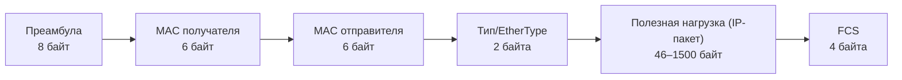
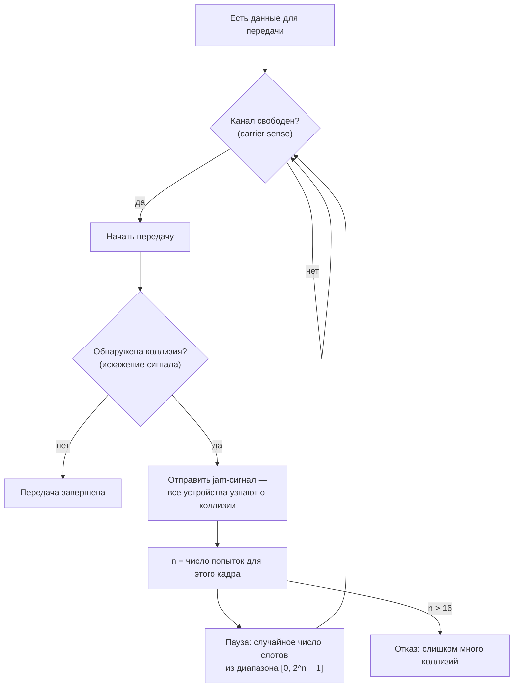
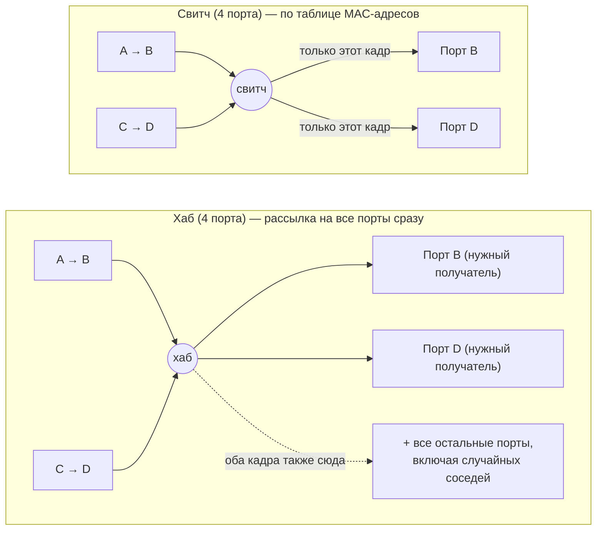

# Ethernet и канальный уровень

## TL;DR
Второй файл углублённого курса (после `01-switching-and-osi.md`, где были общая
модель уровней и инкапсуляция) — конкретика самого нижнего уровня из тех, что
реально видно в проводе: канальный уровень отвечает за доставку данных внутри
одного локального сегмента сети, до того как в игру вступает маршрутизация.
Разница между хабом и свитчем, что такое коллизионный и broadcast-домен — тот
минимум, без которого не объяснить, почему плоская сеть на Ethernet не
масштабируется и зачем в принципе нужны VLAN и маршрутизация — до этого дойдём
в следующих файлах (`03-network-layer-ip.md`, `05-advanced-topics.md`).

## Ключевые концепции

### Ethernet и CSMA/CD
Ethernet-кадр — единица передачи данных канального уровня — устроен как
последовательность полей: преамбула (синхронизация приёмника), MAC-адрес
получателя, MAC-адрес отправителя, поле типа (какой протокол внутри — обычно IP),
полезная нагрузка (сам IP-пакет) и контрольная сумма (FCS) в конце для проверки
целостности.


Размер полезной нагрузки не произволен: минимум 46 байт нужен, чтобы кадр
целиком успел дойти до самого дальнего устройства сегмента раньше, чем
отправитель закончит передачу (иначе коллизию можно не успеть обнаружить), а
максимум 1500 байт — это и есть тот самый MTU классического Ethernet, который
ограничивает MSS у TCP (`04-transport-layer.md`). Итоговый кадр целиком —
от 64 до 1518 байт без преамбулы.

MAC-адрес — это 48-битный идентификатор, зашитый в сетевую карту: первая
половина обозначает производителя оборудования (OUI), вторая — уникальна для
конкретного устройства; есть и специальный широковещательный адрес
`ff:ff:ff:ff:ff:ff`, который получают все устройства сегмента одновременно.

Исторически, когда несколько устройств подключались к одному физическому
кабелю (общая шина или хаб, см. ниже), все они делили одну и ту же среду
передачи — и если два устройства начинали передавать одновременно, сигналы
физически накладывались друг на друга и портились (коллизия). Для этого
придумали CSMA/CD (Carrier Sense Multiple Access with Collision Detection):
устройство сначала слушает канал (carrier sense) и передаёт, только если канал
свободен; несколько устройств имеют равное право на доступ (multiple access);
если коллизия всё же произошла (её можно обнаружить по искажению сигнала),
устройства прекращают передачу и повторяют попытку после случайной паузы
(экспоненциальный backoff, чтобы не столкнуться повторно).


Экспоненциальный backoff на схеме — это диапазон `[0, 2^n − 1]`, который растёт
с каждой новой неудачной попыткой (n): после первой коллизии пауза выбирается
из 1 слота, после второй — уже из 4 возможных, и так далее, что резко снижает
шанс повторного столкновения тех же двух устройств. Jam-сигнал — короткий
намеренно искажённый сигнал, который отправляют оба столкнувшихся устройства,
чтобы все остальные участники сегмента тоже поняли, что кадр испорчен, и не
пытались его декодировать. Цикл `B → D → J → N → W → B` на схеме — это именно
то, что вырождается в бессмысленный шаг, когда устройства уже не делят общую
среду: свитч с full-duplex-портами исключает саму возможность коллизии, и эта
ветка никогда не срабатывает.

Сегодня CSMA/CD практически не работает в реальности — не потому что от него
отказались специально, а потому что современные сети построены на коммутаторах
с full-duplex-соединениями «точка-точка» (см. ниже), где физических коллизий
просто не может быть: каждое устройство говорит и слушает по отдельным парам
проводов одновременно. Но исторически и на собеседовании про CSMA/CD спрашивают
именно как про механизм, объясняющий, откуда вообще взялось ограничение "общая
среда — конкуренция за доступ".

### Топологии
Физическая топология описывает, как устройства реально соединены проводами.
Шина (bus) — все устройства подключены к одному общему кабелю (классический
"тонкий" или "толстый" Ethernet 10BASE); проблема в том, что обрыв кабеля в
любом месте рвёт всю сеть, а среда всегда общая — отсюда и нужен CSMA/CD.

Звезда (star) — все устройства соединены отдельными проводами с одним
центральным устройством (хабом или свитчем); это доминирующая топология сегодня,
потому что обрыв одного провода отключает только одно устройство, а не всю сеть.
Кольцо (ring) — каждое устройство соединено с двумя соседями, данные идут по
кругу (Token Ring, FDDI) — сегодня почти не встречается за пределами некоторых
промышленных и провайдерских сетей. Полносвязная топология (mesh) — каждое
устройство напрямую соединено с каждым — даёт максимальную отказоустойчивость
ценой количества связей, которое растёт квадратично от числа узлов, и обычно
используется только в опорных (backbone) сетях, а не на уровне рабочих станций.

### Концентратор и коммутатор
Концентратор (хаб, репитор) — самое простое устройство звездообразной сети:
физически он просто повторяет полученный электрический сигнал на все остальные
порты, ничего не зная про содержимое кадра. Это удобно, но означает, что все
порты хаба делят одну общую среду и один коллизионный домен — если два устройства
передают одновременно, происходит коллизия, ровно как в топологии "шина".

Коммутатор (свитч) устроен принципиально умнее: он читает MAC-адрес получателя
в каждом кадре и решает, на какой конкретно порт его переслать, а не повторяет
на все сразу. Для этого свитч строит и постоянно обновляет таблицу MAC-адресов
(MAC address table) — запоминая, за каким портом видел кадр с каким MAC-адресом
отправителя. Если адрес получателя уже есть в таблице — кадр уходит только на
нужный порт; если адреса ещё нет (устройство ещё "не представилось") или это
широковещательный адрес — кадр рассылается на все порты (flooding), пока свитч
не узнает, где реальный получатель.

Именно это и убирает коллизии: каждый порт свитча — отдельный физический канал
с отдельным устройством, работающий в полном дуплексе (можно одновременно
передавать и принимать), так что конкурировать за среду больше не с кем — каждый
порт сам себе коллизионный домен из одного участника.


Здесь одновременно идут два независимых разговора: A↔B и C↔D. На хабе оба
кадра физически повторяются на все порты сразу — узлы B и D получают чужой для
себя кадр впустую (сетевая карта его просто отбросит по MAC-адресу, но канал
уже занят), а если A и C случайно передадут одновременно, это коллизия на
общей среде. На свитче кадр A→B идёт только на порт B, а C→D — только на порт
D: оба разговора идут параллельно, не мешая друг другу и не рискуя
столкнуться, — именно это и называют полным дуплексом на уровне всей сети, а
не только отдельного порта.

### Масштабируемость технологии канального уровня
У чисто канального уровня (одна большая плоская сеть на свитчах, без
маршрутизации) есть фундаментальный предел роста. Все устройства такой сети
находятся в одном broadcast-домене — широковещательные кадры (например, ARP-запросы,
см. `03-network-layer-ip.md`) долетают до каждого устройства сети, и чем больше
сеть, тем больше становится этого фонового широковещательного трафика,
конкурирующего за пропускную способность с полезными данными.

К этому добавляется ограниченный размер таблицы MAC-адресов на каждом свитче и
отсутствие какой-либо иерархии — в отличие от IP-адресации, MAC-адреса не
группируются по сетям и не поддаются агрегации (summarization), поэтому крупная
плоская сеть заставляет каждый свитч помнить путь к каждому отдельному
устройству, а не к диапазону адресов сразу. Именно поэтому реальные сети не
остаются плоскими: их делят на VLAN (логическая сегментация broadcast-доменов
без лишнего физического оборудования, `05-advanced-topics.md`) и соединяют между
собой маршрутизацией на сетевом уровне (`03-network-layer-ip.md`), а не
продолжают наращивать один гигантский Ethernet-сегмент.

## Примеры
Так может выглядеть таблица MAC-адресов на свитче (`show mac address-table` на
Cisco-подобном оборудовании, или `bridge fdb show` в Linux):
```
VLAN   MAC Address        Port
1      aa:bb:cc:00:01:11  Gi0/1
1      aa:bb:cc:00:02:22  Gi0/2
1      aa:bb:cc:00:03:33  Gi0/3
```
Каждая строка — результат "обучения" свитча: он увидел кадр с этим MAC-адресом в
поле отправителя, пришедший с конкретного порта, и запомнил соответствие. Когда
следующий кадр придёт с этим MAC-адресом получателя, свитч отправит его именно на
этот порт, а не разошлёт на все.

## Частые вопросы на собеседовании
**Q: Чем принципиально отличается хаб от свитча?**
A: Хаб работает на физическом уровне и просто повторяет электрический сигнал на
все порты, не понимая содержимого кадра — все его порты образуют один общий
коллизионный домен. Свитч работает на канальном уровне, читает MAC-адрес
получателя и пересылает кадр только на нужный порт, опираясь на таблицу
MAC-адресов, — благодаря этому каждый порт свитча становится отдельным
коллизионным доменом, а сеть в целом работает быстрее и надёжнее.

**Q: Что такое коллизионный домен и broadcast-домен и чем они отличаются?**
A: Коллизионный домен — группа устройств, чьи передачи могут физически
столкнуться друг с другом (актуально для общей среды — хаба или старой шины);
свитч разбивает сеть на отдельные коллизионные домены по числу портов.
Broadcast-домен — группа устройств, до которых долетает широковещательный кадр;
свитчи broadcast-домен не разбивают (широковещательный кадр уходит на все порты
свитча) — для этого нужны VLAN или маршрутизация.

**Q: Зачем вообще нужен был CSMA/CD, если сегодня почти everywhere full-duplex?**
A: CSMA/CD был необходим, когда несколько устройств физически делили одну общую
среду передачи (шина или хаб) и коллизии были реальностью. С переходом на
свитчи и full-duplex-соединения «точка-точка» каждое устройство получило
собственный выделенный канал приёма и передачи, и физическая коллизия стала
невозможна — поэтому в современных сетях CSMA/CD фактически не задействован,
хотя формально остаётся частью стандарта Ethernet.

## Ловушки и частые ошибки
Частая ошибка — считать хаб просто "устаревшим свитчем", то есть той же
функции, но похуже. На самом деле это устройства разных уровней OSI: хаб не
принимает никаких решений о пересылке (физический уровень), свитч — принимает
решение на основе MAC-адреса (канальный уровень). Замена хаба на свитч меняет
не скорость, а саму архитектуру сегмента — исчезают коллизии как класс.

Ещё одна ошибка — думать, что свитчи решают проблему масштабируемости сети
целиком. Свитчи убирают коллизии и коллизионные домены, но не трогают
broadcast-домен — большая плоская сеть на одних свитчах всё равно тонет в
широковещательном трафике при росте, и для реального масштабирования всё равно
нужны VLAN и маршрутизация.

## Связанные темы
- [Основы сетей — обзор](00-index.md)
- [Коммутация каналов, OSI, инкапсуляция](01-switching-and-osi.md) — как Ethernet-кадр
  укладывается в общую картину инкапсуляции.
- [Сетевой уровень и IP](03-network-layer-ip.md) — как ARP находит MAC-адрес по
  IP-адресу и что происходит, когда получатель не в этом же сегменте.
- [VLAN, VPN, DHCP и другие продвинутые темы](05-advanced-topics.md) — как
  сегментировать broadcast-домен без нового физического оборудования.

## Источники
- IEEE 802.3 — стандарт Ethernet
- IEEE 802.1D — стандарт работы коммутаторов (bridging)
