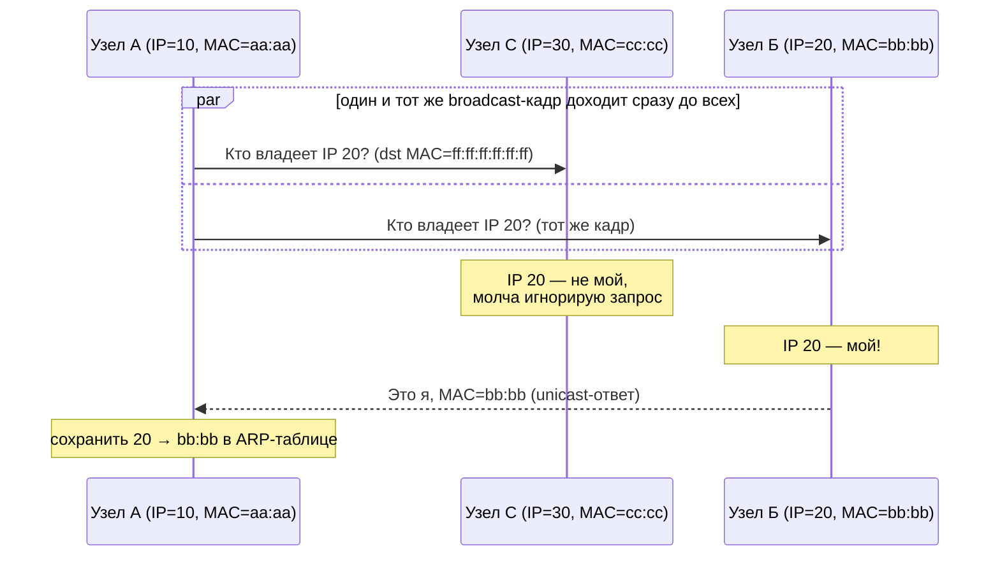
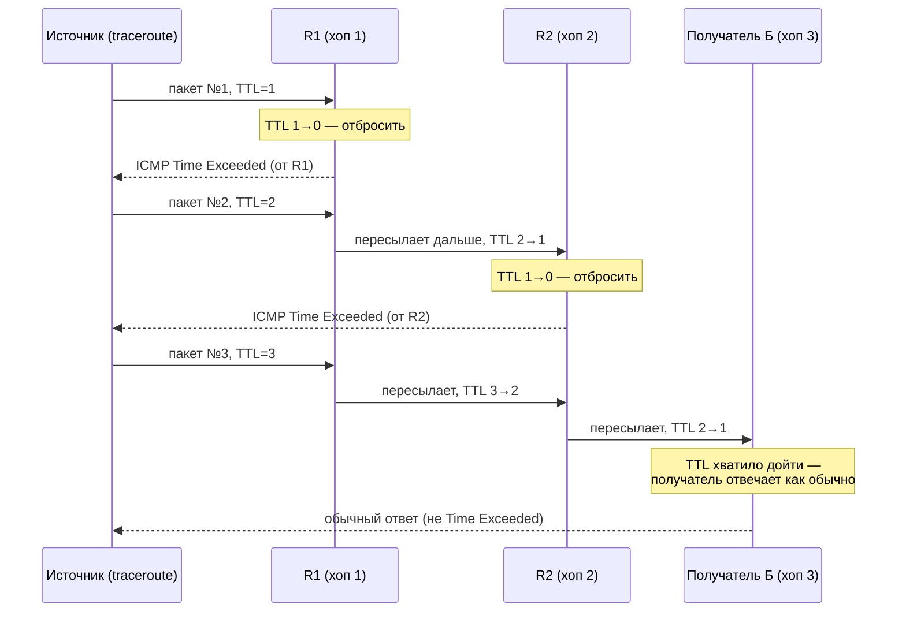
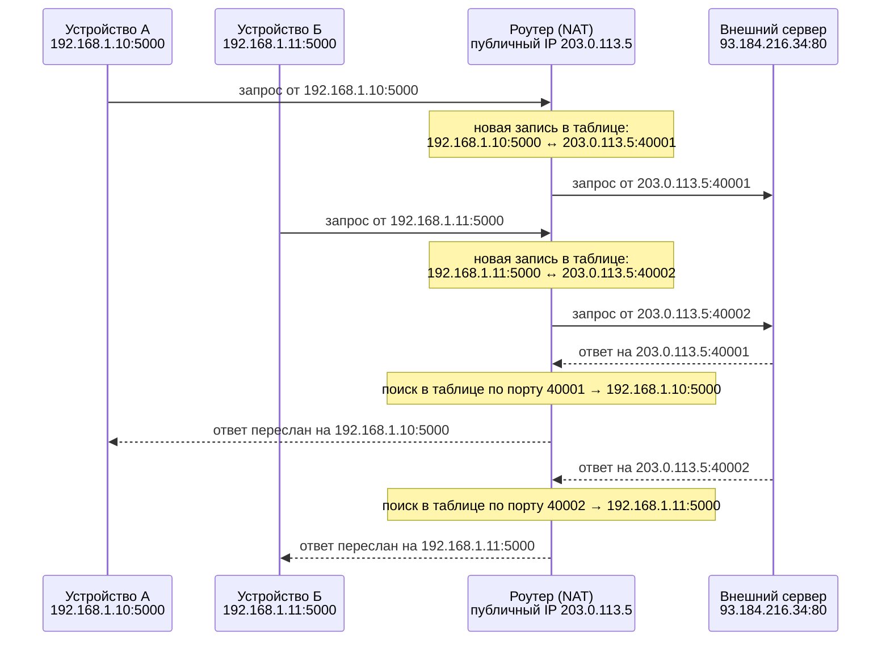
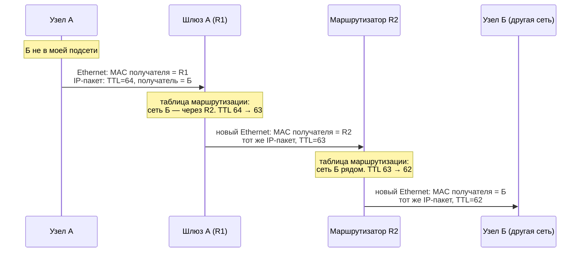

# Сетевой уровень и IP

## TL;DR
Третий файл углублённого курса. Канальный уровень (`02-ethernet-data-link.md`)
умеет доставить кадр только внутри одного сегмента сети — дальше начинается
сетевой уровень, чья единственная задача доставить пакет от отправителя к
получателю, даже если между ними десятки промежуточных сетей и маршрутизаторов.
Без понимания того, что такое IP-адрес, как ARP находит MAC-адрес по IP-адресу
и как работает маршрутизация, не получится объяснить NAT, VPN
(`05-advanced-topics.md`) или почему вообще существует разница между «IP этого
компьютера» и «IP роутера».

## Ключевые концепции

### IP-адреса
IP-адрес — это логический адрес, который идентифицирует устройство в сети на
сетевом уровне, в отличие от MAC-адреса, который зашит в сетевую карту и
идентифицирует её на канальном уровне. Ключевое отличие в том, что MAC-адрес
неизменен и ничего не говорит о местоположении устройства, а IP-адрес — наоборот,
иерархический: часть адреса обозначает сеть, часть — конкретный узел внутри неё,
и именно поэтому по IP-адресу можно проложить маршрут, а по MAC-адресу — нет.

IPv4-адрес — это 32-битное число, которое принято записывать в виде четырёх байтов
через точку (например `192.168.1.10`) — так называемая dotted-decimal нотация.
Маска подсети (subnet mask, например `255.255.255.0`, или её CIDR-запись `/24`)
определяет, где в этом 32-битном числе заканчивается часть "сеть" и начинается
часть "узел": единичные биты маски — это сеть, нулевые — это диапазон адресов
узлов внутри неё.

Два адреса в одной подсети всегда особенные и не могут быть выданы конкретному
устройству. Адрес сети (network address) — это адрес с нулевыми битами узла
(для `192.168.1.0/24` — это `192.168.1.0`), он обозначает саму подсеть как единое
целое. Широковещательный адрес (broadcast address) — адрес с единичными битами
узла (`192.168.1.255` для той же подсети) — пакет, отправленный на него, получают
все узлы этой подсети одновременно.

### ARP
Когда узел А хочет отправить пакет узлу Б в той же локальной сети, он уже знает
IP-адрес Б (например, из DNS-ответа), но для реальной отправки Ethernet-кадра
(`02-ethernet-data-link.md`) нужен MAC-адрес получателя — а его узел А не знает.
ARP (Address Resolution Protocol) — это протокол, который как раз и решает задачу
"найти MAC-адрес по известному IP-адресу" внутри одного сегмента сети.

Механизм простой: узел А рассылает широковещательный ARP-запрос ("кто владеет
IP-адресом Х, сообщите мне свой MAC-адрес") на весь сегмент — этот кадр получают
абсолютно все устройства сегмента, потому что broadcast-домен канального уровня
это позволяет (`02-ethernet-data-link.md`). Узел с искомым IP-адресом отвечает
уже адресно (unicast) — сообщает свой MAC-адрес. Узел А запоминает пару
"IP → MAC" в своей ARP-таблице (ARP cache) на некоторое время, чтобы не
рассылать широковещательный запрос перед каждым пакетом.


Кадр с запросом физически получают все устройства сегмента (на схеме — и C, и
Б), потому что адрес получателя `ff:ff:ff:ff:ff:ff` broadcast заставляет
канальный уровень доставить его каждому. Но отвечает только тот, чей это
IP-адрес — C просто молча отбрасывает запрос, не тратя на него ничего, кроме
самого факта приёма кадра. Именно широковещательность запроса и адресность
ответа и делают ARP дешёвым в среднем: сам запрос рассылается редко (результат
кэшируется), а ответ уже никого, кроме А, не беспокоит.

### Отправка пакета в другой сегмент сети
Ключевой вопрос: что происходит, если получатель находится не в той же локальной
сети, а где-то за её пределами? Узел не может просто разослать ARP-запрос — тот
не выйдет за пределы broadcast-домена, а значит, устройство из другой сети на
него не ответит.

Для этого у каждого узла в настройках есть шлюз по умолчанию (default gateway) —
IP-адрес маршрутизатора, который и является выходом из локальной сети наружу.
Узел сравнивает IP-адрес получателя и свою маску подсети: если получатель
оказывается вне локальной подсети, узел отправляет пакет не напрямую получателю, а
на MAC-адрес шлюза (который для этого предварительно узнаёт через ARP, как обычный
сосед по сегменту) — но при этом IP-адрес получателя в самом пакете остаётся
прежним, меняется только Ethernet-адресация "на один хоп".

Дальше маршрутизатор, получив кадр, снимает Ethernet-обёртку, смотрит на
IP-адрес получателя внутри пакета и по своей таблице маршрутизации (см. ниже)
решает, куда переслать пакет дальше — возможно, следующему маршрутизатору, опять
через ARP этого следующего сегмента. IP-адрес отправителя и получателя внутри
пакета не меняются на всём пути (если не используется NAT, см. ниже) — меняется
только Ethernet-адресация на каждом отдельном "хопе" (переходе между соседними
устройствами).

### IP-сети и маршрутизация
Разбиение на подсети (subnetting) — это способ поделить большой диапазон
IP-адресов на более мелкие независимые сети, каждая со своим broadcast-доменом.
Это делают по практическим причинам: чтобы ограничить размер broadcast-домена
(`02-ethernet-data-link.md`), логически разделить сеть по департаментам или
физическим офисам, и чтобы можно было агрегировать (суммировать) диапазоны адресов
в таблицах маршрутизации, а не хранить маршрут до каждого отдельного адреса.

Таблица маршрутизации (routing table) — это список правил вида "чтобы попасть в
сеть Х, отправляй пакет через интерфейс/шлюз Y". Маршрутизатор смотрит на
IP-адрес получателя в пакете, ищет в таблице наиболее точное совпадение (longest
prefix match — предпочитается более узкая подсеть, если подходит несколько
записей) и пересылает пакет дальше согласно найденной записи. Если явного
совпадения нет, используется маршрут по умолчанию (default route, `0.0.0.0/0`) —
"если не знаешь точнее, отправь вот сюда".

Таблицы маршрутизации заполняются либо вручную (статическая маршрутизация — годится
для маленьких сетей с редкими изменениями), либо автоматически через протоколы
динамической маршрутизации (например OSPF или BGP — тот самый протокол, который
держит вместе весь интернет), которые обмениваются информацией о доступных сетях
между маршрутизаторами и пересчитывают таблицы при изменениях топологии.

### IP-протокол: заголовок, TTL, фрагментация
У самого IP-пакета есть заголовок с несколькими важными полями: уже знакомые
IP-адрес отправителя и получателя, поле протокола (какой протокол вложен внутрь
— 6 значит TCP, 17 — UDP, 1 — ICMP) и TTL (Time To Live).

TTL — счётчик, который уменьшается на единицу на каждом маршрутизаторе, через
который проходит пакет. Существует он ради одной конкретной проблемы: если
где-то в таблицах маршрутизации есть ошибка и два маршрутизатора отправляют
пакет друг другу по кругу (петля маршрутизации), без TTL такой пакет ходил бы
по этому кругу бесконечно, впустую потребляя пропускную способность. Как только
TTL достигает нуля, маршрутизатор, на котором это произошло, отбрасывает пакет
и отправляет отправителю служебное сообщение ICMP «Time Exceeded» (что такое
ICMP в целом — в `04-transport-layer.md`).

На этом же механизме построена диагностическая утилита `traceroute` — она
показывает полный маршрут пакета к получателю, ни разу не обращаясь напрямую ни
к одному промежуточному маршрутизатору. Идея: сначала отправить пакет с TTL=1
— он погибнет на первом же маршрутизаторе на пути, и тот пришлёт «Time
Exceeded» со своим адресом; затем отправить ещё один пакет с TTL=2 — он
погибнет на втором маршрутизаторе; и так далее, пока пакет наконец не дойдёт до
получателя. Собирая адреса отправителей всех этих ICMP-ответов по порядку,
`traceroute` восстанавливает весь маршрут хоп за хопом — пример реального
вывода см. в «Примерах» ниже.


Три отдельных пакета (не один!) с TTL=1, 2, 3 — вот что на самом деле
происходит за одну команду `traceroute`: каждый следующий пакет проходит на
один хоп дальше предыдущего перед тем, как у него закончится TTL, поэтому
источник последовательно узнаёт адрес каждого маршрутизатора на пути, а на
последнем шаге получает уже не «Time Exceeded», а настоящий ответ от Б —
сигнал, что маршрут пройден целиком.

Отдельная особенность IP — фрагментация. Каждая физическая среда передачи имеет
ограничение на максимальный размер кадра, который она способна передать за раз —
MTU (Maximum Transmission Unit, для классического Ethernet — 1500 байт). Если
IP-пакет больше MTU канала, через который его нужно отправить, маршрутизатор
режет его на несколько более мелких фрагментов, каждый со своим заголовком и
флагами, позволяющими получателю собрать исходный пакет обратно по порядку.

Фрагментация — операция дорогая (требует пересборки на стороне получателя и
теряется целиком, если потерян хотя бы один фрагмент), поэтому современные стеки
стараются её избегать заранее через механизм PMTUD (Path MTU Discovery) —
подробнее в `05-advanced-topics.md`. Про "тонкости" размера сегмента уже на
транспортном уровне (MSS) — в `04-transport-layer.md`.

### NAT
NAT (Network Address Translation) — механизм, который подменяет IP-адреса в
заголовке пакета на пути через маршрутизатор, чаще всего чтобы несколько
устройств с приватными (не маршрутизируемыми в интернете) IP-адресами могли
пользоваться одним публичным IP-адресом наружу. Именно поэтому у вашего домашнего
роутера один "белый" адрес от провайдера, а у каждого устройства дома —
свой адрес из приватного диапазона (`192.168.x.x`, `10.x.x.x`).

Механизм в самом частом варианте (NAPT, или "маскарадинг"): когда пакет от
внутреннего устройства уходит наружу, роутер подменяет исходный (приватный)
IP-адрес и порт отправителя на свой публичный IP и произвольный свободный порт,
и запоминает это соответствие в таблице трансляций. Когда приходит ответ на этот
публичный IP и порт, роутер по таблице трансляций находит, какому внутреннему
устройству и порту это переслать обратно, и подменяет адрес получателя уже в
обратную сторону. Разновидности NAT (full cone, restricted, symmetric и т.д.) —
в `05-advanced-topics.md`.

Ниже — пример с двумя внутренними устройствами (А и Б), которые одновременно
обращаются к одному и тому же внешнему серверу; видно, зачем в таблице
трансляций нужен именно порт, а не только IP-адрес:

Оба устройства для внешнего сервера выглядят как один и тот же IP-адрес
`203.0.113.5` — различить их снаружи невозможно, различие живёт только внутри
таблицы трансляций роутера, и именно поэтому в записи участвует порт: если бы
трансляция шла только по IP, роутер не смог бы понять, ответ для А это или для
Б, когда оба обращаются к одному и тому же серверу одновременно.

### Групповые адреса (Multicast) и IPv6
Обычная адресация IP бывает двух видов: unicast (один отправитель — один
конкретный получатель) и broadcast (один отправитель — все узлы подсети,
как в ARP-запросе выше). Multicast — третий вариант: один отправитель — только
те получатели, которые явно подписались на конкретную multicast-группу (адреса
диапазона `224.0.0.0 – 239.255.255.255` для IPv4), независимо от того, в одной
они подсети или нет. Это используется, например, для потокового видео на много
получателей сразу или для служебных протоколов маршрутизации — так пакет не нужно
дублировать вручную для каждого получателя.

IPv6 — следующее поколение IP-протокола, придуманное прежде всего для решения
проблемы исчерпания адресного пространства IPv4 (32 бита — это чуть больше 4
миллиардов адресов, а устройств в интернете давно больше). Адрес IPv6 — 128 бит,
что даёт астрономически больший запас, и записывается восемью группами по 16 бит
в шестнадцатеричном виде через двоеточие (например
`2001:0db8:85a3:0000:0000:8a2e:0370:7334`, что можно сократить до
`2001:db8:85a3::8a2e:370:7334`, заменив подряд идущие нулевые группы на `::`).
Помимо размера адреса, IPv6 упрощает заголовок пакета (убраны редко нужные поля) и
избавляется от NAT как обязательного элемента — адресов хватает, чтобы каждому
устройству выдать собственный публичный адрес напрямую.

## Как это работает "под капотом"
Путь пакета от узла А к узлу Б в другой сети (упрощённо, без учёта DNS — адрес
Б уже известен):
1. Узел А сравнивает IP-адрес Б со своей подсетью — видит, что Б не в этой
   подсети.
2. Узел А смотрит MAC-адрес своего шлюза по умолчанию в ARP-таблице (или сначала
   рассылает ARP-запрос, если записи ещё нет).
3. Узел А отправляет Ethernet-кадр с MAC-адресом шлюза как получателя, но с
   IP-адресом Б как получателя внутри вложенного IP-пакета.
4. Шлюз получает кадр, снимает Ethernet-обёртку, смотрит IP-адрес Б, ищет
   совпадение в своей таблице маршрутизации.
5. Шлюз оборачивает пакет в новый Ethernet-кадр — уже с MAC-адресом следующего
   маршрутизатора (или самого узла Б, если тот уже в соседней сети) — и
   пересылает дальше.
6. Шаги 4-5 повторяются на каждом промежуточном маршрутизаторе, пока пакет не
   дойдёт до сети, где находится узел Б, — там последний маршрутизатор находит
   MAC-адрес Б через ARP и доставляет кадр напрямую.


На диаграмме видно главное сразу на двух хопах, а не на одном: IP-адрес
получателя внутри пакета (Б) не меняется ни разу за весь путь, меняется
только то, кому адресован очередной Ethernet-кадр — сначала R1, потом R2,
потом самому узлу Б. TTL при этом честно убывает на каждом маршрутизаторе
(64 → 63 → 62) — это тот самый счётчик, на котором построен `traceroute`
(«Примеры» ниже), и реальный путь может состоять не из двух хопов, а из
десятка — схема просто показывает повторяющийся шаг «снял Ethernet →
посмотрел IP → уменьшил TTL → завернул в новый Ethernet» в масштабе.

## Примеры
ARP-таблица на узле (`arp -a` в Windows/Linux) после общения с несколькими
соседями по сети:
```
$ arp -a
Address           HWtype  HWaddress           Iface
192.168.1.1       ether   aa:bb:cc:00:00:01   eth0
192.168.1.42      ether   aa:bb:cc:00:00:2a   eth0
```
Первая строка — это шлюз по умолчанию (обычно `.1` в домашних сетях), вторая —
сосед по локальной сети, с которым недавно было прямое общение. Обе записи
устройство узнало через ARP-запросы и хранит какое-то время, чтобы не спрашивать
заново перед каждым пакетом.

Таблица маршрутизации на Linux-машине (`ip route` или устаревающий `netstat -rn`):
```
$ ip route
default via 192.168.1.1 dev eth0
192.168.1.0/24 dev eth0 proto kernel scope link src 192.168.1.42
```
Вторая строка говорит: "сеть `192.168.1.0/24` доступна напрямую через интерфейс
`eth0`, без промежуточного маршрутизатора" — это локальная подсеть самого узла.
Первая строка — маршрут по умолчанию: всё, что не подошло ни под одно более
точное правило, отправляется на шлюз `192.168.1.1`.

Вывод `traceroute` (или `tracert` в Windows), показывающий маршрут пакета
до получателя хоп за хопом:
```
$ traceroute example.com
 1  192.168.1.1 (192.168.1.1)      1.203 ms
 2  10.20.0.1 (10.20.0.1)          8.771 ms
 3  203.0.113.5 (203.0.113.5)     14.532 ms
 4  93.184.216.34 (93.184.216.34) 15.009 ms
```
Каждая строка — это ровно один хоп, соответствующий одному значению TTL: первая
строка — ответ от домашнего роутера (TTL=1), последняя — от самого получателя
(TTL хватило дойти целиком, поэтому там уже не «Time Exceeded», а обычный
ответ). Время справа — RTT до конкретно этого хопа, что удобно для того, чтобы
увидеть, на каком именно участке пути растёт задержка.

## Частые вопросы на собеседовании
**Q: Зачем нужен ARP, если у узла уже есть IP-адрес получателя?**
A: IP-адрес нужен для маршрутизации на сетевом уровне, но реальная доставка
кадра внутри одного сегмента сети происходит по MAC-адресу на канальном уровне
(`02-ethernet-data-link.md`). ARP как раз и решает задачу "по известному
IP-адресу узнать MAC-адрес получателя внутри той же локальной сети", рассылая
широковещательный запрос и получая адресный ответ.

**Q: Что произойдёт, если у узла нет записи в таблице маршрутизации для адреса
получателя?**
A: Узел (или маршрутизатор) использует маршрут по умолчанию (`0.0.0.0/0`), если
он настроен, — отправляет пакет на шлюз, который либо знает более точный
маршрут, либо сам пересылает его дальше по своему маршруту по умолчанию. Если
маршрута по умолчанию тоже нет, пакет отбрасывается и отправителю обычно
возвращается ICMP-сообщение "destination unreachable".

**Q: В чём разница между NAT и обычной маршрутизацией?**
A: Обычная маршрутизация пересылает пакет дальше, не меняя IP-адреса отправителя
и получателя внутри него — меняется только Ethernet-адресация на каждом хопе.
NAT — это активная подмена самих IP-адресов (и часто портов) в заголовке пакета,
обычно чтобы скрыть несколько приватных адресов за одним публичным, и требует,
чтобы устройство помнило таблицу трансляций для обратных пакетов.

**Q: Как работает `traceroute`, если он не может напрямую опросить каждый
промежуточный маршрутизатор?**
A: Он использует побочный эффект TTL: отправляет пакеты с постепенно
увеличивающимся TTL (1, 2, 3…) — каждый такой пакет умирает ровно на очередном
хопе и присылает обратно ICMP «Time Exceeded» с адресом того маршрутизатора,
где это произошло. Собирая эти ответы по порядку, `traceroute` восстанавливает
весь маршрут, не имея доступа ни к одному промежуточному узлу напрямую.

## Ловушки и частые ошибки
Частая ошибка — путать IP-адрес и MAC-адрес по роли, считая их взаимозаменяемыми
идентификаторами устройства. MAC-адрес привязан к конкретной сетевой карте и не
меняется при переезде устройства в другую сеть, а IP-адрес привязан к месту в
топологии сети и меняется при смене подключения — именно поэтому маршрутизация
строится на IP, а не на MAC: MAC-адреса не группируются по сетям
(`02-ethernet-data-link.md`).

Ещё одно частое заблуждение — думать, что при отправке пакета в другую сеть
IP-адрес получателя в пакете как-то меняется по пути через каждый маршрутизатор,
как это происходит с MAC-адресом. На самом деле IP-адреса отправителя и
получателя остаются неизменными на всём маршруте (кроме случаев NAT) — меняется
только Ethernet-обёртка на каждом отдельном переходе между соседними
устройствами.

## Связанные темы
- [Основы сетей — обзор](00-index.md) — краткая версия DNS/TTL-путаницы и общая
  карта темы.
- [Коммутация каналов, OSI, инкапсуляция](01-switching-and-osi.md) — полная
  таблица уровней OSI и то, как IP-пакет вкладывается в кадр.
- [Ethernet и канальный уровень](02-ethernet-data-link.md) — как выглядит кадр,
  в который в итоге упаковывается IP-пакет для передачи по сегменту.
- [Транспортный уровень](04-transport-layer.md) — как MSS привязан к MTU и что
  происходит выше IP-пакета.
- [VLAN, VPN, DHCP и другие продвинутые темы](05-advanced-topics.md) — PMTUD и
  разновидности NAT подробнее.

## Источники
- RFC 791 — Internet Protocol (IPv4)
- RFC 826 — Address Resolution Protocol (ARP)
- RFC 8200 — Internet Protocol, Version 6 (IPv6)
- RFC 1918 — Address Allocation for Private Internets
