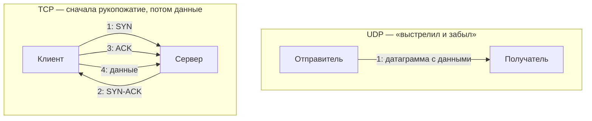
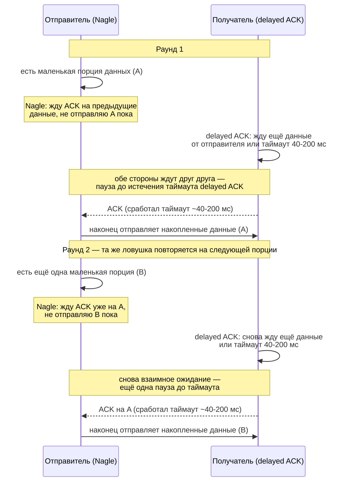

Четвёртый файл углублённого курса. IP (`03-network-layer-ip.md`) умеет доставить
пакет от одной машины к другой, но ничего не знает про приложения —
транспортный уровень добавляет порты (чтобы доставить данные конкретному
процессу на машине) и решает, нужна ли гарантия доставки. Базовая механика TCP
(handshake, close, ACK) уже разобрана в `00-index.md` — здесь она расширяется
до менее очевидных, но регулярно спрашиваемых на собеседовании деталей: чем
принципиально отличается UDP, почему TCP иногда «тормозит» из-за Nagle или
delayed ACK, и что такое ICMP.

## Ключевые концепции

### UDP
#### Что такое UDP
UDP (User Datagram Protocol) — минималистичный транспортный протокол: он
добавляет к данным только порт отправителя, порт получателя, длину и
контрольную сумму — и всё, без какой-либо гарантии доставки, порядка или
контроля перегрузки. Датаграмма UDP либо доходит до получателя целиком, либо
теряется — приложению не сообщается ни то, ни другое, и разбираться с этим
(если нужно) обязано само приложение.

#### UDP vs TCP: время до первого байта данных
Главное практическое отличие от TCP — не в надёжности, а в том, сколько
времени проходит до отправки первого байта полезных данных:

У UDP данные уходят первым же пакетом — задержка до доставки равна одному
проходу по сети (one-way trip). У TCP тот же первый байт данных не может уйти
раньше четвёртого пакета — сначала нужно потратить полтора round-trip'а (SYN →
SYN-ACK → ACK) только на установление соединения. Именно эта разница в 1.5 RTT
"впустую" — а не сама по себе ненадёжность — и есть главная причина, почему
короткие запрос-ответ протоколы вроде DNS по умолчанию выбирают UDP: для
однократного маленького запроса цена рукопожатия оказывается сравнима с ценой
самого запроса или больше неё.

#### Когда выбирают UDP
Это не недостаток, а осознанный компромисс: у UDP почти нулевые накладные
расходы и нет задержки на установление соединения (в отличие от TCP с его
трёхсторонним рукопожатием), поэтому его выбирают там, где важнее скорость и
низкая задержка, чем гарантия каждого байта — потоковое видео и голос (потерянный
кадр за 20 мс лучше пропустить, чем ждать его пересылки), DNS-запросы (короткий
запрос-ответ, где проще повторить весь запрос, чем городить гарантию доставки),
онлайн-игры.

### TCP: базовая механика (кратко)
Полный разбор трёхстороннего рукопожатия, номеров последовательности (seq/ack),
подтверждений и четырёхстороннего закрытия соединения — в `00-index.md`. Здесь —
только то, что нужно как фундамент для следующих разделов: TCP гарантирует
доставку и порядок байтов за счёт того, что каждый байт данных пронумерован
(sequence number), а получатель подтверждает (acknowledgment), что и до какого
номера он получил; непризнанные данные отправитель через некоторое время
отправляет повторно.

### Тонкости работы TCP
TCP не просто "гарантированно доставляет байты" — у него есть ряд оптимизаций и
особенностей поведения, которые на практике сильно влияют на задержку и которые
любят спрашивать на собеседовании отдельно от базового handshake.

#### Алгоритм Найгла (Nagle's algorithm)
Отправка каждого небольшого пакета
данных отдельным TCP-сегментом расточительна — заголовок TCP+IP (около 40 байт)
может оказаться больше самих данных. Алгоритм Найгла накапливает небольшие
порции данных и отправляет их одним сегментом, если ждёт подтверждения на уже
отправленные данные, — это уменьшает число мелких пакетов в сети, но добавляет
задержку, поэтому в задачах, чувствительных к задержке (например, интерактивные
протоколы вроде SSH или realtime-игры), его часто отключают опцией сокета
`TCP_NODELAY`.

#### Отложенное подтверждение (delayed ACK)
Симметричная оптимизация со стороны
получателя: вместо того, чтобы подтверждать каждый полученный сегмент немедленно
отдельным ACK-пакетом, получатель может немного подождать (обычно 40-200 мс) — в
надежде либо получить ещё данные и подтвердить сразу несколько сегментов одним
ACK, либо "приклеить" ACK к своему собственному ответному пакету данных
(piggybacking), сэкономив отдельный пакет.

#### Nagle + delayed ACK: взаимная блокировка
Проблема в том, что Nagle и delayed ACK, включённые одновременно на двух концах
соединения, могут "заклинить" друг друга: отправитель ждёт ACK, чтобы отправить
накопленные данные, а получатель откладывает ACK, ожидая либо новых данных, либо
таймаута — в результате пауза может доходить до сотен миллисечунд на каждый такой
обмен. Именно поэтому для задержко-чувствительных соединений принято отключать
хотя бы Nagle на стороне отправителя.


На диаграмме видно, откуда берётся пауза, и что это не разовая случайность:
отправитель молчит в ожидании ACK, получатель молчит в ожидании либо новых
данных, либо собственного таймаута — и итоговая задержка складывается из этого
взаимного ожидания на каждой отправленной мелкой порции данных, а не только на
первой. Если приложение шлёт поток мелких сообщений (например, посимвольный
ввод в интерактивном протоколе), эта пауза в 40-200 мс повторяется на каждом
сообщении, суммарно превращаясь в заметную и стабильно воспроизводимую
задержку — именно поэтому для таких сценариев `TCP_NODELAY` отключают заранее,
а не находят проблему постфактум через профилирование.

#### MSS и MTU
MSS (Maximum Segment Size) — максимальный размер данных TCP,
который помещается в один сегмент без фрагментации на IP-уровне, — вычисляется
из MTU канала (`03-network-layer-ip.md`) минус размер заголовков TCP и IP
(обычно MSS = 1460 байт при типичном Ethernet MTU в 1500 байт). Значение MSS
стороны согласуют между собой прямо во время трёхстороннего рукопожатия — каждая
сторона сообщает своё максимальное значение, и используется меньшее из двух, а
несовпадение MSS и реального MTU где-то по пути — частая причина проблем с
фрагментацией, которые решает PMTUD (`05-advanced-topics.md`).

#### Keep-alive
TCP-соединение может оставаться "открытым", но полностью
неактивным (ни одна сторона не шлёт данные) сколь угодно долго — и обе стороны
никак не узнают, жив ли ещё собеседник, если он, например, внезапно потерял
питание, не закрыв соединение штатно (FIN). Механизм TCP keep-alive периодически
(по умолчанию раз в 2 часа, настраивается) отправляет пустой пробный пакет — если
ответа нет после нескольких попыток, соединение считается разорванным и
закрывается принудительно.

#### Управление окном (window scaling)
Размер окна (receive window) — сколько
неподтверждённых байт отправитель может передать, не дожидаясь ACK, — изначально
кодировался 16 битами в заголовке TCP, что ограничивало максимум 65535 байт. Для
высокоскоростных или высоко-задержанных каналов (спутник, трансконтинентальные
линии) этого мало — там пропускная способность канала простаивает, пока
отправитель ждёт ACK на уже переданные 64 КБ. Опция window scaling (согласуется
тоже во время handshake) позволяет эффективно расширить окно в тысячи раз,
устраняя это ограничение.

### ICMP
#### Что такое ICMP
ICMP (Internet Control Message Protocol) — не транспортный протокол в привычном
смысле (у него нет портов и концепции "соединения"), а служебный протокол
сетевого уровня, который используется для диагностики и сообщений об ошибках
между узлами и маршрутизаторами. Именно ICMP лежит в основе двух самых
привычных сетевых утилит.

#### ping, traceroute и другие ICMP-сообщения
`ping` отправляет ICMP Echo Request и ждёт в ответ ICMP Echo Reply — если ответ
пришёл, узел доступен по сети и можно измерить время в пути (RTT). Диагностическая
утилита `traceroute` построена на другом типе ICMP-сообщения — «Time Exceeded»,
которое маршрутизатор отправляет обратно, когда TTL пакета достигает нуля;
полный механизм (пакеты с постепенно растущим TTL, каждый умирает на следующем
хопе) разобран в `03-network-layer-ip.md`, вместе с самим TTL. Отдельное важное
сообщение — ICMP «Destination Unreachable», которое приходит, когда пакет не
может быть доставлен (например, порт закрыт или маршрута не существует), и
«Fragmentation Needed», ключевое для работы PMTUD (`05-advanced-topics.md`).

## Примеры
Проверка доступности узла и приблизительной задержки через `ping`:
```
$ ping -c 3 example.com
PING example.com (93.184.216.34): 56 data bytes
64 bytes from 93.184.216.34: icmp_seq=0 ttl=56 time=11.234 ms
64 bytes from 93.184.216.34: icmp_seq=1 ttl=56 time=10.987 ms
64 bytes from 93.184.216.34: icmp_seq=2 ttl=56 time=11.102 ms
```
Каждая строка — это один цикл ICMP Echo Request/Reply. `time` — измеренный
RTT (round-trip time) для этого конкретного пакета, `ttl=56` — значение TTL,
с которым ответ дошёл обратно (см. разбор TTL и того, как на нём построен
`traceroute`, в `03-network-layer-ip.md`); стабильные
близкие значения времени говорят о ровном, не перегруженном канале.

Проверка текущего значения TCP-опции `TCP_NODELAY` (отключение алгоритма Найгла)
для соединений процесса в Linux, через `ss`:
```
$ ss -tin
State      Recv-Q Send-Q   Local Address:Port    Peer Address:Port
ESTAB      0      0        10.0.0.5:52344        93.184.216.34:443
	 cubic wscale:7,7 rto:204 rtt:10.5/2.1 mss:1418 ...
```
`mss:1418` — согласованный во время handshake максимальный размер сегмента
для этого конкретного соединения; `wscale:7,7` — множитель window scaling,
согласованный для обеих сторон, показывающий, что окно расширено сверх
стандартных 65535 байт.

## Частые вопросы на собеседовании
**Q: Когда стоит выбрать UDP вместо TCP, если TCP и так гарантирует доставку?**
A: Когда важнее низкая и предсказуемая задержка, чем гарантия каждого байта —
например, в потоковом видео или голосовой связи потерянный за 20 мс кадр лучше
пропустить, чем ждать повторной пересылки и тормозить весь поток. Также UDP
предпочтителен там, где протокол сам реализует свою логику надёжности проще,
чем общая TCP-модель (например, короткий запрос-ответ в DNS).

**Q: Что такое алгоритм Найгла и когда его стоит отключать?**
A: Это оптимизация TCP, которая накапливает небольшие порции данных в один
сегмент вместо отправки каждой отдельным пакетом, снижая накладные расходы на
заголовки — ценой добавленной задержки. Его стоит отключать (`TCP_NODELAY`) в
задержко-чувствительных сценариях с частой отправкой маленьких порций данных —
интерактивные протоколы, realtime-игры, — где важнее быстрая доставка каждого
сообщения, чем экономия на заголовках.

**Q: Чем ICMP отличается от TCP и UDP?**
A: TCP и UDP — транспортные протоколы, которые доставляют данные конкретным
приложениям через порты. ICMP — служебный протокол сетевого уровня без портов и
концепции соединения, предназначенный для диагностики (`ping`) и сообщений об
ошибках доставки между узлами и маршрутизаторами (`traceroute`,
"Destination Unreachable", "Fragmentation Needed").

## Ловушки и частые ошибки
#### UDP не значит «часто теряет данные»
Частая ошибка — считать, что UDP "ненадёжен" в смысле "часто теряет данные".
На практике UDP теряет данные ровно так же редко, как и IP-сеть под ним, —
разница с TCP не в фактической частоте потерь, а в том, что TCP их обнаруживает
и восстанавливает автоматически, а UDP просто не даёт такой гарантии и не
скрывает потерю от приложения.

#### Nagle/delayed ACK — не баг, а компромисс
Другое заблуждение — думать, что Nagle и delayed ACK — это баг или недоработка
TCP. Обе оптимизации по отдельности снижают накладные расходы сети и вполне
разумны; проблема возникает только в их сочетании на медленных или редких
обменах мелкими пакетами, и решается она осознанным отключением одной из сторон
(`TCP_NODELAY`), а не тем, что "TCP плохо спроектирован".

## Связанные темы
- [Основы сетей — обзор](00-index.md) — базовая механика TCP handshake, ACK и
  закрытия соединения, HTTP поверх TCP.
- [Сетевой уровень и IP](03-network-layer-ip.md) — MTU и фрагментация, из
  которых выводится MSS.
- [VLAN, VPN, DHCP и другие продвинутые темы](05-advanced-topics.md) — PMTUD,
  который решает несовпадение MSS/MTU по пути следования пакета.

## Источники
- RFC 793 — Transmission Control Protocol
- RFC 768 — User Datagram Protocol
- RFC 792 — Internet Control Message Protocol
- RFC 896 — Congestion Control in IP/TCP Internetworks (алгоритм Найгла)
- RFC 1323 — TCP Extensions for High Performance (window scaling)
