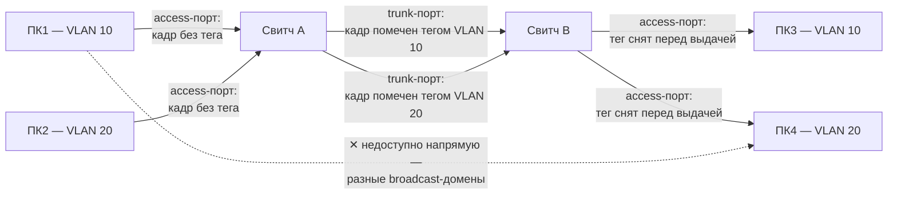
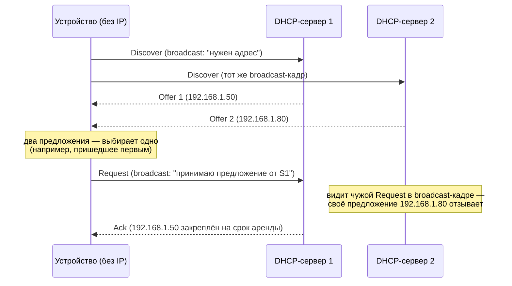

Пятый, заключительный файл углублённого курса. Предыдущие файлы разобрали, как
устроены отдельные уровни сети — модель и инкапсуляция (`01-switching-and-osi.md`),
канальный (`02-ethernet-data-link.md`), сетевой (`03-network-layer-ip.md`) и
транспортный (`04-transport-layer.md`). Здесь — набор практических механизмов,
которые решают конкретные проблемы поверх этой базы: как разделить одну
физическую сеть на несколько логических (VLAN), как безопасно соединить две
сети через недоверенный интернет (VPN), как устройства вообще получают
IP-адрес без ручной настройки (DHCP), и несколько более редких, но всё ещё
периодически спрашиваемых тем.

## Ключевые концепции

### VLAN
#### Зачем нужен VLAN
VLAN (Virtual Local Area Network) решает проблему, обозначенную в
`02-ethernet-data-link.md`: плоская сеть на одних свитчах рано или поздно
упирается в единый разросшийся broadcast-домен. VLAN — это способ логически
разделить один физический свитч (или несколько свитчей) на несколько независимых
широковещательных доменов, не покупая отдельное физическое оборудование под
каждый.

#### Тегирование (802.1Q): access vs trunk
Механизм в основе — тегирование кадров (стандарт IEEE 802.1Q): к обычному
Ethernet-кадру добавляется дополнительное поле с номером VLAN, и свитч,
пересылая кадр, учитывает этот номер — кадр из VLAN 10 никогда не уйдёт на порт,
назначенный VLAN 20, даже если оба порта физически на одном свитче. Порты
свитча настраиваются либо как access-порты (принадлежат ровно одному VLAN,
обычно к ним подключают конечные устройства, которые сами ничего не знают про
теги), либо как trunk-порты (пропускают кадры сразу нескольких VLAN с тегами —
обычно между свитчами или к маршрутизатору).


Тег появляется и исчезает ровно на границе между access- и trunk-портами, а не
где-то в середине пути: когда кадр от ПК1 входит в свитч A через access-порт,
свитч сам помечает его тегом VLAN 10 (сам ПК1 никакого тега не отправлял и
вообще не в курсе, что такое VLAN), несёт этот тег через trunk-соединение между
свитчами, а свитч B перед выдачей кадра на access-порт ПК3 снимает тег обратно
— конечные устройства всегда видят обычные Ethernet-кадры без тегов. При этом
ПК1 (VLAN 10) физически может быть подключён к тому же свитчу, что и ПК4
(VLAN 20), но напрямую канальным уровнем достучаться друг до друга не могут —
именно это и есть эффект отдельных broadcast-доменов.

#### Маршрутизация между VLAN
Раз VLAN — это отдельные broadcast-домены, то устройства из разных VLAN не
могут общаться друг с другом напрямую на канальном уровне — им, как и разным
физическим сетям, нужна маршрутизация между VLAN (inter-VLAN routing) через
маршрутизатор или свитч уровня 3 (`03-network-layer-ip.md`).

### VPN (туннелирование)
#### Туннелирование
VPN (Virtual Private Network) решает другую задачу — соединить два узла или две
сети так, будто они находятся в одной приватной сети, притом что физически трафик
идёт через недоверенную публичную сеть (обычно интернет). В основе лежит
туннелирование: исходный пакет целиком (со своими заголовками) оборачивается в
заголовок ещё одного протокола и передаётся как обычные данные внутри нового
пакета — а на другом конце туннеля извлекается обратно в исходном виде.

#### Шифрование — не то же самое, что VPN
Отдельно от туннелирования как такового стоит шифрование — большинство
современных VPN (например, на основе IPSec или WireGuard) шифруют содержимое
туннеля, чтобы промежуточные узлы публичной сети видели только зашифрованные
данные, а не исходный трафик. Это и даёт эффект "приватности" в названии: даже
если пакет физически проходит через недоверенную сеть, его содержимое
недоступно никому, кроме двух концов туннеля.

#### VPN и уменьшенный MTU
Из-за инкапсуляции у VPN-туннеля есть характерный побочный эффект — уменьшенный
эффективный MTU: заголовки туннелирующего протокола и шифрования занимают часть
полезной нагрузки исходного канала, поэтому исходный пакет, который у обычного
Ethernet укладывался бы в MTU 1500, внутри VPN-туннеля может уже не поместиться
и потребовать фрагментации или согласования меньшего MSS (`04-transport-layer.md`).

### DHCP
#### Что такое DHCP
До сих пор подразумевалось, что у узла уже есть IP-адрес, маска подсети, шлюз
по умолчанию и адрес DNS-сервера — но откуда они берутся, если их не вводить
вручную? DHCP (Dynamic Host Configuration Protocol) — протокол, который
автоматически выдаёт устройству эти параметры при подключении к сети.

#### Процесс DORA
Процесс получения адреса описывается как DORA — по первым буквам четырёх
сообщений. Устройство рассылает широковещательный **D**iscover ("есть ли тут
DHCP-сервер, мне нужен адрес") — DHCP-сервер отвечает **O**ffer с предложением
конкретного IP-адреса и параметров — устройство отправляет широковещательный
**R**equest, явно подтверждая, что принимает именно это предложение (широковещательно,
чтобы другие DHCP-серверы в сети, если есть, поняли, что их предложения не приняты)
— сервер завершает обмен **A**cknowledgment, окончательно закрепляя адрес за
устройством на определённый срок аренды (lease time).


Буквы D-O-R-A на диаграмме — ровно порядок сообщений сверху вниз. Здесь сразу
видно, зачем Request тоже широковещательный, а не адресован напрямую выбранному
серверу: если бы устройство ответило только серверу 1 напрямую, сервер 2 никогда
бы не узнал, что его предложение отклонено, и держал бы адрес 192.168.1.80
зарезервированным впустую до истечения собственного внутреннего таймаута. А так
оба сервера видят один и тот же широковещательный Request и по имени сервера в
нём сразу понимают, чьё предложение принято, а чьё — нет.

#### Аренда адреса (lease time)
По истечении срока аренды устройство должно продлить его (обычно тем же
сервером, простым обменом Request/Ack без полного цикла Discover) — если этого
не происходит, адрес освобождается и может быть выдан другому устройству. Именно
поэтому при смене сети или долгом отключении устройство иногда получает другой
IP-адрес, чем было раньше.

### ARP proxy
#### Как работает Proxy ARP
Обычный ARP (`03-network-layer-ip.md`) работает строго внутри одного
broadcast-домена — устройство отвечает на ARP-запрос только за свой собственный
IP-адрес. Proxy ARP — механизм, при котором маршрутизатор отвечает на ARP-запрос
от имени другого устройства, находящегося в другом сегменте сети, — как будто
искомый адрес находится прямо здесь, хотя физически он за маршрутизатором.

#### Когда используется Proxy ARP
Это используется в основном как обходной приём, когда по каким-то причинам
нельзя нормально настроить маршрутизацию на конечных устройствах (легаси-системы,
которые не понимают концепцию подсетей и ожидают, что все интересующие их адреса
"в одном сегменте") — маршрутизатор с proxy ARP создаёт для них иллюзию плоской
единой сети, реально пересылая трафик куда нужно. Сегодня это относительно редкий
приём, но его любят спрашивать как проверку понимания того, как вообще работает
ARP в основе.

### Разновидности NAT
Базовый механизм NAT/NAPT разобран в `03-network-layer-ip.md` — здесь важны
конкретные варианты поведения, которые отличаются по тому, насколько строго NAT
ограничивает, кто может прислать пакет обратно через созданную трансляцию.

#### Full cone, restricted cone, port-restricted cone
Full cone NAT — самый "открытый" вариант: раз внутреннее устройство отправило
пакет наружу с определённого внутреннего адреса и порта, снаружи присланный
пакет на публичный адрес и порт от **любого** внешнего узла будет переслан
обратно тому же внутреннему устройству. Restricted cone NAT добавляет
ограничение по IP — принимать обратные пакеты будет только от того внешнего
IP-адреса, которому изначально было отправлено что-то наружу (но с любого его
порта). Port-restricted cone добавляет ещё и порт — обратный пакет примут только
от того же самого IP и порта, что и исходный адресат.

#### Symmetric NAT
Symmetric NAT — самый строгий и одновременно самый частый на практике в
корпоративных и мобильных сетях: для каждой уникальной пары "внутренний адрес —
внешний адрес назначения" создаётся отдельная трансляция с новым внешним портом,
и обратный пакет принимается строго от того же внешнего узла, которому был
адресован исходный. Именно symmetric NAT сильнее всего осложняет прямые
P2P-соединения (например, в VoIP или онлайн-играх) и требует дополнительных
техник обхода NAT (STUN/TURN) — уже за рамками этого файла.

### PMTUD (Path MTU Discovery)
#### Что такое PMTUD
В `03-network-layer-ip.md` уже упоминалось, что фрагментация — дорогая операция,
которую современные стеки стараются избегать. PMTUD — это механизм, который
позволяет отправителю заранее узнать наименьший MTU на всём пути к получателю
(path MTU), не дожидаясь фактической фрагментации где-то посередине.

#### Механизм: флаг DF и ICMP Fragmentation Needed
Работает это через флаг "Don't Fragment" (DF) в заголовке IP-пакета: отправитель
шлёт пакет с этим флагом установленным, и если какой-то маршрутизатор на пути
обнаруживает, что пакет больше MTU исходящего канала, он не фрагментирует его
(флаг запрещает), а вместо этого отбрасывает пакет и отправляет обратно ICMP
"Fragmentation Needed" с указанием реального MTU этого канала. Отправитель,
получив такое сообщение, уменьшает размер отправляемых пакетов (и, соответственно,
MSS для TCP-соединения, `04-transport-layer.md`) до указанного значения и
повторяет отправку.

#### PMTUD black hole
Слабое место PMTUD — если по пути кто-то блокирует ICMP-сообщения целиком
(нередкая практика для "безопасности" на файрволах), отправитель никогда не
узнает о проблеме и просто продолжит терять пакеты, которые превышают реальный
MTU где-то посередине пути, — эта ситуация известна как "PMTUD black hole" и
является частой, хоть и не всегда очевидной причиной труднообъяснимых обрывов
соединений именно с большими пакетами при в остальном рабочей сети.

## Примеры
Фрагмент лога DHCP-клиента при получении адреса (упрощённо, `journalctl` для
`dhclient`/`NetworkManager` на Linux):
```
DHCPDISCOVER on eth0 to 255.255.255.255 port 67
DHCPOFFER from 192.168.1.1
DHCPREQUEST for 192.168.1.42 on eth0 to 255.255.255.255 port 67
DHCPACK from 192.168.1.1
bound to 192.168.1.42 -- renewal in 1800 seconds
```
Четыре строки в середине — это ровно четыре сообщения цикла DORA. Последняя
строка показывает, что аренда получена на определённый срок и клиент сам
запланировал момент, когда должен будет продлить её повторным обменом
Request/Ack, не дожидаясь истечения срока.

## Частые вопросы на собеседовании
**Q: Зачем нужен VLAN, если можно просто использовать разные подсети?**
A: Подсети сами по себе — это логическое разделение адресного пространства, но
без VLAN устройства из разных подсетей всё равно физически находятся в одном
broadcast-домене на уровне свитча, если подключены к одним и тем же портам без
тегирования. VLAN разделяет сам broadcast-домен канального уровня, позволяя на
одном физическом свитче держать несколько по-настоящему изолированных сетей,
которые не видят широковещательный трафик друг друга вообще.

**Q: Как DHCP-клиент получает адрес, если у него ещё нет IP для общения с
сервером?**
A: Первое сообщение (Discover) отправляется широковещательно (`255.255.255.255`),
что не требует наличия собственного IP-адреса у отправителя — широковещательные
кадры/пакеты получают все устройства сегмента независимо от их текущей
адресации. Именно поэтому DHCP в принципе может работать "с нуля", без какой-либо
предварительной настройки сети.

**Q: Что произойдёт, если PMTUD не работает из-за заблокированного ICMP?**
A: Отправитель никогда не получит уведомление о том, что пакеты слишком большие
для одного из промежуточных каналов, и будет продолжать отправлять их прежнего
размера — они будут просто отбрасываться где-то по пути без объяснения. На
практике это проявляется как соединения, которые устанавливаются нормально
(небольшие пакеты handshake проходят), но обрываются или зависают при передаче
больших объёмов данных — классический симптом "PMTUD black hole".

## Ловушки и частые ошибки
#### VPN — не синоним шифрования
Частая ошибка — считать VPN синонимом шифрования. VPN как концепция — это
туннелирование (инкапсуляция одного пакета в другой), а шифрование — это
отдельное, хоть и почти всегда сопутствующее свойство конкретных протоколов VPN.
Формально можно построить туннель вообще без шифрования (например, простой
GRE-туннель) — это тоже будет VPN в смысле "виртуальная приватная сеть поверх
чужой инфраструктуры", просто без свойства конфиденциальности данных внутри.

#### Не все NAT одинаковы для P2P
Другое частое заблуждение — думать, что все виды NAT ведут себя одинаково и
поэтому P2P-соединения (VoIP, игры, файлообмен) должны одинаково хорошо работать
за любым роутером. На практике symmetric NAT (самый строгий и частый в мобильных
и корпоративных сетях) заметно осложняет установление прямых P2P-соединений по
сравнению с full/restricted cone NAT именно из-за того, что внешний порт
меняется для каждого нового адресата, — и это регулярная причина того, почему
"звонок не проходит напрямую" и требует посреднических серверов (TURN).

## Связанные темы
- [Основы сетей — обзор](00-index.md) — общая карта темы.
- [Коммутация каналов, OSI, инкапсуляция](01-switching-and-osi.md) — полная
  таблица уровней OSI.
- [Ethernet и канальный уровень](02-ethernet-data-link.md) — broadcast-домен,
  который VLAN и делит на изолированные части.
- [Сетевой уровень и IP](03-network-layer-ip.md) — базовый механизм NAT и ARP,
  которые здесь расширены до нюансов.
- [Транспортный уровень](04-transport-layer.md) — MSS и связь между MTU внутри
  VPN-туннеля и размером TCP-сегмента.

## Источники
- IEEE 802.1Q — стандарт тегирования VLAN
- RFC 2131 — Dynamic Host Configuration Protocol (DHCP)
- RFC 1027 — Using ARP to Implement Transparent Subnet Gateways (Proxy ARP)
- RFC 3489 / RFC 5389 — STUN (упомянуто в контексте обхода symmetric NAT)
- RFC 1191 — Path MTU Discovery
