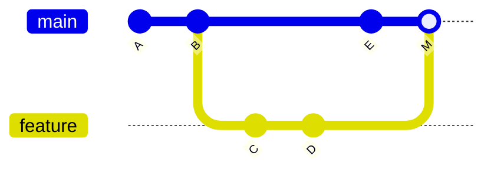
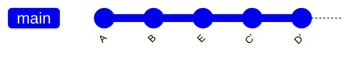
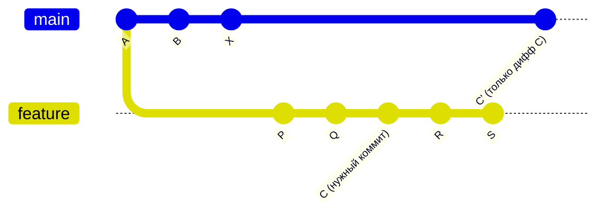
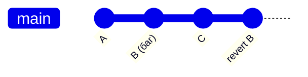
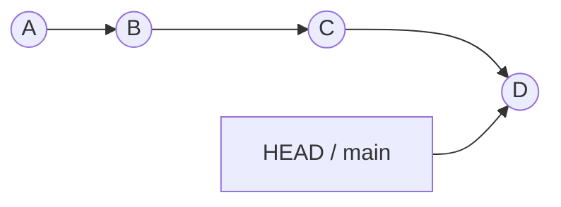
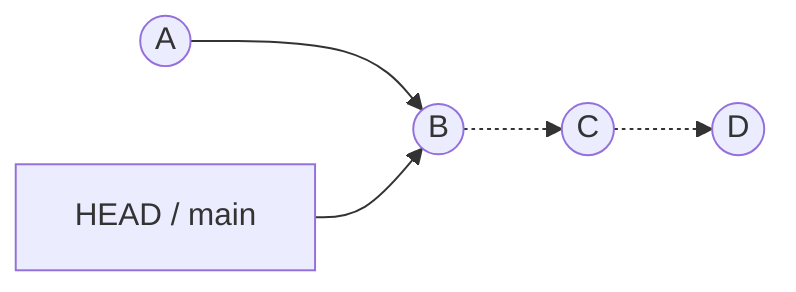

Команды знают все — на senior-собеседовании спрашивают модель (что реально хранит
коммит, чем merge отличается от rebase) и умение выйти из нештатной ситуации
(потерянный коммит, конфликт слияния).

## Ключевые концепции

### Базовые операции
#### Коммит — это снимок, а не diff
Многие представляют коммит как diff — набор изменений относительно предыдущей
версии. На самом деле коммит — это снимок (snapshot) всего дерева проекта целиком
на момент коммита, а не разница; просто git достаточно умён, чтобы эффективно
хранить эти снимки через сжатие и дедупликацию неизменившихся файлов, так что на
диске это не раздувается в полные копии. У каждого коммита есть указатель на
родительский коммит (или на несколько родителей — у merge-коммита их два), и именно
из этих указателей складывается история проекта. Из-за того что у коммита может
быть несколько родителей и несколько потомков (веток, выросших из одной точки),
история — это направленный ациклический граф (DAG), а не прямая линия, как может
показаться при работе с одной веткой.

#### log, diff, blame
Чтобы перемещаться по этой истории, есть три основных команды: `log` показывает
последовательность коммитов, `diff` — конкретные изменения между двумя состояниями,
а `blame` — в каком именно коммите последний раз менялась каждая строка файла
(что удобно, когда нужно понять, кто и почему написал конкретную строку).

### Ветвление и слияние
#### merge vs rebase
Слить две ветки в git можно двумя разными способами, и разница между ними — это
разница на уровне итоговой истории, а не просто разные команды с одинаковым
результатом. `merge` создаёт новый merge-коммит с двумя родителями, честно
сохраняя фактическую историю ветвления — видно, что и когда разошлось и снова
слилось. `rebase`, наоборот, переигрывает коммиты текущей ветки поверх новой базы,
создавая для них новые коммиты с новыми хэшами — история в итоге становится
линейной, но фактически переписанной. Именно поэтому rebase уже опубликованной
(shared) ветки — плохая практика: у всех, кто уже стянул старую версию этой ветки,
локальная история разъедется с тем, что запушено, и придётся разбираться с
конфликтами вручную.

#### Как это выглядит на графе коммитов
Как это выглядит на графе коммитов — до слияния обе стратегии стартуют с одной и
той же картины: ветка `feature` с коммитами C и D растёт от коммита B в `main`,
пока в `main` независимо появляется коммит E.

После `merge` история выглядит так — оба пути видны как есть, с отдельным
merge-коммитом M, у которого два родителя:


После `rebase` (`feature` перебазирована на актуальный `main`) — коммиты C и D
переигрываются как C' и D' поверх E, история линейна, а веток на графе, где было
видно ветвление, больше нет:

Именно этот "штрих" у C' и D' на диаграмме — не опечатка, а обозначение того, что
это новые коммиты с новыми хэшами, а не те же C и D, что были в `feature` до
rebase, — тот самый эффект «нового хэша при том же диффе», который встречается и
в `cherry-pick` ниже.

#### Конфликты слияния и стратегии ветвления
Конфликт слияния возникает, когда обе ветки изменили одно и то же место файла, и
git не может автоматически решить, какую версию оставить — тогда разрешение
ложится на человека: коммитом с ручным исправлением (при `merge`) или через
`rebase --continue` после правки конфликта на каждом переигрываемом коммите (при
`rebase`). На уровне процесса команды обычно выбирают между двумя стратегиями
ветвления: trunk-based development, где ветки короткоживущие и часто вливаются в
main, и Git flow, где вместо этого используются долгоживущие ветки
develop/release/feature — процесс более тяжеловесный, но даёт больше контроля над
тем, что попадает в релиз.

### Продвинутые операции
#### cherry-pick
Кроме базового набора команд, у git есть инструменты для более точечных ситуаций.
`cherry-pick` берёт один конкретный коммит из другой ветки и применяет те же
изменения в файлах, что он вносит (diff этого коммита — то есть разницу,
которую он вносит относительно своего родителя), поверх текущей ветки, создавая
новый коммит с этим же содержимым файлов. Это не копия исходного коммита: у
нового коммита другой родитель (он встаёт поверх истории текущей ветки, а не
той, где был создан изначально) и обычно другое время создания, а хэш коммита в
git как раз и вычисляется из этих данных (родитель, содержимое, автор, время) —
поэтому у нового коммита получается новый хэш, хотя итоговые изменения в файлах
идентичны исходному коммиту. Удобно, когда нужен только один конкретный фикс из
чужой ветки, а не вся ветка целиком — и неважно, где именно в истории той ветки
этот коммит находится: `cherry-pick` смотрит только на дифф самого коммита
относительно его собственного родителя, а не на то, что было до или после него
в этой ветке.


Именно такая ситуация чаще всего и приводит к `cherry-pick`: `feature` — это
чужая ветка с кучей своих коммитов (P, Q, C, R, S), `main` — текущая ветка со
своими независимыми коммитами (B, X), а нужен только один конкретный коммит C
из середины чужой истории, а не всё, что было до него (P, Q) или после (R, S).
`cherry-pick` берёт ровно C, применяет его изменения поверх текущего HEAD на
`main` и создаёт C' — коммиты P, Q, R, S в `main` не попадают вообще, они
остаются только в истории `feature`. Положение C в чужой ветке (в середине, а
не на самом конце) роли не играет — `cherry-pick` одинаково работает что с
последним коммитом ветки, что с любым другим.

#### revert vs reset
Когда нужно откатить уже сделанные изменения, важно не перепутать `revert` и
`reset` — это два принципиально разных механизма, а не два синонима одной
операции.

#### revert
`revert` создаёт новый коммит, который отменяет изменения другого коммита, —
это безопасно даже для уже опубликованной истории, потому что ничего не
удаляется и не переписывается, история только растёт вперёд.


Коммит B со своим багом никуда не делся — он по-прежнему в истории, просто
следующий коммит `revert B` отменяет его изменения. Именно поэтому `revert`
безопасен для чужой (уже стянутой другими) ветки: ни один существующий коммит
не пропадает и не меняет хэш.

#### reset
`reset`, наоборот, двигает указатель текущей ветки назад на более ранний
коммит (и опционально working tree/index вместе с ним) — то есть физически
переписывает то, на какой коммит указывает ветка, а не добавляет новый:



После `git reset --hard B` указатель `main` переставлен с D на B (вторая
схема) — коммиты C и D пунктиром показаны не просто «удалёнными»: они
физически ещё существуют в объектной базе, просто на них больше не указывает
ни одна ветка. Это и делает `reset` опасным для уже запушенных и стянутых
другими коммитов: у всех, кто уже видел историю до C и D, локальная копия
разойдётся с переписанной веткой.

#### stash
Для незаконченной работы есть `stash`: он временно откладывает незакоммиченные
изменения (working tree и index) в отдельный стек, не создавая коммит, — удобно,
когда нужно быстро переключиться на другую ветку, не коммитя черновик.

#### reflog
Отдельно стоит `reflog` — локальный журнал перемещений `HEAD` и веток именно на
этой машине, который не является частью истории проекта и никуда не пушится. Он
спасает после ошибочного `reset --hard` или удалённой ветки: даже если коммит
перестал быть виден в обычном `log`, он физически всё ещё жив в объектной базе,
пока сборщик мусора его не удалит, — и `reflog` показывает его хэш, чтобы можно
было вернуться назад.

## Примеры
```bash
git reset --hard HEAD~3
git reflog
```
Пример вывода `git reflog`:
```
a1b2c3d HEAD@{0}: reset: moving to HEAD~3
e4f5g6h HEAD@{1}: commit: fix null check in OrderService
i7j8k9l HEAD@{2}: commit: add integration test
m1n2o3p HEAD@{3}: commit: refactor payment flow
```
Каждая строка — это состояние `HEAD` в конкретный момент времени, самое новое
сверху. Строка `HEAD@{0}` — это уже результат reset, а вот `HEAD@{1}` — тот самый
коммит `fix null check in OrderService`, который "потерялся" из обычного `log`.
Чтобы вернуть его, достаточно выполнить `git reset --hard e4f5g6h`.

## Частые вопросы на собеседовании
**Q: Чем rebase отличается от merge и когда что уместно?**
A: `merge` сохраняет реальную историю ветвления через merge-коммит с двумя
родителями — безопасно для любой ветки, в том числе публичной. `rebase` переписывает
коммиты текущей ветки поверх новой базы, давая линейную историю, но меняя хэши
коммитов — уместен для локальной, ещё не опубликованной ветки перед тем, как влить
её в main; на публичной ветке ломает историю у всех, кто её уже стянул.

**Q: Как восстановить коммит после `git reset --hard`?**
A: Через `git reflog` — там виден хэш `HEAD` до reset, к которому можно вернуться
`git reset --hard <hash>`, пока объект не удалён сборщиком мусора.

## Ловушки и частые ошибки
#### «Коммит хранит diff»
Распространённое заблуждение — что коммит хранит diff. На самом деле это снимок
всего дерева проекта на тот момент, а diff — это то, что показывают команды вроде
`git diff`, вычисляя разницу между двумя такими снимками на лету.

#### «rebase теряет коммиты»
Другое частое заблуждение — что `rebase` теряет коммиты. Формально он ничего не
удаляет: пока жив `reflog`, старые коммиты физически остаются в объектной базе. Но
по умолчанию они выглядят недостижимыми через обычный `log`, потому что ветка
теперь указывает на новые, переигранные коммиты — так что «потерянными» они кажутся
только до тех пор, пока не знаешь про `reflog`.

#### cherry-pick не подтягивает изменения P и Q
Похожее заблуждение — про `cherry-pick` коммита C, у которого в исходной ветке
перед ним стоят коммиты P и Q: кажется, что изменения P и Q как-то «подтягиваются
по пути», просто не попадая в историю отдельными записями. На самом деле это не
так: `cherry-pick` применяет только собственный дифф коммита C относительно ЕГО
родителя (то есть Q), а не накопленную сумму P+Q+C — изменения P и Q в текущую
ветку не попадают вообще, ни явно, ни неявно. Если дифф C по факту зависит от
того, что поменяли именно P или Q (например, C правит строку, которую P или Q
только что добавили, а в текущей ветке её ещё нет), `cherry-pick` не «дотянет»
недостающий контекст сам — он просто не применится чисто и выдаст конфликт,
который придётся разрешать вручную, как при обычном merge.
