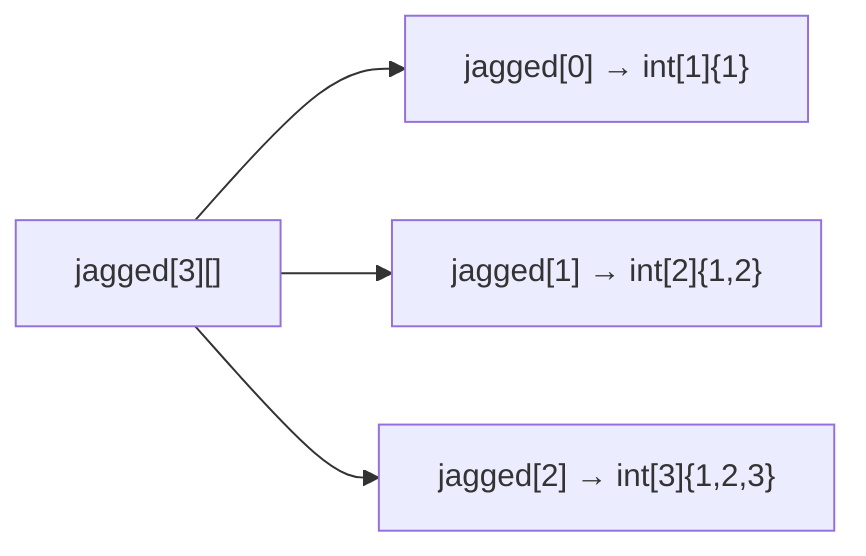

Самая простая структура данных в Java, но с несколькими деталями, которые
регулярно всплывают на собеседовании: массив — это полноценный объект в куче,
а не низкоуровневая абстракция вроде массива в C, и от этого зависит и его
жизненный цикл, и то, какой именно алгоритм использует `Arrays.sort` под
капотом.

## Ключевые концепции

### Устройство

#### Массив как объект и фиксированная длина
В Java массив — это объект: он создаётся в куче через `new` (даже для массива
примитивов), имеет собственный заголовок объекта (object header) и метаданные
в JVM, и у него есть ровно одно публичное поле — `length`, доступное как обычное
поле, а не как метод (в отличие от `size()` у коллекций). Длина массива
фиксируется в момент создания и после этого неизменна: «изменение размера»
массива на практике всегда означает создание нового массива большей длины и
копирование в него старых элементов — именно так внутри и устроен `ArrayList`
(раздел 5), который использует обычный массив как хранилище и пересоздаёт его
при переполнении текущей ёмкости.

#### Многомерные и jagged-массивы
Многомерный массив в Java — это не матрица в математическом смысле, а массив
массивов: `int[][] m` — это на самом деле одномерный массив, каждый элемент
которого — ссылка на отдельный одномерный массив `int[]`. Из этого следует
важное практическое следствие — «строки» такого массива необязательно должны
быть одинаковой длины (jagged array, «рваный» массив): можно создать
`new int[3][]` без указания внутренней размерности и затем присвоить каждому
элементу массив своей собственной длины. Это отличает Java от языков с
настоящими многомерными массивами, где размерность фиксирована по каждой оси
сразу для всего блока памяти.


На диаграмме видно, что `jagged` сам по себе — массив из трёх ссылок, а не блок
памяти прямоугольной формы: каждая ссылка ведёт на отдельный `int[]` своей
длины, и ничто не мешает им отличаться, в отличие от настоящей матрицы.

#### Примитивы vs объекты в массиве
Разница между массивом примитивов и массивом объектов — не только синтаксис
объявления, но и то, что физически лежит в ячейках. Массив примитивов
(`int[]`, `double[]` и так далее) хранит сами значения впритык друг к другу в
непрерывном блоке памяти — без отдельных заголовков объектов на каждый элемент,
это одна из причин, почему операции над примитивными массивами (сортировка,
обход) быстрее операций над эквивалентным массивом обёрток. Массив объектов
(`String[]`, `Integer[]`, массив пользовательских классов) хранит не сами
объекты, а ссылки на них — каждый элемент физически занимает столько же места,
сколько ссылка (4 или 8 байт в зависимости от режима указателей JVM), а сами
объекты живут отдельно в куче и могут быть разбросаны по памяти либо вовсе
быть одним и тем же объектом, на который указывают несколько элементов массива
одновременно.

### API

#### Arrays.sort: Dual-Pivot Quicksort vs TimSort
Класс `java.util.Arrays` — основной набор статических утилит для работы с
массивами, и на собеседовании часто спрашивают не столько «что делает
`Arrays.sort`», сколько «каким алгоритмом» — и здесь ответ разный для примитивов
и объектов. Для массивов примитивов `Arrays.sort` использует Dual-Pivot
Quicksort — модификацию быстрой сортировки с двумя опорными элементами вместо
одного, которая на практике для примитивных типов оказывается быстрее
классического одноопорного quicksort и не требует дополнительной памяти. Для
массивов объектов используется другой алгоритм — TimSort (гибрид merge sort и
insertion sort, изначально разработанный для Python), и причина смены
алгоритма принципиальна: сортировка объектов идёт через `Comparable`/
`Comparator`, и такая сортировка обязана быть стабильной (сохранять
относительный порядок равных по сравнению элементов) — то, чего Dual-Pivot
Quicksort не гарантирует, а TimSort гарантирует по построению. Именно
стабильность — причина, почему для примитивов и объектов выбраны настолько
разные по своей природе алгоритмы, хотя оба линейно-логарифмические по
асимптотике (O(n log n) в среднем).

#### binarySearch, copyOf и copyOfRange
`Arrays.binarySearch` ищет элемент в уже отсортированном массиве за
O(log n) — но только в отсортированном: на неотсортированном массиве метод
не бросает исключение, а просто может вернуть некорректный результат, потому
что бинарный поиск полагается на упорядоченность для отбрасывания половины
диапазона поиска на каждом шаге. `Arrays.copyOf` создаёт новый массив заданной
длины и копирует в него элементы исходного (если новая длина больше — остаток
заполняется значениями по умолчанию), а `Arrays.copyOfRange` копирует
конкретный полуоткрытый диапазон `[from, to)` исходного массива в новый.

#### System.arraycopy
`System.arraycopy` — более низкоуровневый и, как правило, более быстрый способ
копирования: это нативный (`native`) метод, который в HotSpot часто
транслируется в одну intrinsic-операцию, копирующую блок памяти напрямую, без
промежуточных проверок на уровне обычного Java-кода, которые делают
`Arrays.copyOf`/`copyOfRange` внутри себя (сами эти методы, кстати, тоже в
итоге вызывают `System.arraycopy` — это их общая низкоуровневая основа).
Сигнатура `arraycopy(src, srcPos, dest, destPos, length)` требует уже
существующего целевого массива подходящего размера и позволяет копировать
как в новый, так и в существующий массив, включая копирование внутри одного
и того же массива (например, для сдвига элементов) — в отличие от
`Arrays.copyOf`, который всегда создаёт новый массив.

## Примеры

```java
int[] a = {5, 3, 8, 1, 9};
System.out.println("до сортировки: " + Arrays.toString(a));
Arrays.sort(a);
System.out.println("после Arrays.sort: " + Arrays.toString(a));

int idx = Arrays.binarySearch(a, 8);
System.out.println("binarySearch(8) index = " + idx);
```
```
до сортировки: [5, 3, 8, 1, 9]
после Arrays.sort: [1, 3, 5, 8, 9]
binarySearch(8) index = 3
```
`Arrays.sort` для `int[]` использует Dual-Pivot Quicksort — массив
отсортирован по месту (in-place), без создания копии. `binarySearch`
возвращает индекс `8` в уже отсортированном массиве — искать в исходном,
неотсортированном массиве этим методом было бы некорректно.

```java
int[] copy = Arrays.copyOf(a, 3);
int[] range = Arrays.copyOfRange(a, 1, 4);
System.out.println("copyOf(a, 3) = " + Arrays.toString(copy));
System.out.println("copyOfRange(a, 1, 4) = " + Arrays.toString(range));

int[] src = {1, 2, 3, 4, 5};
int[] dst = new int[5];
System.arraycopy(src, 1, dst, 0, 3);
System.out.println("System.arraycopy(src,1,dst,0,3) = " + Arrays.toString(dst));
```
```
copyOf(a, 3) = [1, 3, 5]
copyOfRange(a, 1, 4) = [3, 5, 8]
System.arraycopy(src,1,dst,0,3) = [2, 3, 4, 0, 0]
```
`copyOf(a, 3)` берёт первые 3 элемента уже отсортированного `a`.
`copyOfRange(a, 1, 4)` берёт полуоткрытый диапазон индексов `[1, 4)` — элементы
с индексами 1, 2, 3. `System.arraycopy` скопировал 3 элемента из `src` начиная
с индекса 1 (`2, 3, 4`) в начало `dst` — оставшиеся два элемента `dst`
остались нулями по умолчанию, потому что копирование их не затронуло.

```java
String[] refs = {"a", "b"};
String[] refsCopy = refs.clone();
refsCopy[0] = "z";
System.out.println("refs after clone+mutate: " + Arrays.toString(refs) + " / " + Arrays.toString(refsCopy));
```
```
refs after clone+mutate: [a, b] / [z, b]
```
`clone()` у массива — поверхностное (shallow) копирование: создаётся новый
массив той же длины с теми же ссылками на элементы. Для массива `String[]`
изменение элемента копии не задевает оригинал именно потому, что присвоение
`refsCopy[0] = "z"` меняет саму ссылку в ячейке массива, а не содержимое
объекта — для массива изменяемых объектов, где элементы мутируются через их
собственные методы, а не переприсваиваются, shallow copy этой защиты уже не
даёт, потому что обе копии массива указывали бы на одни и те же объекты.

```java
int[][] jagged = new int[3][];
jagged[0] = new int[]{1};
jagged[1] = new int[]{1, 2};
jagged[2] = new int[]{1, 2, 3};
for (int[] row : jagged) {
    System.out.println("row: " + Arrays.toString(row));
}
```
```
row: [1]
row: [1, 2]
row: [1, 2, 3]
```
Каждая «строка» — независимый одномерный массив своей длины: `jagged` в
действительности хранит три ссылки на три разных массива `int[]`, а не единый
блок памяти с фиксированной шириной строки, как было бы в настоящей матрице.

## Частые вопросы на собеседовании

**Q: Чем Arrays.sort для int[] отличается по реализации от Arrays.sort для объектов?**
A: Для примитивных массивов используется Dual-Pivot Quicksort — быстрый
алгоритм на месте без дополнительной памяти, который не гарантирует
стабильность (для примитивов это неважно, у них нет понятия «равных, но
различимых» элементов). Для массивов объектов используется TimSort — гибрид
merge sort и insertion sort, обязательно стабильный, потому что сортировка
объектов идёт через `Comparable`/`Comparator`, и потребители часто рассчитывают,
что элементы, равные по компаратору, сохранят исходный относительный порядок.

**Q: Массив — это объект в Java или примитивная конструкция языка, как в C?**
A: Полноценный объект в куче, даже для массива примитивов: у него есть поле
`length`, объект создаётся через `new`, а классы массивов (`int[].class`,
`String[].class`) — часть иерархии типов JVM. Отсюда и фиксированная при
создании длина: «расширение» массива всегда означает создание нового объекта-
массива большего размера и копирование элементов, а не изменение уже
существующего.

**Q: Чем System.arraycopy лучше Arrays.copyOf на практике?**
A: `System.arraycopy` — нативный метод, который HotSpot умеет распознавать как
intrinsic и копировать блок памяти напрямую, без накладных расходов обычного
Java-байткода; он также позволяет копировать в уже существующий массив
(в том числе «внутри себя», для сдвига элементов) без выделения новой памяти.
`Arrays.copyOf`/`copyOfRange` удобнее в использовании (сразу возвращают новый
массив нужного размера), но под капотом в конечном счёте тоже вызывают
`System.arraycopy`.

## Ловушки и частые ошибки

#### int[][] — не настоящая матрица
Частая ошибка — считать `int[][]` настоящей матрицей с фиксированной шириной
строки и гарантированной прямоугольной формой. В Java это массив ссылок на
независимые одномерные массивы, каждый из которых может иметь свою длину
(jagged array); код, который предполагает единую ширину для всех строк без
явной проверки, может упасть с `ArrayIndexOutOfBoundsException` на «рваных»
данных, которые формально валидны для этого типа.

#### clone() — это shallow copy
Другое заблуждение — думать, что `array.clone()` или `Arrays.copyOf` дают
полноценную независимую копию для массива объектов. Это поверхностное
копирование: новый массив получает свои собственные ячейки, но значения в этих
ячейках — те же самые ссылки на те же объекты, что и в оригинале. Мутация
объекта через один из массивов будет видна и через другой — полноценная
независимость нужна отдельно, через явное глубокое копирование (deep copy)
каждого элемента.

#### binarySearch на неотсортированном массиве
Похожая ловушка — вызывать `Arrays.binarySearch` на неотсортированном массиве.
Метод не проверяет упорядоченность и не бросает исключение при её нарушении —
он просто может вернуть неверный индекс или ложно сообщить, что элемент не
найден, потому что весь алгоритм опирается на предположение об уже
отсортированных данных.

## Связанные темы
- [Переменные и типы данных](02-variables-and-types.md) — примитивы и обёртки, чьё хранение в массиве отличается по семантике (значения против ссылок).
- Иерархия коллекций JCF (раздел 5) — `ArrayList` как обёртка над обычным массивом с автоматическим пересозданием при росте.
- Области памяти JVM (раздел 9) — где именно живёт объект массива и как устроен его заголовок.
