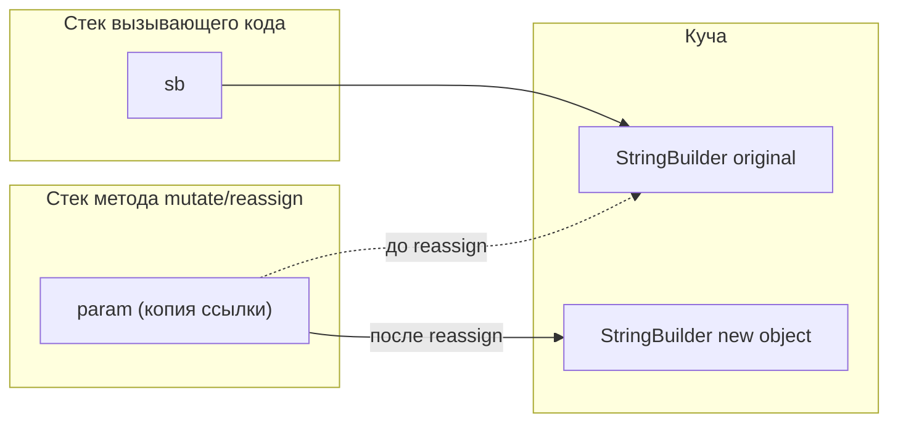

Формально простая тема, но именно здесь начинается одно из самых упорных
заблуждений о Java — «объекты передаются по ссылке». На самом деле Java всегда
передаёт параметры по значению, и понимание того, что именно копируется в
случае объекта, — обязательный минимум для senior-собеседования.

## Ключевые концепции

### Сигнатуры и перегрузка

#### Сигнатура метода и overloading
Сигнатура метода — это его имя плюс типы и порядок параметров, и принципиально
важная деталь: возвращаемый тип в сигнатуру не входит. Именно поэтому нельзя
объявить в одном классе два метода с одинаковым именем и одинаковыми
параметрами, различающихся только возвращаемым типом, — компилятор увидит в
этом не перегрузку, а конфликтующее повторное объявление одного и того же
метода. Перегрузка (overloading) — это как раз наличие в классе нескольких
методов с одинаковым именем, но разными сигнатурами (разными типами или
количеством параметров), и то, какой из них будет вызван, определяется
компилятором статически, на этапе компиляции, по объявленным типам
аргументов в точке вызова — в отличие от переопределения (overriding, раздел
3), которое разрешается динамически в рантайме по фактическому типу объекта.

#### Разрешение перегрузки
Когда для вызова подходит сразу несколько перегруженных вариантов (например,
аргумент типа `byte` формально может быть неявно расширен и до `int`, и до
`long`, и до `double`), компилятор выбирает наиболее специфичный подходящий
метод — тот, что требует наименьшего из возможных неявных преобразований. Для
примитивов порядок предпочтения следует иерархии widening-преобразований
(раздел про переменные и типы): сначала ищется точное совпадение типа, затем —
ближайшее расширение (`byte` → предпочтительно `short`/`int`, а не сразу
`long`/`double`), и только если подходящего варианта с примитивами нет вовсе —
компилятор рассматривает автобоксинг и varargs, которые считаются менее
приоритетными способами подгонки аргумента под параметр. Если после всех
правил остаётся более одного одинаково подходящего варианта и компилятор не
может однозначно определить самый специфичный — компиляция завершается
ошибкой неоднозначности (ambiguous method call), а не случайным выбором одного
из них.

### Передача параметров и рекурсия

#### Java всегда pass-by-value
В Java существует только один способ передачи параметров в метод — по значению
(pass-by-value), и это верно как для примитивов, так и для объектов, несмотря
на устойчивое заблуждение об обратном. Для примитива в метод копируется само
значение — изменения параметра внутри метода никак не отражаются на переменной
вызывающего кода. Для объекта в метод передаётся не сам объект, а копия
значения ссылки на него — то есть копия адреса, по которому объект лежит в
куче. Из-за этого метод, получивший такую ссылку, действительно может изменить
состояние того же самого объекта, на который эта ссылка указывает (например,
вызвать у него мутирующий метод) — и это изменение будет видно и вызывающему
коду, потому что обе ссылки, оригинал и копия-параметр, указывают на один и тот
же объект в куче. Но если внутри метода саму параметр-ссылку переприсвоить на
другой объект (`param = new SomeType();`), это меняет только локальную копию
ссылки внутри метода — переменная вызывающего кода как указывала на исходный
объект, так и продолжает указывать на него, метод никак не может заставить её
указывать на что-то другое. Именно эта тонкость — «объект можно изменить через
ссылку, но саму ссылку вызывающего кода изменить нельзя» — и порождает миф о
передаче по ссылке: первая часть наблюдения верна, но интерпретация неверна.


`sb` и `param` изначально указывают на один и тот же объект в куче — поэтому
мутация через `param` видна и через `sb`. `reassign` лишь перевешивает
собственную копию ссылки `param` на новый объект, а `sb` как указывала на
`original`, так и продолжает.

#### Varargs
Varargs (`Type... args`) — синтаксический сахар, позволяющий вызывать метод с
переменным числом аргументов одного типа без явного создания массива на
стороне вызывающего кода. Под капотом компилятор превращает varargs-параметр в
обычный параметр-массив (`Type[] args`), а на месте каждого конкретного вызова
подставляет создание массива нужной длины с переданными значениями — то есть
`sum(1, 2, 3)` компилируется примерно в `sum(new int[]{1, 2, 3})`. Из этого
следует, что varargs-параметр может быть только последним в списке параметров
метода, а вызвать такой метод можно и напрямую с готовым массивом вместо
перечисления элементов через запятую — оба способа полностью эквивалентны на
уровне байткода.

#### Рекурсия и StackOverflowError
Рекурсия — вызов метода самим собой, напрямую или через цепочку других
методов, — работает благодаря тому, что у каждого вызова метода в потоке своя
собственная область стека (stack frame) с собственными локальными переменными
и параметрами, независимая от area предыдущего вызова. Но стек потока
ограничен по размеру (раздел 1, настраивается флагом JVM `-Xss`), и каждый
рекурсивный вызов добавляет новый кадр поверх текущего стека — если у рекурсии
отсутствует корректный базовый случай (условие, при котором дальнейшие
рекурсивные вызовы прекращаются), стек в конце концов заполняется целиком, и
JVM бросает `StackOverflowError`. Важно, что это `Error`, а не `Exception`
(раздел 4) — сигнал о серьёзной проблеме на уровне JVM, а не штатная ситуация,
которую предполагается перехватывать и обрабатывать в обычной бизнес-логике.

## Примеры

```java
static void show(int x) { System.out.println("show(int): " + x); }
static void show(long x) { System.out.println("show(long): " + x); }
static void show(double x) { System.out.println("show(double): " + x); }
static void show(Object x) { System.out.println("show(Object): " + x); }
// ...
byte b = 5;
show(b);      // byte -> widening -> ближайший подходящий
show(5);      // int
show(5L);     // long
show(5.0);    // double
show("str");  // Object
```
```
show(int): 5
show(int): 5
show(long): 5
show(double): 5.0
show(Object): str
```
`byte b = 5` при вызове `show(b)` расширяется до `int`, а не сразу до `long`
или `double` — компилятор всегда предпочитает ближайшее по иерархии widening
расширение, а не первый попавшийся подходящий вариант. Литерал `"str"`
попадает в `show(Object)`, потому что среди перегрузок нет варианта с
параметром `String`, а `Object` — единственный подходящий тип для ссылки.

```java
static void mutate(StringBuilder sb) { sb.append("-mutated"); }
static void reassign(StringBuilder sb) { sb = new StringBuilder("new object"); }
// ...
StringBuilder sb = new StringBuilder("original");
mutate(sb);
System.out.println("after mutate: " + sb);
reassign(sb);
System.out.println("after reassign: " + sb);
```
```
after mutate: original-mutated
after reassign: original-mutated
```
После `mutate(sb)` изменение видно снаружи — метод вызвал `append` на том же
самом объекте, на который указывает и внешняя переменная `sb`. После
`reassign(sb)` внешняя переменная не изменилась вообще — внутри метода
локальная копия ссылки была переприсвоена на новый объект, но это никак не
повлияло на оригинальную ссылку в `main`. Это и есть прямое наблюдение
pass-by-value для ссылочных типов.

```java
static int sum(int... nums) {
    int total = 0;
    for (int n : nums) total += n;
    return total;
}
// ...
System.out.println("sum() = " + sum());
System.out.println("sum(1,2,3) = " + sum(1, 2, 3));
System.out.println("sum(array) = " + sum(new int[]{10, 20}));
```
```
sum() = 0
sum(1,2,3) = 6
sum(array) = 30
```
`sum()` без аргументов вызывается корректно — компилятор подставляет пустой
массив нулевой длины, а не `null`. Вызов с явным массивом (`sum(new int[]{10, 20})`)
работает так же, как и перечисление элементов через запятую, — оба варианта
компилируются в один и тот же байткод, потому что varargs — это просто массив.

```java
static long factorial(long n) {
    return n * factorial(n - 1); // нет базового случая
}
// вызов: factorial(10)
```
```
Exception in thread "main" java.lang.StackOverflowError
	at Sof.factorial(Sof.java:3)
	at Sof.factorial(Sof.java:3)
	at Sof.factorial(Sof.java:3)
	...
```
Без базового случая (`if (n <= 1) return 1;`) рекурсия не останавливается
никогда, и стек потока переполняется — на этой JVM стек вместил ровно 1024
кадра `factorial` до падения. Стектрейс `StackOverflowError` — это, по сути,
живая иллюстрация того, что каждый рекурсивный вызов действительно занимает
собственный кадр стека, а не переиспользует один и тот же.

## Частые вопросы на собеседовании

**Q: Java — pass-by-value или pass-by-reference?**
A: Java всегда pass-by-value, без исключений. Для примитивов в метод
копируется значение. Для объектов в метод копируется значение ссылки —
то есть адрес объекта в куче, а не сам объект. Из-за этого метод может изменить
состояние объекта через полученную ссылку (изменение будет видно вызывающему
коду), но не может заставить внешнюю переменную указывать на другой объект —
переприсваивание параметра внутри метода меняет только локальную копию ссылки.

**Q: Как компилятор разрешает неоднозначность при перегрузке методов?**
A: Разрешение overloading происходит статически, на этапе компиляции, по
объявленным типам аргументов, а не по их фактическим значениям в рантайме.
Компилятор ищет сначала точное совпадение типов, затем — ближайшее по
иерархии widening-преобразование, и только в последнюю очередь рассматривает
автобоксинг и varargs как более «дорогие» способы подгонки аргументов. Если
после применения всех правил остаётся несколько одинаково подходящих
вариантов, компиляция падает с ошибкой неоднозначности.

**Q: Почему бесконечная рекурсия даёт StackOverflowError, а не зависает навсегда?**
A: У каждого потока есть стек ограниченного размера (по умолчанию —
платформозависимый, настраивается флагом `-Xss`), и каждый вызов метода,
включая рекурсивный, добавляет новый кадр (stack frame) с собственными
локальными переменными поверх этого стека. Без корректного базового случая
глубина рекурсии растёт неограниченно, и рано или поздно стек физически
заканчивается — JVM бросает `StackOverflowError`, что и не даёт программе
зависнуть бесконечно, лишь довольно быстро завершает её падением.

## Ловушки и частые ошибки

#### «Java передаёт объекты по ссылке»
Самое частое заблуждение — «Java передаёт объекты по ссылке». Формально это
неверно: передаётся значение ссылки, то есть её копия. Разница видна ровно в
одном сценарии — переприсваивании параметра внутри метода: если бы Java была
pass-by-reference по-настоящему, `reassign(sb)` из примера выше действительно
поменял бы, на что указывает переменная `sb` в вызывающем коде, а этого не
происходит.

#### Overloading vs overriding
Другая ошибка — путать overloading с overriding при рассуждениях о том, когда
выбирается конкретный метод. Overloading полностью разрешается статически, на
этапе компиляции, по объявленным типам — то есть если переменная объявлена как
`Object`, а хранит в себе `String`, вызов перегруженного метода с этой
переменной пойдёт в вариант для `Object`, даже если существует более
подходящий вариант для `String`, потому что компилятор смотрит на объявленный,
а не фактический тип. Overriding (раздел 3), напротив, разрешается динамически
по фактическому типу объекта в рантайме — эти два механизма подчиняются
принципиально разным правилам, и их смешение — частая причина ошибки в
рассуждениях о полиморфизме.

#### Перехват StackOverflowError
Ещё одна ловушка — считать, что `StackOverflowError` можно спокойно перехватывать
как обычное исключение и продолжать работу дальше. Формально `catch (StackOverflowError e)`
скомпилируется и даже может сработать, но на момент переполнения стека JVM уже
находится в нестабильном состоянии, и дальнейшая работа потока после такого
перехвата ненадёжна — правильный подход — не допускать неограниченной рекурсии
вовсе (корректный базовый случай, либо переход на итеративный алгоритм или
хвостовую рекурсию, которую, впрочем, Java не оптимизирует автоматически, в
отличие от некоторых других языков).

## Связанные темы
- [Массивы](04-arrays.md) — то, во что компилятор превращает varargs-параметр под капотом.
- Полиморфизм и overriding (раздел 3) — динамическое разрешение вызова метода в рантайме, в отличие от статического overloading.
- Области памяти JVM и стек потока (раздел 9) — устройство stack frame и причина StackOverflowError.
