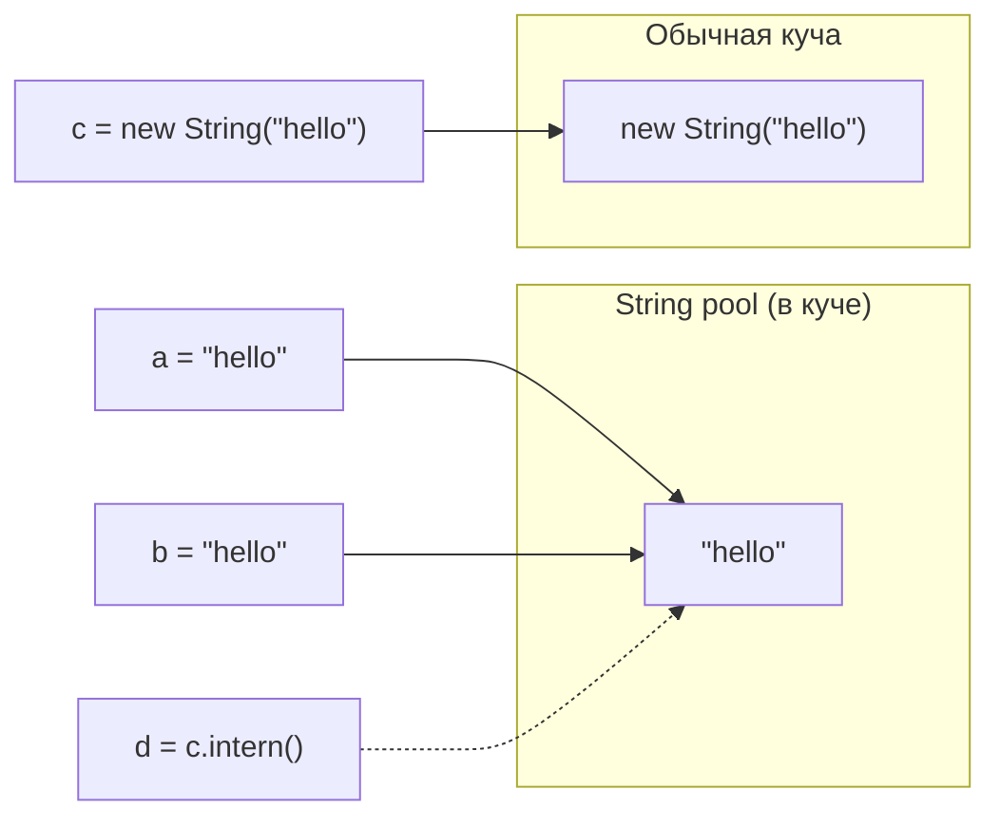

`String` — самый часто используемый тип в любом Java-коде, и именно поэтому
детали его устройства — иммутабельность, пул строк, разница `==`/`equals` —
спрашивают чаще почти любой другой темы синтаксиса, вплоть до junior-уровня.
На senior-собеседовании к этому добавляется вопрос «почему», а не только «что».

## Ключевые концепции

### Immutability

#### Почему String неизменяем
`String` в Java неизменяем: ни один публичный метод класса не меняет уже
созданный объект, каждая операция, которая выглядит как «изменение» строки
(`substring`, `replace`, `concat`, `toUpperCase` и так далее), на самом деле
возвращает новый объект `String`, оставляя исходный нетронутым в памяти.
Иммутабельность здесь — не случайность, а сознательное проектное решение сразу
по нескольким причинам. Во-первых, безопасность: строки повсеместно
используются как пути к файлам, имена классов при рефлексии, аргументы для
сетевых соединений и SQL — если бы `String` можно было изменить уже после
проверки (например, после проверки прав доступа к пути, но до фактического
открытия файла), это открывало бы класс атак TOCTOU (time-of-check to
time-of-use). Во-вторых, кэшируемость `hashCode()`: поскольку содержимое
`String` никогда не меняется, его хеш-код можно вычислить один раз и
закэшировать в поле объекта — это заметно ускоряет использование строк как
ключей в `HashMap` и `HashSet` (раздел 5), где `hashCode()` вызывается часто.
В-третьих, потокобезопасность «бесплатно»: неизменяемый объект нельзя
испортить гонкой данных между потоками просто потому, что менять в нём нечего
— это резко упрощает совместное использование одних и тех же строк
несколькими потоками без какой-либо синхронизации.

#### String pool и intern()
Иммутабельность строковых литералов делает возможным ещё один механизм — пул
строк (string pool, до Java 7 — часть PermGen, с Java 7 и позже — часть кучи).
Когда компилятор встречает строковый литерал, JVM не создаёт новый объект
каждый раз заново, а сначала проверяет, нет ли уже такой же строки в пуле:
если есть — переиспользует существующий объект, если нет — добавляет в пул
новый. Именно поэтому два литерала с одинаковым содержимым (`"hello"` в двух
разных местах кода) — это буквально один и тот же объект в памяти, и сравнение
через `==` для них даёт `true`. Строка, созданная явно через `new String(...)`,
эту логику обходит намеренно — конструктор всегда создаёт новый объект в куче
вне пула, даже если строка с таким же содержимым там уже есть. Метод
`intern()` — это способ вручную «вернуть» такую строку в пул: он возвращает
ссылку либо на уже существующий в пуле объект с тем же содержимым, либо, если
там такого ещё нет, помещает туда переданный объект и возвращает ссылку на
него же.


`a` и `b` — два литерала с одинаковым содержимым, поэтому оба указывают на
один и тот же объект пула. `c` намеренно создан вне пула через `new`, и только
`c.intern()` возвращает ссылку обратно на объект пула — на этой картинке `d` и
`a`/`b` указывают на один и тот же объект, а `c` — на отдельный.

### Производительность

#### StringBuilder vs StringBuffer
Для накопления строки по частям (особенно в цикле) используется не `String`, а
специализированный изменяемый класс `StringBuilder`: в отличие от `String`, он
держит внутри себя расширяемый массив символов и умеет добавлять содержимое на
месте, без создания нового объекта на каждую операцию. `StringBuffer` — более
старый аналог с той же семантикой, но все его методы объявлены `synchronized`,
что даёт потокобезопасность за счёт накладных расходов блокировки на каждый
вызов, даже когда объект реально используется только одним потоком — в
подавляющем большинстве современного кода, где объект `StringBuilder`/
`StringBuffer` не покидает пределы одного метода и не расшаривается между
потоками, эта синхронизация просто лишняя, поэтому `StringBuilder` — выбор по
умолчанию, а `StringBuffer` сегодня используется редко.

#### Конкатенация через + и invokedynamic
Конкатенация через `+` внутри цикла — классический источник лишних временных
объектов: каждое выполнение `result += item` в наивной трактовке создавало бы
новый промежуточный объект `String` на каждой итерации, потому что `String`
неизменяем. Компилятор действительно оптимизирует это — но конкретный
механизм зависит от версии Java. До Java 9 `javac` буквально разворачивал цепочку
конкатенаций в явные вызовы `new StringBuilder().append(...).append(...).toString()`
прямо в байткоде метода. Начиная с Java 9 (JEP 280) это делается иначе — через
`invokedynamic` и `StringConcatFactory.makeConcatWithConstants`: сама
стратегия конкатенации (использовать ли `StringBuilder`, `MethodHandle` или
что-то ещё) выбирается и может меняться уже во время выполнения JVM, а не
жёстко фиксируется в байткоде на этапе компиляции — это даёт JVM больше
свободы для оптимизации и делает байткод компактнее. Ключевой практический
вывод не изменился: **одна** конкатенация через `+`, даже длинная и
многострочная, компилятором эффективно оптимизируется в обоих случаях. Проблема
возникает именно с ручным `+=` внутри цикла: несмотря на внутреннюю оптимизацию
каждой отдельной итерации, при большом числе итераций явный `StringBuilder`,
заведённый один раз до цикла и переиспользуемый через `append` на каждой
итерации, всё равно оказывается быстрее и предсказуемее — компилятор не может
слить итерации цикла в одну операцию конкатенации сам.

### API

#### equals, substring, split, replace, format
Сравнение строк на равенство содержимого всегда должно идти через `equals`
(или `equalsIgnoreCase`), а не через `==` — `==` для ссылочных типов сравнивает
не содержимое, а то, указывают ли обе ссылки на один и тот же объект в памяти,
и, как показано выше, для строк это зависит от деталей вроде пула и способа
создания объекта, которые не должны влиять на бизнес-логику сравнения. Среди
базовых методов `String`: `substring(from, to)` возвращает подстроку заданного
полуоткрытого диапазона индексов; `split(regex)` разбивает строку по
регулярному выражению (раздел про регулярные выражения) на массив подстрок;
`replace` заменяет буквальную подстроку (или символ) на другую без
интерпретации regex-метасимволов, в отличие от `replaceAll`. `String.format`
и появившийся в Java 15 метод-аналог `formatted` (вызываемый прямо на строке-
шаблоне, `"...".formatted(args)`) форматируют строку по спецификаторам в духе
`printf` из C — удобны для чисел, дат и выравнивания текста без ручной
конкатенации.

#### Text blocks (Java 15+)
Text blocks (Java 15+, литерал в тройных кавычках `"""`) решают отдельную
проблему — многострочные строковые литералы (JSON, SQL, HTML-шаблоны) раньше
приходилось либо собирать через конкатенацию построчно с явными `\n`, либо
использовать сторонние библиотеки. Text block сохраняет форматирование как
есть, автоматически убирает лишний общий отступ (incidental whitespace) по
всем строкам блока, и по-прежнему остаётся обычным объектом `String` после
компиляции — никакого отдельного типа или рантайм-механизма для этого не
вводится, это чисто синтаксическая возможность на уровне компилятора.

## Примеры

```java
String a = "hello";
String b = "hello";
String c = new String("hello");
String d = c.intern();
System.out.println("a == b (оба литерала из пула): " + (a == b));
System.out.println("a == c (c создан через new): " + (a == c));
System.out.println("a.equals(c): " + a.equals(c));
System.out.println("a == d (d = c.intern()): " + (a == d));
```
```
a == b (оба литерала из пула): true
a == c (c создан через new): false
a.equals(c): true
a == d (d = c.intern()): true
```
`a` и `b` — один и тот же объект из пула строк, поэтому `==` истинно. `c`
создан через `new` и намеренно живёт вне пула — отдельный объект с тем же
содержимым, поэтому `a == c` ложно, хотя `equals` всё равно возвращает `true`.
`c.intern()` возвращает ссылку на уже существующий в пуле объект с тем же
содержимым — тот же самый, на который указывает `a`, поэтому `a == d` снова
истинно.

```java
String s1 = "abc";
String s2 = s1.concat("def");
System.out.println("s1 после concat: " + s1);
System.out.println("s2 (новый объект): " + s2);
```
```
s1 после concat: abc
s2 (новый объект): abcdef
```
`s1` не изменился вообще — `concat` вернул новый объект, а исходная строка
осталась прежней, что и есть прямое наблюдение неизменяемости `String`.

```java
static String plusConcat(String a, String b) {
    return a + b + "!";
}
```
```
static java.lang.String plusConcat(java.lang.String, java.lang.String);
    Code:
       0: aload_0
       1: aload_1
       2: invokedynamic #7,  0   // InvokeDynamic #0:makeConcatWithConstants:
       7: areturn
```
Байткод (`javap -c`, Java 21) не содержит явных вызовов `StringBuilder` — вместо
этого одна инструкция `invokedynamic` делегирует стратегию конкатенации
`StringConcatFactory` во время выполнения. Это современный (с Java 9)
механизм: компилятор по-прежнему эффективно оптимизирует конкатенацию через
`+`, но конкретная реализация скрыта за индирекцией `invokedynamic`, а не
захардкожена в байткоде как явная цепочка `.append(...)`.

```java
String text = "2026-09-10";
String[] parts = text.split("-");
System.out.println("split: год=" + parts[0] + " месяц=" + parts[1] + " день=" + parts[2]);
System.out.println("substring(0,4): " + text.substring(0, 4));
System.out.println("replace: " + text.replace("-", "."));
String formatted = "Итого: %,.2f руб.".formatted(1234.5);
System.out.println("formatted: " + formatted);
```
```
split: год=2026 месяц=09 день=10
substring(0,4): 2026
replace: 2026.09.10
formatted: Итого: 1,234.50 руб.
```
`%,.2f` в `formatted` — спецификатор с группировкой разрядов через запятую и
двумя знаками после точки; локаль по умолчанию у этой JVM использует точку как
десятичный разделитель, а запятую — как разделитель тысяч.

```java
String json = """
        {
          "name": "Java",
          "year": 1995
        }""";
System.out.println(json);
```
```
{
  "name": "Java",
  "year": 1995
}
```
Text block сам убрал общий отступ, присутствовавший в исходном коде из-за
вложенности внутри метода, оставив только относительное форматирование
JSON-содержимого — не нужно было вручную считать пробелы или добавлять `\n`
между строками.

## Частые вопросы на собеседовании

**Q: Почему String неизменяемый?**
A: Три основные причины: безопасность (строки используются как пути,
аргументы, имена классов, и изменяемость создавала бы риск TOCTOU-атак),
возможность кэшировать `hashCode()` один раз при создании объекта (ускоряет
использование строк как ключей `HashMap`), и потокобезопасность без
синхронизации — неизменяемый объект невозможно испортить гонкой данных, потому
что менять в нём нечего. Иммутабельность также делает возможным безопасный пул
строк — одинаковые литералы могут безопасно переиспользовать один и тот же
объект, потому что ни один из держателей ссылки не может его изменить.

**Q: Что вернёт == для двух строк из пула и созданных через new String()?**
A: Для двух одинаковых литералов `==` вернёт `true` — компилятор и JVM
переиспользуют один и тот же объект из пула строк для всех одинаковых
литералов. Для строки, созданной явно через `new String("...")`, `==` с
литералом того же содержимого вернёт `false` — конструктор всегда создаёт
новый объект вне пула, даже если строка с идентичным содержимым там уже
существует. Сравнивать содержимое строк нужно через `equals`, а не `==`.

**Q: Когда стоит использовать StringBuilder вместо конкатенации через +?**
A: Одна конкатенация, даже многострочная, компилятором эффективно
оптимизируется в любом случае (через `invokedynamic`/`StringConcatFactory`
начиная с Java 9). Явный `StringBuilder`, заведённый один раз и переиспользуемый
через `append`, нужен там, где накопление строки происходит в цикле с
неизвестным заранее числом итераций — компилятор не может слить итерации цикла
в одну операцию конкатенации сам, и каждая итерация `+=` в цикле по-прежнему
создаёт новый промежуточный объект `String`, даже если сама эта операция
внутри одной итерации оптимизирована.

## Ловушки и частые ошибки

#### == вместо equals
Частая ошибка — использовать `==` для сравнения строк, особенно там, где
строка пришла не из литерала, а, например, была прочитана из файла, сети или
результата `substring`/`split`. Такой код может «случайно работать» в тестах,
где строки создаются как литералы и совпадают по ссылке благодаря пулу, а
потом ломаться в проде на строках, полученных другим путём — единственный
надёжный способ сравнения содержимого строк — `equals`.

#### StringBuffer — не «устаревший мусор»
Другое заблуждение — считать `StringBuffer` устаревшим и бесполезным классом,
который нужно везде заменить на `StringBuilder` без разбора. `StringBuffer`
by design synchronized и по-прежнему уместен там, где один и тот же
изменяемый буфер строки реально расшаривается между несколькими потоками —
просто такие случаи в современном коде редки по сравнению с локальным
использованием внутри одного метода, где синхронизация не нужна вовсе.

#### replace vs replaceAll
Похожая ловушка — путать `replace` и `replaceAll`, считая их взаимозаменяемыми.
`replace` заменяет буквальные вхождения подстроки или символа, не интерпретируя
метасимволы регулярных выражений. `replaceAll` (как и `matches`, `split` без
явного кэширования `Pattern`) принимает именно регулярное выражение — строка
вида `"a.b"` для `replace` означает буквально «a точка b», а для `replaceAll` —
«a, любой символ, b», что при работе, например, с путями к файлам или версиями
(`"1.0.5"`) — частый источник неверного результата.

## Связанные темы
- [Переменные и типы данных](02-variables-and-types.md) — иммутабельность обёрток `Integer`/`Long` устроена по тому же принципу, что и `String`.
- Регулярные выражения: Pattern/Matcher — синтаксис шаблонов для `split`/`replaceAll`, которые здесь были показаны только на базовом уровне.
- Байткод и invokedynamic (раздел 9) — механизм `StringConcatFactory`, стоящий за оптимизацией конкатенации в современной Java.
- HashMap изнутри (раздел 5) — практическое применение кэшированного `hashCode()` строк как ключей.
