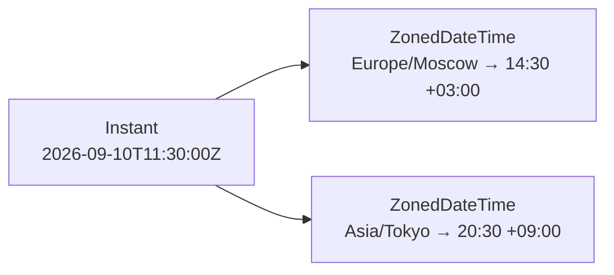

`java.time` (Java 8, JSR-310) — обязательный минимум для любого современного
Java-кода: старые `Date`/`Calendar`/`SimpleDateFormat` считаются legacy именно
потому, что были изменяемыми, нетокобезопасными и путали момент времени с его
отображением в конкретной временной зоне. На senior-собеседовании важно не
просто знать названия классов, а понимать, какой из них для какой задачи и
почему их вообще понадобилось так много.

## Ключевые концепции

### Основные типы

#### LocalDate, LocalTime, LocalDateTime
`LocalDate`, `LocalTime` и `LocalDateTime` — «локальные» типы в том смысле, что
они вообще не содержат информации о временной зоне: `LocalDate` — только дата
(год, месяц, день), `LocalTime` — только время суток (часы, минуты, секунды,
наносекунды), `LocalDateTime` — их комбинация. Слово «локальный» здесь means
не «зона по умолчанию устройства», а буквально «без привязки к какой-либо зоне
вообще» — это делает их удобными для представления вещей, которые
концептуально не имеют зоны: дня рождения, даты открытия магазина, расписания
на бумаге («встреча в 15:00» — не «в 15:00 UTC» и не «в 15:00 по Москве», а
просто 15:00 в контексте, где эта дата будет прочитана).

```java
LocalDate date = LocalDate.of(2026, 9, 10);
LocalTime time = LocalTime.of(14, 30);
LocalDateTime dateTime = LocalDateTime.of(date, time);
System.out.println("LocalDate: " + date);
System.out.println("LocalTime: " + time);
System.out.println("LocalDateTime: " + dateTime);
```
```
LocalDate: 2026-09-10
LocalTime: 14:30
LocalDateTime: 2026-09-10T14:30
```
Ни в одном из трёх значений нет ни малейшего упоминания временной зоны —
`14:30` здесь означает ровно то, что написано, без интерпретации «14:30 где
именно».

#### ZonedDateTime и OffsetDateTime
`ZonedDateTime`, напротив, — момент времени с явной привязкой к конкретной
временной зоне (`ZoneId`, например `Europe/Moscow` или `Asia/Tokyo`) — не
просто фиксированным смещением, а полным набором правил этой зоны, включая
переходы на летнее/зимнее время там, где они применяются. Именно поэтому один
и тот же физический момент, представленный в разных зонах через
`withZoneSameInstant`, показывает разное локальное время, но остаётся тем же
самым моментом на шкале времени. `OffsetDateTime` — промежуточный вариант:
дата-время с фиксированным смещением от UTC (`+03:00`), но без знания о
правилах конкретной зоны — то есть без понимания, когда именно в этой зоне
происходит переход на летнее время. `OffsetDateTime` уместен там, где нужна
однозначность момента (как у `ZonedDateTime`), но не нужна логика зоны как
таковая — например, в форматах передачи данных вроде ISO 8601 с явным
смещением, где сохранение самого имени зоны избыточно.


Один и тот же `Instant` — один и тот же момент на шкале времени — при
`withZoneSameInstant` в разные зоны даёт разное локальное время (14:30 в
Москве и 20:30 в Токио), не переставая быть одним и тем же моментом.

```java
ZonedDateTime moscow = dateTime.atZone(ZoneId.of("Europe/Moscow"));
ZonedDateTime tokyo = moscow.withZoneSameInstant(ZoneId.of("Asia/Tokyo"));
System.out.println("ZonedDateTime Moscow: " + moscow);
System.out.println("ZonedDateTime Tokyo (тот же момент): " + tokyo);
```
```
ZonedDateTime Moscow: 2026-09-10T14:30+03:00[Europe/Moscow]
ZonedDateTime Tokyo (тот же момент): 2026-09-10T20:30+09:00[Asia/Tokyo]
```
`withZoneSameInstant` пересчитывает локальное представление под другую зону,
сохраняя тот же физический момент — 14:30 в Москве (`+03:00`) и 20:30 в Токио
(`+09:00`).

```java
OffsetDateTime offsetDateTime = dateTime.atOffset(ZoneOffset.of("+03:00"));
System.out.println("OffsetDateTime: " + offsetDateTime);
System.out.println("offset (без правил зоны): " + offsetDateTime.getOffset());
```
```
OffsetDateTime: 2026-09-10T14:30+03:00
offset (без правил зоны): +03:00
```
В отличие от `ZonedDateTime Moscow` выше, у `OffsetDateTime` в строковом
представлении нет `[Europe/Moscow]` — только голое смещение `+03:00` без
знания о том, что это конкретно московская зона и когда в ней сменится
смещение из-за перехода на летнее время (для России сейчас — никогда, но для
большинства других зон это не так).

#### Instant
`Instant` — самый «сырой» из всех: точка на единой шкале времени UTC,
представленная как количество секунд (плюс наносекунды) от начала эпохи Unix
(1970-01-01T00:00:00Z). У `Instant` вообще нет представления в виде «года,
месяца, дня» — это чистая числовая метка времени, поэтому он и используется
там, где важен именно момент как таковой: метки времени в логах, `createdAt`/
`updatedAt` в базе данных, временные штампы событий в распределённой системе,
где сравнение «что раньше, что позже» должно быть однозначным независимо от
того, в какой зоне находится читающий эти данные наблюдатель.

```java
Instant instant = moscow.toInstant();
System.out.println("Instant (UTC epoch): " + instant);
```
```
Instant (UTC epoch): 2026-09-10T11:30:00Z
```
Это тот же самый момент, что и `moscow`/`tokyo` выше — просто представленный
без какой-либо привязки к зоне вообще, что и подтверждает совпадающий
`Instant`, полученный из обоих представлений.

### Периоды и длительности

#### Duration, Period и ChronoUnit
`Duration` и `Period` — два разных способа выразить «сколько времени прошло»,
и путать их — типичная ошибка. `Duration` измеряет точное количество времени в
секундах и наносекундах между двумя моментами — он применим к `Instant` и
`LocalTime`/`LocalDateTime` и не знает о календарных понятиях вроде «месяца»
(которые бывают разной длины). `Period`, наоборот, измеряет разницу именно в
календарных единицах — годах, месяцах, днях — и применим только к `LocalDate`;
`Period.between` двух дат возвращает не абсолютное число дней, а разложение
вида «столько-то лет, столько-то месяцев, столько-то дней», учитывающее
реальную длину конкретных месяцев в этом промежутке. `ChronoUnit.between`
(например `ChronoUnit.DAYS.between(d1, d2)`) даёт третий вариант — разницу в
одной конкретной единице измерения целиком, без разложения на составляющие,
что часто удобнее, когда нужно именно число (для сортировки, сравнения,
отображения «прошло N дней»), а не человекочитаемое «2 года 7 месяцев 26 дней».

```java
LocalDateTime start = LocalDateTime.of(2026, 9, 10, 9, 0);
LocalDateTime end = LocalDateTime.of(2026, 9, 10, 17, 45);
Duration duration = Duration.between(start, end);
System.out.println("Duration between: " + duration + " (часы=" + duration.toHours() + " минуты=" + duration.toMinutesPart() + ")");

LocalDate d1 = LocalDate.of(2024, 1, 15);
LocalDate d2 = LocalDate.of(2026, 9, 10);
Period period = Period.between(d1, d2);
System.out.println("Period between: " + period.getYears() + "y " + period.getMonths() + "m " + period.getDays() + "d");
System.out.println("ChronoUnit.DAYS.between: " + ChronoUnit.DAYS.between(d1, d2));
```
```
Duration between: PT8H45M (часы=8 минуты=45)
Period between: 2y 7m 26d
ChronoUnit.DAYS.between: 969
```
`Duration` дал точное количество времени (8 часов 45 минут) в формате ISO-8601
(`PT8H45M`). `Period` разложил разницу между датами на календарные компоненты
с учётом реальной длины месяцев между ними, а `ChronoUnit.DAYS.between` дал то
же расстояние одним числом — 969 дней — без разложения, что удобнее для
сортировки и сравнения.

### Форматирование и конвертация

#### DateTimeFormatter vs SimpleDateFormat
`DateTimeFormatter` — замена старого `SimpleDateFormat`, и главное отличие —
потокобезопасность. `SimpleDateFormat` изменяем: внутри объекта хранится
рабочее состояние (в частности, внутренний `Calendar`), которое модифицируется
прямо в процессе разбора или форматирования даты, — если один и тот же объект
`SimpleDateFormat` без внешней синхронизации используют несколько потоков
одновременно, их операции перемешиваются в этом общем изменяемом состоянии, и
результат оказывается непредсказуемым: некорректно отформатированная строка
или ошибка при разборе, которая на первый взгляд никак не связана с
многопоточностью. `DateTimeFormatter`, как и все классы `java.time`, устроен
иначе: он неизменяем, вся необходимая для форматирования информация
зафиксирована при создании объекта через `ofPattern(...)` или предопределённые
ISO-константы, и сам процесс форматирования не трогает никакого общего
изменяемого состояния — поэтому один и тот же экземпляр `DateTimeFormatter`
можно свободно шарить между потоками и хранить как `static final` константу,
не опасаясь гонок.

```java
DateTimeFormatter formatter = DateTimeFormatter.ofPattern("dd.MM.yyyy HH:mm");
LocalDateTime dt = LocalDateTime.of(2026, 9, 10, 14, 30);
System.out.println("formatted: " + dt.format(formatter));

LocalDateTime parsed = LocalDateTime.parse("10.09.2026 14:30", formatter);
System.out.println("parsed back: " + parsed);
```
```
formatted: 10.09.2026 14:30
parsed back: 2026-09-10T14:30
```
Один и тот же неизменяемый `formatter` использован и для форматирования
(`format`), и для разбора (`parse`) — паттерн `"dd.MM.yyyy HH:mm"` задаёт и то,
как дата выводится, и то, как она разбирается из строки в обратную сторону.

```java
// один и тот же SimpleDateFormat, 20 потоков, по 200 форматирований+разборов каждый
SimpleDateFormat sdf = new SimpleDateFormat("yyyy-MM-dd");
// ... 4000 параллельных вызовов sdf.format(d) / sdf.parse(...) без синхронизации
```
```
Общих вызовов: 4000, ошибок парсинга/формата: 403
```
Реальный прогон (JDK 21, пул из 20 потоков, общий на всех объект
`SimpleDateFormat`) — около 10% вызовов заканчиваются исключением при разборе
только что отформатированной этим же объектом строки. Ошибки не детерминированы
и меняются от запуска к запуску — характерный симптом гонки данных в общем
изменяемом состоянии, а не логической ошибки в самом коде форматирования.
Такой же код с `DateTimeFormatter` вместо `SimpleDateFormat` подобных ошибок не
даёт вовсе — при попытке сравнить это на практике.

#### Конвертация с legacy Date и хранение в БД
Иногда всё ещё нужно работать со старым API — например, сторонняя библиотека
принимает `java.util.Date`. Конвертация между мирами идёт через `Instant` как
общую точку: `Date.toInstant()` превращает legacy-дату в современный
`Instant`, `Instant.atZone(zoneId)` добавляет к нему временную зону и даёт
`ZonedDateTime`, а обратно — `Date.from(instant)` собирает `Date` из `Instant`.
Само по себе хранение даты/времени в базе данных — источник отдельного
типичного промаха: колонка типа `timestamp without time zone` хранит просто
«сырую» комбинацию год-месяц-день-час-минута-секунда без привязки к зоне
(интерпретация полностью на совести приложения), тогда как `timestamp with
time zone` (в PostgreSQL, несмотря на название, реально хранит момент в UTC и
конвертирует при чтении/записи в зону сессии) фиксирует однозначный момент
времени. Смешение этих двух подходов в разных частях системы — распространённая
причина расхождений во времени на несколько часов при работе с пользователями
из разных часовых поясов.

```java
Date legacyDate = Date.from(instant);
Instant backToInstant = legacyDate.toInstant();
System.out.println("Date -> Instant round-trip equal: " + instant.equals(backToInstant));
```
```
Date -> Instant round-trip equal: true
```
`Instant` — общая точка конвертации между legacy `Date` и `java.time`:
преобразование туда и обратно не теряет точность (обе стороны работают с
одной и той же шкалой UTC), что и подтверждает равенство после round-trip.

#### Неизменяемость всех классов java.time
Наконец, все классы `java.time` — и `LocalDate`, и `Instant`, и `Duration`, и
`DateTimeFormatter` — неизменяемы: любой метод, который выглядит как изменение
(`plusDays`, `withZoneSameInstant`, `plusMonths`), на самом деле возвращает
новый объект, оставляя исходный без изменений, — та же логика, что и у
`String` (раздел про строки), и с теми же практическими следствиями:
потокобезопасность без синхронизации и невозможность случайно испортить
объект, переданный куда-то ещё по ссылке.

```java
LocalDate original = LocalDate.of(2026, 9, 10);
LocalDate plusOne = original.plusDays(1);
System.out.println("original: " + original);
System.out.println("plusOne (новый объект): " + plusOne);
```
```
original: 2026-09-10
plusOne (новый объект): 2026-09-11
```
`original` остался прежним после вызова `plusDays(1)` — метод вернул новый,
независимый объект `LocalDate`, а не изменил тот, на котором был вызван.

## Частые вопросы на собеседовании

**Q: Почему SimpleDateFormat не потокобезопасен, а DateTimeFormatter — да?**
A: `SimpleDateFormat` изменяем — хранит рабочее состояние (внутренний
`Calendar` и промежуточные буферы) прямо в полях объекта и модифицирует его в
процессе форматирования/разбора. Без внешней синхронизации параллельное
использование одного и того же объекта несколькими потоками приводит к гонке
данных и непредсказуемым, трудно воспроизводимым ошибкам (как показано в
замере выше — около 10% вызовов падают). `DateTimeFormatter` неизменяем, как и
все классы `java.time`, — операция форматирования не трогает общего состояния
объекта, поэтому один и тот же экземпляр безопасно шарить между потоками без
какой-либо синхронизации.

**Q: В чём разница между Instant, LocalDateTime и ZonedDateTime?**
A: `Instant` — точка на единой шкале времени UTC (секунды и наносекунды от
эпохи Unix), без какого-либо календарного представления вообще — чистая метка
момента. `LocalDateTime` — дата и время без привязки к зоне, то есть само по
себе неоднозначное относительно того, какой это момент на глобальной шкале, —
подходит для вещей, у которых зоны концептуально нет (расписание, день
рождения). `ZonedDateTime` — дата-время плюс явная временная зона с полными
правилами перехода на летнее время — однозначный момент с удобным для человека
локальным представлением одновременно.

**Q: Почему выбор между timestamp with time zone и without — частая ошибка?**
A: `timestamp without time zone` хранит «сырые» компоненты даты-времени без
интерпретации, какому моменту в UTC они соответствуют, — правильность
зависит полностью от дисциплины приложения. `timestamp with time zone` (в
PostgreSQL) фиксирует однозначный момент в UTC и конвертирует его в зону
сессии при выводе. Смешение подходов в разных частях системы или между
приложением и базой — частая причина расхождения показываемого пользователям
времени на количество часов, равное разнице зон.

## Ловушки и частые ошибки

#### LocalDateTime вместо однозначного момента
Частая ошибка — использовать `LocalDateTime` там, где на самом деле нужен
однозначный момент времени (метка события, `createdAt` записи в базе,
временная отметка в распределённой системе). `LocalDateTime` не содержит
информации о зоне вообще, и «15:00» без контекста зоны — принципиально
неоднозначное значение: правильный выбор для таких случаев — `Instant` (если
зона получателя неважна) или `ZonedDateTime`/`OffsetDateTime` (если важно
явно сохранить, в какой зоне это время имеет смысл).

#### Duration vs Period — путаница
Другое заблуждение — путать `Duration` и `Period` как взаимозаменяемые способы
выразить промежуток времени. `Duration` — точное количество времени в
секундах, безразличное к календарным особенностям (день не всегда 24 часа
из-за перехода на летнее время, месяц не имеет фиксированной длины). `Period`
— именно календарная разница, которая может показывать разное абсолютное
количество времени в секундах в зависимости от того, какие конкретно месяцы
и дни попали в промежуток (см. пример выше). Использование `Duration` там, где
нужна календарная логика (например, «добавить один месяц к дате»), даёт
технически работающий, но семантически неверный результат.

#### Забыть присвоить результат (no-op)
Похожая ловушка — забывать, что методы `java.time`, как и у `String`, ничего не
меняют на месте. `date.plusDays(1);` без присвоения результата — no-op: метод
вернул новый объект с изменённой датой, но он нигде не сохранён, а исходная
переменная `date` осталась прежней. Это тот же паттерн ошибки, что и с
`String.trim()`/`replace()` без присвоения результата.

```java
LocalDate date = LocalDate.of(2026, 9, 10);
date.plusDays(1); // результат вызова нигде не сохранён
System.out.println("date после 'plusDays(1)' без присвоения: " + date);
```
```
date после 'plusDays(1)' без присвоения: 2026-09-10
```
Дата осталась той же самой — вызов `plusDays(1)` честно создал новый объект
`2026-09-11`, но раз он ни во что не присвоен, этот новый объект сразу же
становится недостижимым и исчезает, а `date` продолжает указывать на исходный,
неизменённый объект.

## Связанные темы
- [Строки](06-strings.md) — тот же принцип неизменяемости объектов и тот же класс ошибок при игнорировании возвращаемого значения.
- Основы потоков (раздел 8) — гонка данных как общая причина непредсказуемого поведения `SimpleDateFormat` под конкурентной нагрузкой.
- Базы данных: типы данных и проектирование схемы (раздел 15) — практические последствия выбора timestamp with/without time zone.
