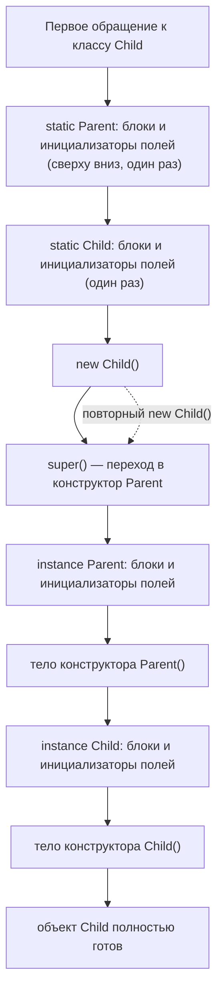

Классическая ловушка на собеседовании — «в каком порядке выполнится этот код»,
если в цепочке наследования несколько static- и instance-блоков. Формально это
прямое продолжение предыдущей темы (порядок инициализации внутри одного
класса), но добавление наследования создаёт отдельный класс ошибок, включая
одну из самых коварных — вызов переопределяемого метода из конструктора
родителя.

## Ключевые концепции

### Instance initializer block — то, что часто путают со static-блоком

#### instance-блок vs static-блок
Instance initializer block — это блок `{ ... }` прямо в теле класса без
модификатора `static`, синтаксически почти неотличимый от static-блока
(`static { ... }`) на первый взгляд, но с принципиально другой семантикой:
static-блок исполняется один раз при загрузке класса, а instance-блок — при
каждом создании объекта этого класса, как будто это ещё один кусок кода,
добавленный в начало каждого конструктора. Как и в рамках одного класса без
наследования (предыдущая тема), instance-инициализаторы полей и instance-блоки
выполняются в текстовом порядке их объявления в классе, сливаясь в единую
последовательность — но с добавлением наследования важно, **где именно** в
общей цепочке эта последовательность вставляется: после вызова конструктора
родителя (неявного или явного `super()`), но обязательно до тела конструктора
самого текущего класса.

```java
class Counter {
    static { System.out.println("static-блок Counter (один раз)"); }
    { System.out.println("instance-блок Counter (на каждый new)"); }
    Counter() { System.out.println("тело конструктора Counter()"); }
}
// вызов: new Counter(); new Counter();
```
```
static-блок Counter (один раз)
instance-блок Counter (на каждый new)
тело конструктора Counter()
instance-блок Counter (на каждый new)
тело конструктора Counter()
```
`static`-блок отработал ровно один раз, ещё до первого `new Counter()`.
Instance-блок, синтаксически отличающийся только отсутствием слова `static`,
повторяется при каждом создании объекта — именно эта разница чаще всего и
путают по чисто визуальному сходству записи.

#### Double brace initialization
Практическое (хотя и не рекомендуемое сегодня) применение instance-блока —
double brace initialization: создание анонимного подкласса коллекции с
instance-блоком внутри, который сразу добавляет в неё элементы, — например,
`new ArrayList<String>() {{ add("a"); add("b"); }}`. Внешние двойные скобки и
дали этому приёму название: внешняя пара — создание анонимного класса,
наследующего `ArrayList`, внутренняя — instance-блок этого анонимного класса.
Выглядит компактно, но в реальном коде не рекомендуется: каждое такое
выражение создаёт отдельный скрытый `.class`-файл анонимного класса, а сам
этот анонимный объект неявно хранит ссылку на внешний экземпляр (если приём
используется в нестатическом контексте) — это может помешать сборке мусора
внешнего объекта, пока жива созданная таким образом коллекция, то есть создаёт
скрытую утечку памяти, совершенно не очевидную из места использования.

```java
List<String> names = new ArrayList<String>() {{
    add("Аня");
    add("Борис");
}};
System.out.println("names: " + names);
System.out.println("реальный класс names: " + names.getClass().getName());
```
```
names: [Аня, Борис]
реальный класс names: Main$1
```
`names.getClass().getName()` выдаёт не `ArrayList`, а сгенерированное
компилятором имя анонимного подкласса (`Main$1`) — прямое подтверждение, что
double brace initialization реально создаёт новый класс на каждое такое
выражение, а не просто синтаксический сахар над обычным `ArrayList`.

### Полный порядок при иерархии классов

#### Четыре этапа: static → super() → instance → конструктор
Когда в игру вступает наследование, инициализация класса и объекта проходит
через четыре чётко определённых этапа, два из которых происходят один раз на
класс, а два — при каждом создании объекта. Сначала, один раз при первой
загрузке иерархии классов (реальный триггер загрузки — раздел 9, обычно первое
обращение к классу), выполняются static-блоки и static-инициализаторы полей —
от самого верхнего родителя вниз к потомку, в порядке объявления внутри
каждого класса, потому что JVM не может инициализировать класс-потомок, пока
не гарантированно инициализирован его родитель. Затем, при создании **каждого**
конкретного объекта: конструктор потомка первой инструкцией обязан вызвать
конструктор родителя (`super(...)`, неявно или явно) — эта цепочка
разворачивается вверх по иерархии до самого базового класса, прежде чем
исполнение начнёт по-настоящему что-либо делать. Дальше, всё ещё в рамках
одного вызова `new`, идут instance-инициализаторы полей и instance-блоки
родителя, затем тело его конструктора — и только после того, как родительская
часть объекта полностью инициализирована, — instance-инициализаторы и
instance-блоки текущего (потомка) класса, а следом тело его конструктора.


Пунктирная стрелка внизу — важная деталь: при повторном создании объекта того
же класса шаги A–C (static-инициализация) уже не повторяются вовсе, потому что
класс к этому моменту уже загружен и инициализирован — цепочка начинается
сразу с `super()`.

Итог для двухуровневой иерархии, если проговорить его целиком одной строкой:
static-родителя → static-потомка (оба — один раз за всё время жизни JVM) →
затем на **каждое** `new` — instance-родителя → конструктор-родителя →
instance-потомка → конструктор-потомка. Эта строка — то, что стоит уметь
воспроизвести на собеседовании без запинки, потому что именно её и проверяют
вопросом «в каком порядке выполнится этот код».

```java
class Parent {
    static { System.out.println("1. static-блок Parent"); }
    { System.out.println("3. instance-блок Parent"); }
    int parentField = initParentField();
    int initParentField() { System.out.println("4. instance-инициализатор Parent.parentField"); return 0; }
    Parent() { System.out.println("5. тело конструктора Parent()"); }
}

public class Child extends Parent {
    static { System.out.println("2. static-блок Child"); }
    { System.out.println("6. instance-блок Child"); }
    int childField = initChildField();
    int initChildField() { System.out.println("7. instance-инициализатор Child.childField"); return 0; }
    Child() { System.out.println("8. тело конструктора Child()"); }

    public static void main(String[] args) {
        System.out.println("=== new Child() #1 ===");
        new Child();
        System.out.println("=== new Child() #2 ===");
        new Child();
    }
}
```
```
1. static-блок Parent
2. static-блок Child
=== new Child() #1 ===
3. instance-блок Parent
4. instance-инициализатор Parent.parentField
5. тело конструктора Parent()
6. instance-блок Child
7. instance-инициализатор Child.childField
8. тело конструктора Child()
=== new Child() #2 ===
3. instance-блок Parent
4. instance-инициализатор Parent.parentField
5. тело конструктора Parent()
6. instance-блок Child
7. instance-инициализатор Child.childField
8. тело конструктора Child()
```
Строки `1` и `2` вывелись ровно один раз, ещё до первого `new Child()`, —
static-инициализация всей иерархии произошла один раз при загрузке класса.
При каждом из двух `new Child()` заново повторяется полностью одна и та же
последовательность `3–8`, точно соответствующая диаграмме выше.

### Типичная ловушка

#### Вызов overridable-метода из конструктора родителя
Самая коварная ошибка, вытекающая из этого порядка, — вызов переопределяемого
(не `final`, не `private`, не `static`) метода прямо из конструктора родителя.
Полиморфизм в Java динамический: вызов `describe()` внутри конструктора
`Base`, если `describe()` переопределён в `Overridable`, реально вызывает
именно переопределённую версию — объект уже относится к типу `Overridable` с
момента начала конструирования, виртуальная диспетчеризация методов (раздел 3)
не знает о том, что конструктор родителя ещё не завершился. Проблема в том,
что на этот момент, согласно порядку выше, instance-поля потомка ещё не
инициализированы — шаг «instance-потомка» идёт строго после шага «конструктор-
родителя», а не до него. Переопределённый метод потомка отработает, но
обратится к полям, которые ещё хранят значения по умолчанию для своего типа
(`0` для чисел, `false` для `boolean`, `null` для ссылочных типов), а не те
значения, что были заданы при их объявлении в самом классе `Overridable`.
Именно поэтому Effective Java (пункт «Design and document for inheritance or
else prohibit it») прямо советует избегать вызова переопределяемых методов из
конструктора — а если это неизбежно по архитектуре, документировать это
поведение максимально явно, потому что для наследника такой вызов — источник
трудноуловимого бага, зависящего исключительно от порядка инициализации, а не
от логики самого метода.

```java
class Base {
    Base() {
        System.out.println("Base() вызывает переопределённый describe():");
        describe();
    }
    void describe() { System.out.println("  Base.describe"); }
}

public class Overridable extends Base {
    private String name = "инициализировано";
    Overridable() {
        super();
        System.out.println("Overridable() после super(): name = " + name);
    }
    @Override
    void describe() {
        System.out.println("  Overridable.describe: name = " + name);
    }
    public static void main(String[] args) {
        new Overridable();
    }
}
```
```
Base() вызывает переопределённый describe():
  Overridable.describe: name = null
Overridable() после super(): name = инициализировано
```
Вызов `describe()` из `Base()` реально ушёл в переопределённую версию
`Overridable.describe` — динамическая диспетчеризация сработала, несмотря на
то что конструирование объекта ещё далеко не завершено. На этот момент
`name` равно `null`, хотя в объявлении поля явно указано `"инициализировано"`
— инициализатор поля `Overridable.name` ещё не выполнялся, потому что, согласно
порядку выше, instance-часть потомка исполняется строго после завершения
тела конструктора родителя, а не до него.

## Частые вопросы на собеседовании

**Q: В каком порядке выполнятся static- и instance-блоки в цепочке из двух-трёх классов?**
A: Все static-блоки и static-инициализаторы полей — один раз, от самого
верхнего родителя вниз, при первой загрузке класса, ещё до любого `new`. Затем
при каждом создании объекта — instance-часть (блоки и инициализаторы полей) и
тело конструктора каждого класса в иерархии, тоже сверху вниз: сначала полностью
родитель (instance-часть, потом тело конструктора), и только после этого —
instance-часть и конструктор следующего уровня, и так до самого конкретного
класса.

**Q: Что вернёт переопределённый метод, если его вызвать из конструктора родительского класса?**
A: Вызовется именно переопределённая версия метода — виртуальная
диспетчеризация работает независимо от того, завершено ли конструирование
объекта. Проблема в том, что на этот момент instance-поля класса-потомка ещё
не инициализированы (шаг инициализации потомка идёт после завершения
конструктора родителя), поэтому метод увидит их в состоянии по умолчанию
(`0`/`false`/`null`), а не в том, что задано при объявлении полей в самом
потомке — именно поэтому Effective Java советует не вызывать переопределяемые
методы из конструктора.

## Ловушки и частые ошибки

#### «final починит проблему overridable-вызова» — нет
Главная ловушка уже разобрана в примерах — вызов переопределяемого метода из
конструктора базового класса, который получает не то состояние объекта, какое
ожидается по объявлению полей в конкретном подклассе. Её усложнённый вариант —
считать, что достаточно объявить метод `final`, чтобы «починить» проблему:
`final` действительно убирает риск полиморфной подмены реализации (метод
больше не может быть переопределён), но не решает саму проблему, если этот
`final`-метод сам обращается к полям, которые ещё не инициализированы на
момент вызова из конструктора родителя, — если у метода нет наследников,
переопределяющих его, риска полиморфной подмены нет, но обращение к ещё не
инициализированным полям остаётся ровно той же проблемой независимо от
`final`.

```java
class Base3 {
    Base3() {
        System.out.println("Base3() вызывает describe():");
        describe();
    }
    void describe() { System.out.println("  Base3.describe"); }
}

class FinalOverride extends Base3 {
    private String name = "инициализировано";
    @Override
    final void describe() { // final -- дальше переопределить нельзя, но это НЕ чинит проблему
        System.out.println("  FinalOverride.describe: name = " + name);
    }
    public static void main(String[] args) {
        new FinalOverride();
    }
}
```
```
Base3() вызывает describe():
  FinalOverride.describe: name = null
```
Результат ровно тот же, что и без `final` в примере с `Overridable` выше —
`name` всё ещё `null` на момент вызова из `Base3()`. `final` здесь запретил бы
только дальнейшее переопределение `describe()` в подклассах `FinalOverride`,
но проблема была не в переопределении, а в порядке инициализации: поле `name`
инициализируется уже после того, как отработал конструктор `Base3`.

#### Путаница instance-блока со static-блоком по синтаксису
Другое заблуждение — путать instance initializer block с static-блоком просто
по визуальному сходству синтаксиса (`{ ... }` против `static { ... }`, см.
пример `Counter` выше). Присутствие или отсутствие одного слова `static`
полностью меняет, когда этот код выполняется — один раз на класс или при
каждом создании объекта, — и спутать их в реальном коде означает получить
логику инициализации, которая либо выполняется совсем не при том событии,
либо (что хуже) выполняется один-единственный раз для всех объектов класса
вместо каждого из них.

#### super() — не первое, что выполняется в объекте
Похожая путаница — считать, что раз `super()` вызывается «первой строкой»
конструктора, то родительский конструктор и есть первое, что вообще
выполняется при создании объекта. На самом деле у родителя тоже есть своя
instance-часть (блоки и инициализаторы полей), которая исполняется до тела
его собственного конструктора, — «первым» в абсолютном порядке оказывается
именно она, просто на уровне самого верхнего класса иерархии (шаг `3` в
примере `Parent`/`Child` выше идёт раньше шага `5`, тела самого конструктора).

## Связанные темы
- [Классы и объекты](09-classes-and-objects.md) — тот же порядок инициализации в рамках одного класса, без усложнения наследованием.
- Наследование и переопределение методов (раздел 3) — механизм динамической диспетчеризации, из-за которого и возникает ловушка с overridable-методом в конструкторе.
- Загрузка классов (раздел 9) — что конкретно триггерит момент «первой загрузки класса», после которого static-инициализация больше не повторяется.
