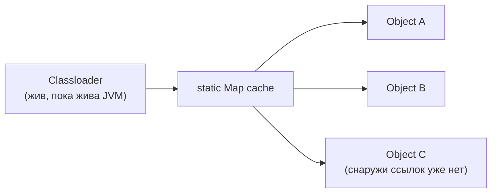

Два коротких ключевых слова, которые встречаются в коде каждый день, но за
внешней простотой скрывают несколько тонкостей уровня senior: чем `final`
переменная отличается от иммутабельного объекта, почему `static`-метод нельзя
переопределить, а можно только «скрыть» (что не одно и то же), и как
безобидное на вид `static` поле-коллекция превращается в утечку памяти.

## Ключевые концепции

### final

#### final: blank final и «ссылка, а не объект»
`final`-переменная может быть присвоена ровно один раз, но это не обязано
происходить прямо в момент объявления — так называемый blank final (пустой
final) объявляется без инициализатора и получает значение позже, например, в
теле конструктора, при условии, что компилятор может гарантированно доказать,
что присваивание произойдёт ровно один раз на любом пути исполнения (для
каждого конструктора класса, если полей несколько). Важная деталь, которую
часто путают: `final` для ссылочного типа фиксирует саму ссылку, а не
содержимое объекта, на который она указывает, — `final List<String> list = new
ArrayList<>();` не даёт списку `list` быть переприсвоенным на другой объект, но
не мешает добавлять и удалять элементы через `list.add(...)`/`list.remove(...)`
у того же самого объекта. `final` и неизменяемость (immutability) — разные,
хотя и связанные понятия: `final` — про саму переменную-ссылку, а
неизменяемость — про то, можно ли вообще изменить состояние объекта, на
который эта ссылка указывает, независимо от того, сколько ссылок на него
существует.

```java
public class FinalStatic {
    static int instanceCount = 0; // одно поле на класс
    final int id;                 // blank final - присваивается в конструкторе

    FinalStatic() {
        id = ++instanceCount; // присвоение final один раз, не в момент объявления
    }

    public static void main(String[] args) {
        FinalStatic a = new FinalStatic();
        FinalStatic b = new FinalStatic();
        FinalStatic c = new FinalStatic();
        System.out.println("a.id=" + a.id + " b.id=" + b.id + " c.id=" + c.id);
        System.out.println("instanceCount (общий на класс) = " + FinalStatic.instanceCount);
    }
}
```
```
a.id=1 b.id=2 c.id=3
instanceCount (общий на класс) = 3
```
`id` у каждого объекта своё и присвоено ровно один раз — это допустимый blank
final. `instanceCount`, наоборот, один на весь класс — каждый новый объект
увеличивает одну и ту же общую ячейку, что и объясняет, почему `id`
последовательно растёт от объекта к объекту, несмотря на то что каждый из них
создаётся независимо.

```java
final List<String> names = new ArrayList<>();
names.add("Аня");
names.add("Борис");
System.out.println("final-ссылка позволяет менять содержимое: " + names);
// names = new ArrayList<>(); // НЕ скомпилируется -- final-ссылку нельзя переприсвоить
```
```
final-ссылка позволяет менять содержимое: [Аня, Борис]
```
`final` здесь запрещает только `names = ...` (переприсвоение самой переменной
на другой объект) — вызовы `add`/`remove` у того же самого объекта `final` не
трогает вообще, потому что они не меняют ссылку, а меняют внутреннее состояние
объекта, на который эта ссылка указывает.

#### final-метод и final-класс
`final`-метод нельзя переопределить (override) в классе-наследнике — попытка
объявить в подклассе метод с той же сигнатурой не компилируется. Это
осознанный инструмент проектирования API: если автор класса точно знает, что
конкретная реализация метода должна оставаться неизменной во всех подклассах
(часто — потому что от неё зависит корректность работы других частей класса,
которые сами вызывают этот метод), `final` защищает от случайной или
намеренной подмены этой реализации где-то ниже по иерархии наследования.
`final`-класс, аналогично, нельзя унаследовать вообще — самый известный
пример в стандартной библиотеке — `String`, и причина та же: гарантия того,
что поведение класса (в случае `String` — в первую очередь неизменяемость и
всё, что на неё опирается: пул строк, кэшированный `hashCode`) не может быть
нарушена наследником, переопределяющим часть методов и создающим объект,
который формально является `String`, но ведёт себя иначе.

```java
class Base {
    final void greet() { System.out.println("hi"); }
}
public class FinalMethodFail extends Base {
    void greet() { System.out.println("bye"); } // нельзя переопределить final
}
```
```
FinalMethodFail.java:5: error: greet() in FinalMethodFail cannot override greet() in Base
    void greet() { System.out.println("bye"); }
         ^
  overridden method is final
1 error
```
```java
public class ExtendStringFail extends String { // String — final класс
}
```
```
ExtendStringFail.java:1: error: cannot inherit from final String
public class ExtendStringFail extends String {
                                      ^
1 error
```
Оба случая — не рантайм-ошибки, а отказ компиляции: `final` проверяется
статически, ещё до того, как код вообще может быть запущен, что и делает его
надёжной гарантией на уровне API, а не просто соглашением, которое можно
случайно нарушить и заметить только в рантайме.

### static

#### static-поле и static-метод: hiding, а не overriding
`static`-поле принадлежит классу целиком, а не отдельному объекту, — все
экземпляры класса разделяют одну и ту же ячейку памяти под это поле, и
изменение значения через любой из объектов сразу видно через все остальные,
включая обращение напрямую через имя класса без создания объекта вообще. Это
прямо противоположно обычному (instance) полю, у которого своя собственная
копия в каждом объекте. `static`-метод, соответственно, не привязан к
конкретному экземпляру — у него нет доступа к `this`, потому что при вызове
`static`-метода никакого конкретного объекта, о котором шла бы речь, может не
существовать вовсе (метод можно вызвать через имя класса, ни разу не создав ни
одного объекта этого класса). Отсюда прямое следствие для полиморфизма:
`static`-метод не может быть переопределён — он может быть только скрыт
(method hiding) методом с той же сигнатурой в подклассе, и, в отличие от
настоящего overriding, выбор конкретной реализации `static`-метода происходит
статически, на этапе компиляции, по объявленному типу переменной, а не
динамически, по фактическому типу объекта в рантайме — то есть по тем же
правилам, что и overloading (тема про методы), а не как виртуальный вызов
instance-метода.

```java
class Animal {
    static String kind() { return "Animal"; }
    String sound() { return "..."; }
}
class Dog extends Animal {
    static String kind() { return "Dog"; } // hiding, не overriding
    @Override String sound() { return "Woof"; } // настоящее overriding
}
public class StaticHiding {
    public static void main(String[] args) {
        Animal ref = new Dog();
        System.out.println("ref.kind() [по объявленному типу Animal]: " + ref.kind());
        System.out.println("ref.sound() [по фактическому типу Dog]: " + ref.sound());
    }
}
```
```
ref.kind() [по объявленному типу Animal]: Animal
ref.sound() [по фактическому типу Dog]: Woof
```
Хотя переменная `ref` на этапе выполнения указывает на объект `Dog`,
`ref.kind()` вернул `"Animal"` — вызов `static`-метода разрешается по
объявленному типу переменной (`Animal`) на этапе компиляции, а не по
фактическому типу объекта. `ref.sound()`, настоящий instance-метод, наоборот,
разрешился динамически и вернул переопределённую в `Dog` версию — наглядная
разница между hiding и overriding на одном примере.

#### static-блок инициализации
`static`-блок инициализации выполняется ровно один раз — при первой загрузке
класса (подробный разбор точного порядка вместе с наследованием — в теме про
порядок инициализации этого раздела), и используется там, где нужно выполнить
более сложную логику инициализации `static`-состояния, чем простое присвоение
значения полю в одну строку — например, заполнение статической `Map` данными
или загрузка конфигурации, требующая нескольких шагов.

```java
class Config {
    static final Map<String, String> DEFAULTS = new HashMap<>();
    static {
        DEFAULTS.put("timeout", "30s");
        DEFAULTS.put("retries", "3");
        System.out.println("static-блок Config: заполнили DEFAULTS (" + DEFAULTS.size() + " записи)");
    }
}
// обращение: Config.DEFAULTS.get("timeout")
System.out.println("timeout=" + Config.DEFAULTS.get("timeout"));
```
```
static-блок Config: заполнили DEFAULTS (2 записи)
timeout=30s
```
`static`-блок отработал один раз при загрузке класса `Config`, ещё до первого
обращения к `DEFAULTS` из `main` — заполнение через несколько вызовов `put`
было бы невозможно сделать одним простым инициализатором поля в одну строку,
отсюда и потребность в блоке.

#### static-поля и утечки памяти


`static`-поле само по себе — GC root: пока загружен объявивший его класс,
всё, что накопилось в этом поле, остаётся достижимым, даже если извне на эти
объекты давно никто не ссылается.

Отдельная практическая опасность `static`-полей — их время жизни. Обычный
объект живёт до тех пор, пока на него есть хотя бы одна достижимая ссылка
(раздел 9), и как только ссылок не остаётся, сборщик мусора рано или поздно
освобождает память. `static`-поле само по себе — часть метаданных класса и
живёт вместе с загруженным классом, то есть практически на всё время жизни
приложения (пока classloader, загрузивший класс, сам не станет недостижимым,
что для системного classloader на практике означает «до конца работы JVM»).
Если в такое поле складывать объекты, добавляя их со временем (кэш без
ограничения размера, список слушателей событий, без которых забыли
отписываться, и подобное), но никогда явно не удалять, эти объекты
фактически никогда не станут недостижимыми и не будут собраны сборщиком
мусора — классическая утечка памяти в managed-языке, которая формально не
является «утечкой» в C-смысле (память не потеряна безвозвратно, JVM всегда
знает, где она), но по факту ведёт себя точно так же: приложение постепенно
потребляет всё больше памяти, пока не упрётся в `OutOfMemoryError`.

```java
class LeakyCache {
    static final List<byte[]> cache = new ArrayList<>(); // никогда не очищается
    static void handleRequest() {
        cache.add(new byte[1_000_000]); // 1MB, "забыли" удалить после обработки запроса
    }
}
for (int i = 1; i <= 5; i++) {
    LeakyCache.handleRequest();
    System.out.println("после запроса " + i + ": cache.size()=" + LeakyCache.cache.size());
}
```
```
после запроса 1: cache.size()=1
после запроса 2: cache.size()=2
после запроса 3: cache.size()=3
после запроса 4: cache.size()=4
после запроса 5: cache.size()=5
```
Каждый вызов `handleRequest()` кладёт очередной мегабайт в `cache` и никогда
его оттуда не убирает — с точки зрения вызывающего кода массив после обработки
запроса уже не нужен, но `static`-поле как GC root держит его достижимым
вечно. На реальном сервере с тысячами запросов в час это ровно тот сценарий,
который постепенно приводит к `OutOfMemoryError`, а не к аккуратному
освобождению памяти сборщиком мусора.

## Частые вопросы на собеседовании

**Q: В чём разница между final переменной и неизменяемым (immutable) объектом?**
A: `final` фиксирует саму переменную-ссылку — её нельзя переприсвоить на
другой объект после первого присваивания, но объект, на который она
указывает, может оставаться вполне изменяемым, если его класс это позволяет
(`final List<String> list` не мешает `list.add(...)`). Неизменяемость — это
свойство самого объекта: у него в принципе нет методов, способных поменять его
состояние после создания (как у `String`). Это разные, ортогональные понятия,
которые можно комбинировать, но одно не подразумевает другое.

**Q: Почему static-метод нельзя переопределить, только скрыть?**
A: `static`-метод не привязан к конкретному объекту и не участвует в
виртуальной диспетчеризации, на которой строится полиморфизм для
instance-методов. Метод с той же сигнатурой в подклассе не переопределяет, а
скрывает родительскую версию — выбор между ними происходит статически, на
этапе компиляции, по объявленному типу переменной, а не по фактическому типу
объекта в рантайме, как это было бы для обычного instance-метода.

**Q: Как static-поле может привести к утечке памяти в Java?**
A: `static`-поле живёт вместе с загруженным классом — практически всё время
работы приложения, если это не выгружаемый отдельно classloader. Если в такое
поле складывать объекты (кэш, список подписчиков, накопительная коллекция) и
никогда явно их не убирать, эти объекты остаются достижимыми через `static`-
ссылку сколь угодно долго, и сборщик мусора не может их собрать, даже если
логически в остальной программе они уже никому не нужны, — память постепенно
растёт, пока приложение не упрётся в `OutOfMemoryError`.

## Ловушки и частые ошибки

#### final-коллекция — не неизменяемая коллекция
Частая ошибка — считать `final`-коллекцию (`final List<...> list`)
неизменяемой. `final` защищает только саму переменную от переприсваивания —
элементы такого списка по-прежнему можно свободно добавлять, удалять и менять.
Для настоящей защиты от изменения содержимого нужна отдельная неизменяемая
коллекция (`List.of(...)`, `Collections.unmodifiableList(...)`, раздел 5), а
не просто `final` у ссылки на обычный изменяемый `ArrayList`.

```java
final List<String> mutable = new ArrayList<>(List.of("a", "b"));
mutable.add("c"); // работает -- final не защищает содержимое
System.out.println("final ArrayList после add: " + mutable);

final List<String> immutable = List.of("a", "b");
try {
    immutable.add("c");
} catch (UnsupportedOperationException e) {
    System.out.println("List.of() бросает UnsupportedOperationException на add()");
}
```
```
final ArrayList после add: [a, b, c]
List.of() бросает UnsupportedOperationException на add()
```
Обе переменные объявлены `final`, но ведут себя принципиально по-разному:
`mutable` — `final`-ссылка на обычный изменяемый `ArrayList`, и `add`
прекрасно работает. `immutable` — `final`-ссылка на объект `List.of(...)`,
который сам по себе не позволяет изменять содержимое, независимо от `final`.
Защиту от изменения содержимого даёт именно тип коллекции, а не `final`.

#### static сам по себе не определяет потокобезопасность
Другое заблуждение — полагать, что `static` сам по себе делает код
потокобезопасным или, наоборот, всегда опасным в многопоточной среде. Ни то,
ни другое не верно автоматически: `static`-поле — это просто общая для всех
потоков память, и её конкурентное изменение без должной синхронизации
подвержено гонкам данных ровно так же, как и любое другое разделяемое
состояние (раздел 8), — `static` сама по себе не даёт и не отнимает
потокобезопасность, это отдельный вопрос, решаемый другими средствами
(`synchronized`, atomic-классы, immutability).

```java
class Counter {
    static int total = 0;
    static void increment() { total++; } // read-modify-write, НЕ атомарно
}

int threadsCount = 8;
int perThread = 100_000;
Thread[] threads = new Thread[threadsCount];
for (int i = 0; i < threadsCount; i++) {
    threads[i] = new Thread(() -> {
        for (int j = 0; j < perThread; j++) Counter.increment();
    });
    threads[i].start();
}
for (Thread t : threads) t.join();

System.out.println("ожидалось: " + (threadsCount * perThread));
System.out.println("реально:   " + Counter.total);
```
```
ожидалось: 800000
реально:   611947
```
`total++` — это три отдельных шага (читать, прибавить 1, записать обратно), и
между ними другой поток может вклиниться и перезаписать значение, основанное
на уже устаревшем прочитанном числе, — часть инкрементов бесследно теряется
(«lost update»). Результат меняется от запуска к запуску, но почти никогда не
равен ожидаемому — `static` тут никак не защитил от гонки данных, потому что
сам по себе не про синхронизацию, а только про то, что поле общее.

#### «Это не настоящая утечка» — тоже заблуждение
Похожая ловушка — забывать о утечках через `static`-поля именно потому, что
формально это «не настоящая» утечка памяти в духе C/C++ (где память вообще
теряется безвозвратно). В managed-языке с garbage collector неограниченно
растущий `static`-кэш или подписка, из которой забыли отписаться и сохранили
ссылку в `static`-поле (см. пример `LeakyCache` выше), ведёт себя для
приложения ровно так же плохо — растущее потребление памяти вплоть до
`OutOfMemoryError`, просто механизм этой утечки другой: не потерянный
указатель, а забытая, но всё ещё достижимая ссылка.

## Связанные темы
- [Классы и объекты](09-classes-and-objects.md) — модификаторы доступа и структура класса, к которым `static`/`final` применяются как дополнительное уточнение.
- [Порядок инициализации при наследовании](10-initialization-order.md) — точный момент, когда выполняется static-блок в цепочке классов.
- GC Roots, типы ссылок и утечки памяти (раздел 9) — почему `static`-поле формально является GC root и как это приводит к утечкам на практике.
