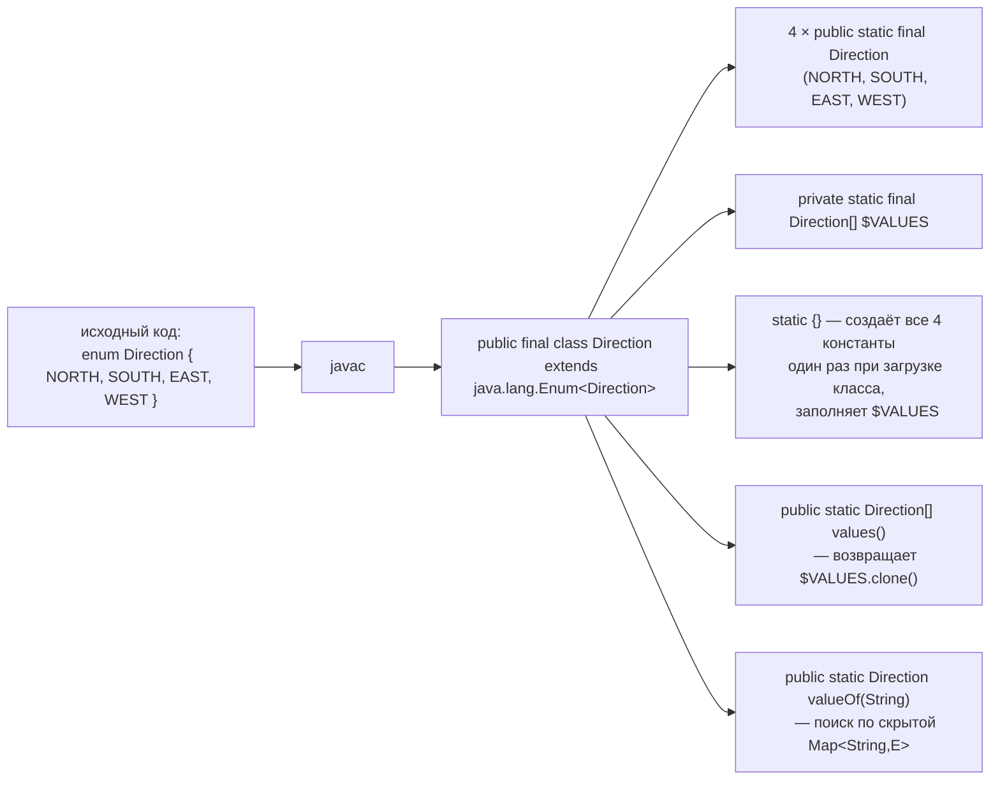

# Enum под капотом

---
Углублённый разбор того, во что компилятор на самом деле превращает `enum` —
именно это различает кандидата, который «умеет пользоваться enum», и того, кто
понимает, почему enum считается самым надёжным способом сделать singleton в
Java (по рекомендации Effective Java) и почему `switch` по enum не сравнивает
строки. Все утверждения ниже проверены дизассемблированием реального байткода
(`javap`, JDK 21) — конкретные детали компиляции могут отличаться между
версиями JDK, но общий принцип неизменен уже много лет.

## Ключевые концепции

### От enum к final-классу

#### enum наследует java.lang.Enum и не может быть extended
Компилятор превращает объявление `enum` в обычный класс на уровне байткода —
`final`-класс, неявно наследующий параметризованный `java.lang.Enum<E>` (где
`E` — сам этот enum-тип, классический пример рекурсивного ограничения типа,
curiously recurring generic pattern). Именно из этого факта следуют сразу два
практических ограничения языка. Во-первых, enum не может наследовать никакой
другой класс — место единственного родителя в Java уже занято `java.lang.
Enum`, и это архитектурное, а не искусственное ограничение. Во-вторых, enum
не может быть расширен другим классом или enum — компилятор помечает
сгенерированный класс модификатором `final` точно так же, как это происходит
для явно объявленного `final class`, и по той же причине: гарантия того, что
набор экземпляров типа останется фиксированным и не может быть расширен где-то
ниже по иерархии. При этом enum вполне может реализовывать интерфейсы
(`enum Op implements Calculable`) — единственное наследование класса занято, а
реализация интерфейсов, как и у обычных классов, ничем не ограничена.

#### Константы — static final поля, инициализация в static {}
Каждая константа, объявленная в `enum`, компилируется в `public static final`
поле этого класса — то есть на уровне JVM константа `Direction.NORTH` ничем
принципиально не отличается от любого другого `static final` поля-объекта.
Значения этих полей создаются один раз, в статическом инициализаторе класса
(`static { ... }`, сгенерированном компилятором автоматически), который
выполняется при первой загрузке класса — то есть ровно по тому же механизму
static-инициализации, что разобран в отдельной теме этого раздела. Именно
из этого прямо следует потокобезопасность enum-констант без единой явной
строчки синхронизации: создание объекта каждой константы гарантированно
происходит один раз, и сама эта гарантия обеспечивается моделью загрузки
классов JVM (класс инициализируется под её внутренней блокировкой,
раздел 9) — тем же механизмом, что делает потокобезопасной классическую
идиому «инициализация через statically-initialized holder».



Реальный вывод `javap -p` для `enum Direction { NORTH, SOUTH, EAST, WEST }`
подтверждает эту структуру буквально:
```
public final class Direction extends java.lang.Enum<Direction> {
  public static final Direction NORTH;
  public static final Direction SOUTH;
  public static final Direction EAST;
  public static final Direction WEST;
  private static final Direction[] $VALUES;
  public static Direction[] values();
  public static Direction valueOf(java.lang.String);
  private Direction();
  private static Direction[] $values();
  static {};
}
```
Здесь видно сразу несколько деталей, которые редко проговаривают вслух:
конструктор `private Direction()` — сгенерирован компилятором как приватный
даже без явного модификатора в исходном коде (создание экземпляров enum
извне запрещено языком в принципе, не только соглашением), а
`$VALUES`/`$values()` — синтетические имена с `$`, по соглашению
обозначающие элементы, сгенерированные компилятором, а не написанные
разработчиком.

### values(), valueOf() и константы с телом

#### values() клонирует массив, valueOf() ищет через Map
`values()` — не просто геттер: дизассемблирование его байткода показывает,
что метод делает `$VALUES.clone()` перед возвратом, а не отдаёт внутренний
массив напрямую:
```
public static Direction[] values();
    Code:
       0: getstatic     #16    // Field $VALUES:[LDirection;
       3: invokevirtual #20    // Method "[LDirection;".clone:()Ljava/lang/Object;
       6: checkcast     #21    // class "[LDirection;"
       9: areturn
```
Причина — защита инкапсуляции: массив в Java изменяем (тема про массивы этого
раздела), и если бы `values()` возвращал сам `$VALUES`, любой вызывающий код
мог бы модифицировать его элементы (`Direction.values()[0] = null;`) и тем
самым испортить состояние, общее для всех последующих обращений к enum во
всём приложении. Клонирование на каждый вызов — небольшая, но реальная цена
в горячем коде: если `values()` вызывается в цикле с высокой частотой,
стоит один раз сохранить результат в переменную, а не звать метод повторно.
`valueOf(String)`, в свою очередь, ищет константу не линейным перебором, а
через скрытую `Map<String, E>`, которую компилятор и рантайм `java.lang.Enum`
поддерживают внутри себя, — поиск по имени происходит за счёт хеш-таблицы, а
не последовательного сравнения строк со всеми константами по очереди.

#### Константы с телом — анонимные подклассы
Отдельный интересный случай — константа с собственным телом (constant-specific
class body), например `PLUS { public int apply(int a, int b) { return a + b; } }`
внутри enum с абстрактным методом `apply`. Такая константа компилируется не
просто в объект основного enum-класса, а в объект отдельного анонимного
подкласса этого enum-класса — у каждой константы с телом появляется
собственный `.class`-файл:
```java
enum Op {
    PLUS  { public int apply(int a, int b) { return a + b; } },
    MINUS { public int apply(int a, int b) { return a - b; } };
    public abstract int apply(int a, int b);
}
```
```
PLUS: class=Op$1 apply(5,3)=8
MINUS: class=Op$2 apply(5,3)=2

$ ls Op*.class
Op$1.class   Op$2.class   Op.class
```
`PLUS.getClass()` возвращает не `Op.class`, а синтетический `Op$1` — реальный
анонимный подкласс `Op`, переопределяющий `apply` конкретной реализацией.
Это ровно тот же механизм, что стоит за анонимными классами вообще (см. также
«Вложенные и анонимные классы», раздел 3), просто применённый компилятором
автоматически для каждой enum-константы с телом.

### Иммунитет к рефлексии, сериализации и switch без сравнения строк

#### Иммунитет к рефлексии и сериализации
Классический ручной Singleton (приватный конструктор плюс статическое поле
или метод `getInstance()`) уязвим к двум конкретным атакам, о которых часто
забывают: рефлексия может вызвать приватный конструктор напрямую через
`Constructor.setAccessible(true)` и создать второй экземпляр, а обычная Java-
сериализация/десериализация по умолчанию создаёт новый объект при каждой
десериализации, минуя конструктор вовсе, — оба пути ломают гарантию
«единственный экземпляр» без единой явной ошибки компиляции. Enum устойчив к
обеим атакам не по соглашению, а по факту устройства платформы: JVM явно
запрещает рефлексивный вызов конструктора enum-типа (`newInstance` на enum
бросает исключение независимо от `setAccessible`), а сериализация enum
устроена особым образом — по контракту `Serializable`, стандартная
сериализация enum-констант всегда происходит по имени константы (`name()`),
а не через обычную сериализацию полей объекта, и десериализация восстанавливает
её через тот же `valueOf(String)`, то есть возвращает существующий экземпляр
константы, а не создаёт новый. Именно поэтому Effective Java (Джошуа Блох,
пункт про Singleton) прямо рекомендует enum с единственной константой как
самый надёжный способ реализовать singleton в Java — гарантии платформы здесь
сильнее любых соглашений, которые разработчик мог бы случайно нарушить в
ручной реализации.

#### switch по enum: ordinal() + tableswitch
Наконец, `switch` по enum не сравнивает строки, как могло бы показаться по
аналогии со `switch` по `String`, — он использует числовой `ordinal()`
константы. Реальная бытовая проверка на JDK 21 для классического
`switch`-оператора над enum показывает прямой вызов `ordinal()` с
последующим `tableswitch` по полученному числу:
```java
enum Color { RED, GREEN, BLUE }
static String describe(Color c) {
    switch (c) {
        case RED: return "warm";
        case GREEN: return "nature";
        default: return "cold";
    }
}
```
```
static java.lang.String describe(Color);
    Code:
       0: aload_0
       1: invokevirtual #7   // Method Color.ordinal:()I
       4: tableswitch   { // 0 to 2
                     0: 32
                     1: 35
               default: 41
          }
      32: ldc  #13  // String warm
      34: areturn
      35: ldc  #15  // String nature
      37: areturn
      41: ldc  #17  // String cold
      43: areturn
}
```
`tableswitch` — самая быстрая форма switch в байткоде JVM: переход по индексу
в таблице переходов за O(1), без последовательного сравнения ни с числами, ни
тем более со строками имён констант. Это прямое объяснение, почему `switch` по
enum на практике быстрее, чем эквивалентная цепочка `if/else if` со сравнением
через `equals` или `==`, — компилятор сводит его к элементарной индексации по
уже известному на этапе компиляции диапазону `ordinal()`-значений.

## Частые вопросы на собеседовании

**Q: Почему enum считается самым надёжным способом сделать Singleton?**
A: Ручной Singleton уязвим к повторному созданию экземпляра через рефлексию
(вызов приватного конструктора напрямую) и через штатную сериализацию/
десериализацию (которая по умолчанию создаёт новый объект в обход
конструктора). Enum устойчив к обеим угрозам на уровне самой платформы: JVM
запрещает рефлексивное создание enum-экземпляров в принципе, а сериализация
enum по контракту `Serializable` восстанавливает константу по имени через
`valueOf`, возвращая существующий объект, а не создавая новый. Это гарантии
JVM, а не соглашения программиста, которые можно случайно нарушить.

**Q: Почему у enum-константы с собственным телом (constant-specific class body) свой .class-файл?**
A: Такая константа компилируется не в обычный экземпляр enum-класса, а в
объект отдельного анонимного подкласса, переопределяющего абстрактный (или
обычный) метод конкретной реализацией именно для этой константы, — тот же
механизм, что стоит за анонимными классами вообще. Отсюда и отдельный
синтетический `.class`-файл (`Op$1.class`, `Op$2.class`) на каждую такую
константу, и `getClass()` для неё возвращает не сам enum-класс, а этот
конкретный анонимный подкласс.

**Q: Как именно устроен switch по enum на уровне байткода?**
A: Никакого сравнения строк — компилятор вставляет вызов `ordinal()` у
переданной константы и затем `tableswitch`/`lookupswitch` по полученному
числу, что эквивалентно переходу по индексу в таблице за константное время.
Именно поэтому switch по enum — не просто удобный синтаксис, а действительно
более быстрая операция, чем эквивалентная цепочка сравнений через `equals`.

## Ловушки и частые ошибки

#### ordinal() — нестабильный идентификатор для внешнего хранения
Частая ошибка — считать `ordinal()` подходящим стабильным идентификатором для
хранения enum-константы во внешних системах (базе данных, сериализованном
файле, API-контракте). Значение `ordinal()` — это просто позиция константы в
текущем порядке объявления в исходном коде: если позже кто-то переставит
константы местами или вставит новую в середину списка, `ordinal()` у всех
последующих констант молча изменится, а уже сохранённые где-то внешне
числовые значения начнут указывать не на те константы. Для внешнего
хранения правильный выбор — `name()` (при условии, что имена констант не
переименовываются) или отдельное явное поле с кодом, задаваемое через
конструктор enum, а не полагаться на порядок объявления.

#### values() клонирует массив, но не сами константы
Другое заблуждение — думать, что раз `values()` возвращает клон массива, то
сравнение через `==` для двух отдельных вызовов `values()` вернёт `true` для
всего массива целиком. Клонируется именно массив-контейнер — каждый вызов
`values()` действительно даёт новый объект-массив, и сравнивать два таких
массива через `==` бессмысленно (это будут два разных объекта). Но элементы
внутри этих массивов — сами enum-константы — остаются теми же самыми
единственными на JVM объектами, поэтому `values()[0] == Direction.NORTH`
по-прежнему истинно, даже если сам массив-обёртка при каждом вызове новый.

## Связанные темы
- [Enum и аннотации](00-index.md) — базовое использование enum и EnumMap/EnumSet, обзорный уровень для собеседования.
- Байткод, invokedynamic и Instrumentation API (раздел 9) — более широкий контекст того, как javac транслирует конструкции языка в байткод.
- Abstract class vs interface (раздел 3) — почему enum может реализовывать интерфейсы, но не наследовать класс, и как устроены анонимные подклассы вообще.
